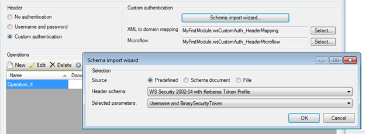

{}

This document describes published web services. If you're looking for specific information on the published web services screen, you can check the [Published web service](published-web-service) documentation.

{}

You can publish your own webservices in a Mendix application. These webservices consist of operations. Other applications can then call operations of this webservice and you can return a result. This result is based on a microflow that will be executed when the webservice is called.

To enable usage of a microflow as a web service, right-click anywhere in the whitespace of the microflow and select "Publish as web service operation".

## Runtime documentation

When running, Mendix projects publish webservices documentation. The address is (if running locally) [http://localhost:8080/ws-doc/](http://localhost:8080/ws-doc/) This documentation explains how the service can be used, in two ways:

### WSDL

This is an XML document that is computer readable. This means that the modeler can read this document and automatically figure out how to interact with the webservice.

### Example request/response xml messages

On the "Published webservices" page ([http://localhost:8080/ws-doc/](http://localhost:8080/ws-doc/)) you will also find a list of all operations, per published webservice. These link to pages which describe sample messages. Note that you do not need these examples when building a mendix-to-mendix interaction, they are there purely to help people who want to create their own clients.


## How does a published webservice call work?

A microflow that has been published can be called by systems from the outside. In this section, we will take a look at how this process works.

### Call is initiated

A webservice call is simply a HTTP call that the runtime receives and recognizes as a webservice call. An XML message is received and parsed to a format that the runtime understands.

#### Authentication

##### No authentication

Sometimes, authentication for your web service is not necessary if you do not include sensitive information in your reply. Therefore, choose "No authentication" to disable authentication in the header.

##### User name and password

This is the default authentication option. The Mendix platform expects a security header with username and password when a web service is called. Specifically, the SOAP envelope header should contain an element called "authentication", which contains a username and password:

```xml
<soap:Header>
        <tns:authentication>
            <username>john</username>
            <password>john'ssecretpassword</password>
        </tns:authentication>
    </soap:Header>

```

These details _must_ match an existing webservice user in the runtime. These users can be created by logging in as an Administrator and clicking on "create webservice user" in the Users datagrid in the system module. Normal (non-webservice) users cannot be used to call webservices and webservice users cannot log in via the standard login page.
Other than that, there is no difference between how normal users and webservice users call microflows.

##### Custom authentication

There are also more advanced authentication mechanisms. With "Custom Authentication", you can select any schema you want to use. An XML-to-domain mapping transforms header XML to Modeler entities, and a microflow can be dedicated to implementing interaction logic with, for instance, an Active Directory service to verify and obtain user information. The header microflow returns a User under which the body microflow is executed.
A wizard helps you with some standard templates for header schemes that are used often, such as WS Security in combination with a Kerberos token profile.



#### Parameter handling

Depending on which types of parameters are inputs to the published Microflow, two things can happen.

If an input is a Domain Entity, the XML is translated to the entity using an XML-to-Domain mapping. Note that these mappings create actual domain objects, depending on the mapping.

Normal parameters (integer, string etc) aren't converted in any way and used as inputs directly.

### Microflow is executed

Once the parameters have been parsed from the XML, the microflow call proceeds as normal.

### Result is converted back to XML

If the microflow has a return value, it will be returned as a result of the webservice call. As with the parameters, basic types will be returned directly, and Domain Entities require a mapping to be converted to XML.
