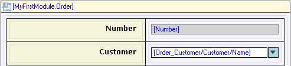
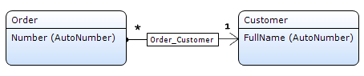
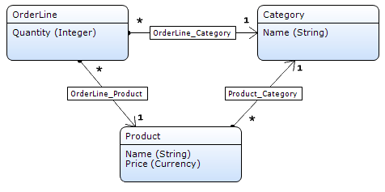
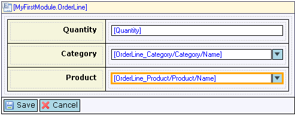

The reference selector allows you to set an association of type reference by selecting an object. For example, in an order form you might be able to select the customer to whom the order applies. The reference selector shows an attribute of the associated entity, for example, the name of the customer.

{}

The reference selector allows you to select the customer by name.

To use a reference selector you need a many-to-one association in the domain model.

{}

The reference selector looks like a drop-down but the important difference is that an attribute _path_ is displayed. The first part of the path is the association (of type reference) that is being shown and edited by the reference selector (Order_Customer in the example). The second part is the entity on the other side of the association (Customer) and the third part is the attribute of which the value is shown at run-time (Name).

{}

If you only want to _display_ information, you can also use the text box. This has the added advantage that you can follow more than one association step.

{}

## General Properties

### Decimal precision (only in web forms, only for numeric attributes)

The precision of a value describes the number of digits that are used to express that value. This property indicates the number of decimal places (the number of digits following the point).

_Default value:_ 2

### Group digits (only in web forms, only for numeric attributes)

For ease of reading, numbers with many digits before the decimal separator may be divided into groups using a delimiter. This property indicates whether the end user will see these groups.

_Default value:_ No

### Date format (only in web forms, only for attributes of type DateTime)

The date format determines whether the date part, the time part or both are shown. How the date and time parts are formatted depends on the localization of the user using the application. Possible values: 'Date', 'Time' and 'Date and time'.

_Default value:_ Date

### Required (only in web forms)

See [Widget Properties](widget-properties).

### Required message (only in web forms)

See [Widget Properties](widget-properties).

### Select using

The reference selector allows the end user to select by using either a drop-down or a pop-up form. With the property select-using you can choose which way you want selections to happen. If you choose to select using a form, the reference selector will get a button next to it to open the pop-up.

| Value | Description |
| --- | --- |
| Form | Select the reference using a pop-up form. |
| Drop-down | Select the reference using a drop-down. |

{}

The advantage of a selecting using a drop-down is that it is very efficient; no form needs to be opened. The advantage of selecting using a form is that the end user can search the objects. If there are a lot of objects (say, more than 20) to select from, selecting using a form is advisable.

{}

_Default value:_ Drop-down

### Select form

This property determines which form is shown if the 'Select using' property is set to 'Form'. The form should contain a data grid or template grid with at least a Select button. The entity of the grid should correspond to the entity that is selected using the reference selector.

{}

Let us say that you have a data view showing the details of an order including the customer that placed the order. In the domain model, the customer has an association of type reference to the order. The customer can be selected with a reference selector that is configured to select using a form. The form shows a grid of customers and the Select button will confirm the selected row, close the form and set the value of the reference selector.

{}

### Select form settings

These settings specify how the form is opened.

See [Opening Forms](opening-forms) for more details.

### Go-to form (only in web forms)

The go-to form gives end users the possibility to quickly view a more detailed form containing the referenced object. This property determines which form is shown to the user. The form should contain a data view with the same entity as the one that is selected by the reference selector.

### Go-to form settings (only in web forms)

These settings specify how the form is opened.

See [Opening Forms](opening-forms) for more details.

## Common Properties

### Tab index

See [Widget Properties](widget-properties).

### Name

See [Widget Properties](widget-properties).

### Class

See [Widget Properties](widget-properties).

### Style

See [Widget Properties](widget-properties).

## Data Source Properties

### Attribute path

The attribute path specifies which attribute of an associated entity is shown in the reference selector. The path must follow one association of type reference starting in the entity of the data view. For example, Order_Customer/Customer/Name.

{}

Keep in mind that even though you connect an attribute to the reference selector you are actually selecting an object. The attribute is just there to provide a visualization of the object. In this respect, the reference selector is different from other widgets like check boxes and text boxes. In those widgets you edit the value of the attribute. In the reference selector you edit an association of type reference.

{}

## Editability Properties

### Editable

See [Widget Properties](widget-properties).

### Condition

See [Widget Properties](widget-properties).

## Events

### On change

See [Widget Events](widget-events).

### On change settings

See [Widget Events](widget-events).

## Selectable Objects Properties

The properties in the category 'Selectable objects' determine the objects out of which the end user can make a selection. There are two, mutually exclusive, ways of influencing the selectable objects:

1.  A microflow returns the list of selectable objects.
2.  The list of objects is determined automatically taking into account the context mechanism and the properties that influence that mechanism.

### Microflow (only in web forms)

If a microflow is selected, the microflow will be called to compute the list of objects that the reference selector will show. A microflow can only be used if the selection is made using a drop-down.

{}

Note that the other properties in this category have no effect when using a microflow!

{}

### Microflow settings (only in web forms)

In the microflow settings you can specify what parameters to pass to the microflow.

### XPath constraint

With the XPath constraint, you can add a manual constraint to limit the list of objects that can be selected. This XPath constraint will be added to the constraints that are generated by the [context mechanism](context-mechanism).

{}

The XPath constraint `[InStock = true()]` on a reference selector for products will ensure that only products that are in stock are selectable.

{}

This property has no effect if a microflow is used to fill the reference selector.

### Constrained by

A reference selector can be constrained by one or more paths. This is typically used to make one reference selector dependent on another. For example, in form where you can edit an order line, a product selector can be constrained by a category selector. After selecting a category, the product selector is constrained by this category and shows only products in the category.

_Domain model_ 

In the domain model the order line has associations of type reference to both category and product. This is necessary for the two reference selectors (category and product). The third association, from product to category, describes the relation between those two entities. Such a 'triangle' shaped part of the domain model is what makes constraining possible.

_Form_ 

The form has two reference selectors, one for category and one for product. The one for product is constrained by the path through the domain model that forms the triangle.

This property has no effect if a microflow is used to fill the reference selector.

### Apply context (only in web forms)

The property 'Apply context' indicates whether the context mechanism will be used to constrain the list of selectable objects. See [Context Mechanism](context-mechanism) for more information.

This property has no effect if a microflow is used to fill the reference selector.

_Default value:_ False

### Remove from context (only in web forms)

The property 'Remove from context' allows you to remove specific entities from the context. This change in the context has effect on the list of objects that you can select from.

This property is useful if you want the application to 'forget' the fact that for example a customer was selected and to show all orders of all customers instead of only the orders of the selected customer. See the [Context mechanism](context-mechanism) for more information.

This property has no effect if a microflow is used to fill the reference selector.

### Sort order

The sort order specifies the order in which the items in the reference selector are shown. You can sort on multiple attributes in both directions (ascending and descending). If no sort order is specified, the reference selector sorts on the displayed attribute.

_Default value:_ No sort order

## Related Articles

*   [Data View](data-view)
*   [Entities](entities)
*   [Associations](associations)
