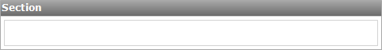

A section is a container in which other components can be placed. A list view, data view, table, navigation list, label, microflow trigger, link button, back button, drop down button, sign out button or another section can be placed on top level.

{}

An empty section.

{}

## Common Properties

### Name

See [Widget Properties](widget-properties).

### Class

See [Widget Properties](widget-properties).

### Style

See [Widget Properties](widget-properties).

## General Properties

### Show header

Toggle whether a header is shown above the section.

### Caption

The text of the header.

### Collapsible

This property specifies whether the section can be collapsed and if so, whether it starts collapsed or expanded.

_Default value:_ No
