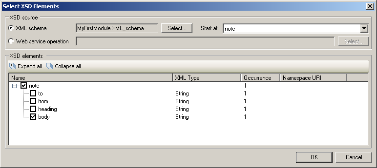

This describes how to select elements for a XML-to-Domain mapping.

## XSD Source

Here you can select whether the XML schema comes from an [imported web service](imported-web-services) or an [XML schema](xml-schemas).

When using an XML schema as source, you must select which XML element to start at. This should be the root element of the XML file(s) that you wish to import.

## XSD Elements

In this part you can select which elements from the XML you wish to map to your domain model. It is possible to skip certain elements of complex XML schemas and start the mapping at the element you need.

{}

The select elements screen.

{}
