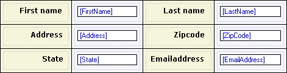

Tables can be used to change the layout of the form. They contain a number of rows and columns and the intersection of the two is called a cell. Each cell can contain widgets again. Cells can be merged horizontally and vertically (using the context menu in the table) to allow for asymmetric layouts.

{}

This is how the layout of a form can be altered with use of tables.

{}

## Components

A table consists of several rows and each row consists of a number of cells.

See [Table Row](table-row) and [Table Cell](table-cell).

## General Properties

### Column weights

This property determines the size of the table columns in percentages. Every column weight is presented by an integer value in this semi-colon separated list. Please note that the sum of the values in this list must be exactly 100.

{}

15;35;15;35

{}

## Common Properties

### Name

See [Widget Properties](widget-properties).

### Class

See [Widget Properties](widget-properties).

### Style

See [Widget Properties](widget-properties).
