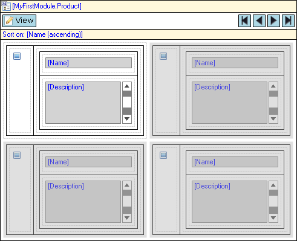

The template grid shows a list of objects in a tile view. For example, a template grid can show a list of products. Using controls provided by the template grid you can browse, search and manipulate those objects. The template grid has a lot in common with the data grid. The main difference is that the objects are shown in templates (a sort of small data view) instead of rows.

{}

A template grid showing products with an image, name and description.

{}

## Components

### Control bar

See [Control Bar](control-bar).

### Search bar (for data source type "Database")

See [Search Bar](search-bar).

### Sort bar (for data source type "Database")

See [Sort Bar](sort-bar).

## General Properties

### Show control bar

This property indicates whether the control bar will be visible in the end user interface. The control bar also includes the paging buttons.

{}

Even if the control bar is invisible there can still be a default button that is triggered by (double) clicking a row. See the property 'Default button trigger' and [grid buttons](control-bar) for more information.

{}

_Default value:_ True

### Show paging buttons

This property indicates with the buttons to page through the information in the grid are visible. Only hide these buttons if you are sure that there will never be more objects than the number of rows of the grid. Note that hiding the control bar also hides the paging buttons.

_Default value:_ True

### Number of rows

With this property you can change the number of rows of templates that will be shown on one page.

_Default value:_ 3

### Number of columns

With this property you can change the number of templates that will be shown next to each other in one row.

_Default value:_ 2

### Style template

The style template property allows you to choose from three different styling of the template grid. These stylings depend on your theme package.

### Selection mode

The selection mode determines whether and how the user can select items in the grid.

| Value | Description |
| --- | --- |
| No selection | The user cannot select items. |
| Single selection | The user can select a single item by clicking on it. Clicking another item will make that item the selection. |
| Multi-selection | The user can select multiple items by clicking the first one and holding the 'Ctrl' key while clicking on other items. Simply clicking an item will deselect all items and make the clicked item the selection. |
| Simple multi-selection | The user can select multiple items by simply clicking on them. |

_Default value:_ Single selection

### Select first

This property indicates whether the first item will be selected initially. This is especially useful if there is a data view listening to this grid.

_Default value:_ False

### Default button trigger

The default button can be triggered by a single or a double click on a row.

| Value | Description |
| --- | --- |
| Single click | A single click triggers the default button. This cannot be used in combination with allowing the user to select rows. |
| Double click | A double click triggers the default button. |

_Default value:_ Double click

### Refresh time (in seconds)

If the refresh time is non-zero, the template grid will refresh its contents every given number of seconds. For example, a task list could be refreshed every minute so that you know when new tasks arrive. By default the refresh time is zero and this means that the grid will not automatically refresh itself.

_Default value:_ 0

## Data Source Properties

The data source determines which objects will be shown in the template grid. For general information about data sources, see [Data Sources](data-sources).

### Type

The template grid supports the following types of data sources: Database Source, Association Source, Microflow Source. The database source retrieves objects from the database and supports searching and sorting. The association source follows an association from the enclosing data view to get to the objects. Finally, the microflow source calculates the list of objects by executing a microflow.

### Entity (Path) (for data source types "Database" and "Association")

The entity (path) property specifies of which entity instances will be shown in the grid. A top-level grid is always connected to an entity. A nested grid can either be connected to an entity or to an entity path starting in the entity of the containing data view.

{}

Let us say the domain model contains entities Order and OrderLine with a reference from OrderLine to Order. You can then create a data view on Order and inside it a grid on OrderLine that is connected to the entity path OrderLine_Order/OrderLine. This will ensure that the grid will only show order lines of the order in the data view.

{}

### Show search bar (for data source type "Database")

See [Database Source](database-source).

### Wait for search (for data source type "Database")

See [Database Source](database-source).

### XPath constraint (for data source type "Database")

See [Database Source](database-source).

### Apply context (for data source type "Database")

See [Database Source](database-source).

### Remove from context (for data source type "Database")

See [Database Source](database-source).

### Microflow (for data source type "Microflow")

The microflow property specifies a microflow is executed when the grid is opened. The microflow returns the objects that will be shown in the grid.

### Microflow settings (for data source type "Microflow")

The microflow settings specify which parameters to pass to the microflow. See [Starting Microflows](starting-microflows).

## Common Properties

### Tab index

See [Widget Properties](widget-properties).

### Name

See [Widget Properties](widget-properties).

### Class

See [Widget Properties](widget-properties).

### Style

See [Widget Properties](widget-properties).
