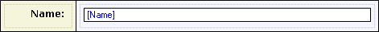

A text box can be used to display and/or edit a textual value.

{}

This text box allows the end-user to set the name of the customer.

{}

A text box must be placed in a table cell within a data view or template grid and connected to an attribute of type String. The connected attribute is shown in blue and between brackets inside the text box.

## General Properties

### Decimal precision (only in web forms, only for numeric attributes)

The precision of a value describes the number of digits that are used to express that value. This property indicates the number of decimal places (the number of digits following the point).

_Default value:_ 2

### Group digits (only in web forms, only for numeric attributes)

For ease of reading, numbers with many digits before the decimal separator may be divided into groups using a delimiter. This property indicates whether the end user will see these groups.

_Default value:_ False

### Show as password (only for attributes of type String or HashString)

| Value | Description |
| --- | --- |
| False
 | Normal text box
 |
| True
 | Typed characters are not shown to the end user. Instead an asterisk is shown for every typed character.
 |

_Default value:_ False

### Placeholder text (only in mobile forms)

The placeholder text is shown when no text has been entered yet. It can be used to give a hint to the user what kind of text should be entered.

### Required (only in web forms)

See [Widget Properties](widget-properties).

### Required message (only in web forms)

See [Widget Properties](widget-properties).

### Maximum length

This property indicates the maximum number of characters that can be typed in this text box.

| Value | Description |
| --- | --- |
| Attribute length
 | The maximum number of characters is the same as the maximum length of the connected attribute. |
| Unlimited
 | The maximum number of characters is unlimited.
 |
| Custom
 | The maximum number of characters is set by the user.
 |

_Default value: Attribute length_

### Input mask (only in web forms)

The input mask limits what the user can enter in the text box. A '9' means any digit, 'Z' means any letter, 'U' an upper-case letter, 'L' a lower-case letter and '*' a letter or a digit. Other characters will be taken literally. For example, the input mask 99-LLL-9999 matches 24-apr-2008.

## Common Properties

### Tab index (only in web forms)

See [Widget Properties](widget-properties).

### Name

See [Widget Properties](widget-properties).

### Class

See [Widget Properties](widget-properties).

### Style

See [Widget Properties](widget-properties).

## Data Source Properties

### Attribute (path)

See [Widget Properties](widget-properties).

## Editability Properties

### Editable

See [Widget Properties](widget-properties).

### Condition

See [Widget Properties](widget-properties).

## Events

### On change

See [Widget Events](widget-events).

### On change settings

See [Widget Events](widget-events).

### On enter (only in web forms)

See [Widget Events](widget-events).

### On enter settings (only in web forms)

See [Widget Events](widget-events).

### On leave (only in web forms)

See [Widget Events](widget-events).

### On leave settings (only in web forms)

See [Widget Events](widget-events).

## See also

*   [Data View](data-view)
*   [Attributes](attributes)
