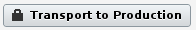

The Cloud Portal supports **two factor authentication** using cell phones to protect your applications when your password or computer has been compromised.

Certain actions have been marked sensitive in the Cloud Portal. These include downloading production data, starting and stopping the production environment, adding/removing team members and more. All sensitive actions are marked by buttons with a lock icon:

When a user tries to perform one of these actions, he/she is sent a secret code via the registered cell phone. A correct entry gives the user's current browser access to all sensitive actions he/she can normally perform for half an hour.

Naturally the normal security constraints for users will take priority. If a user has not been allowed by his Technical Contact to transport to the production environment, he still won't be able to do so after authentication.

We've tried to make the enrollment process as simple as possible. To activate two factor authentication for your account, simply go to the Cloud Portal at cloud.mendix.com. The first time you perform a sensitive operation you will be prompted for a phone number, optionally you can skip this step to postpone activation. After verification of the phone number by sending a secret code, two factor authentication will be activated. After this point, the option to skip is disabled.
