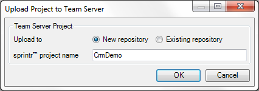

Use this dialog to upload a project that is not yet under version control to the Team Server. You can upload to a new repository (and create a sprintr™ project at the same time) or to an existing repository.

## Upload to

Choose whether you want to upload to a new repository or to an existing one. Uploading to a new repository will also create a new sprintr™ project.

## sprintr™ project name (for 'New repository')

Enter a name for the new sprintr™ project and corresponding Team Server repository.

## Team Server project (for 'Existing repository')

Choose the Team Server project that you want to upload the current project to.
