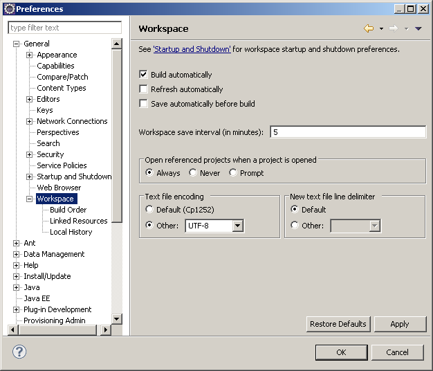
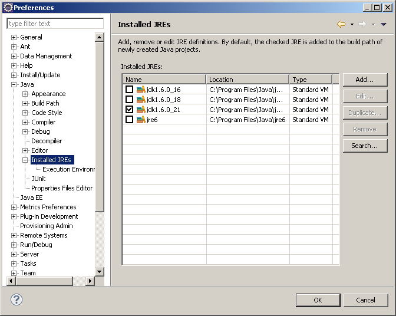
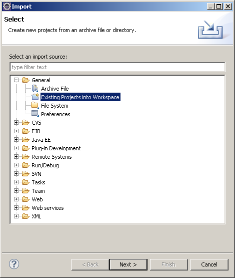
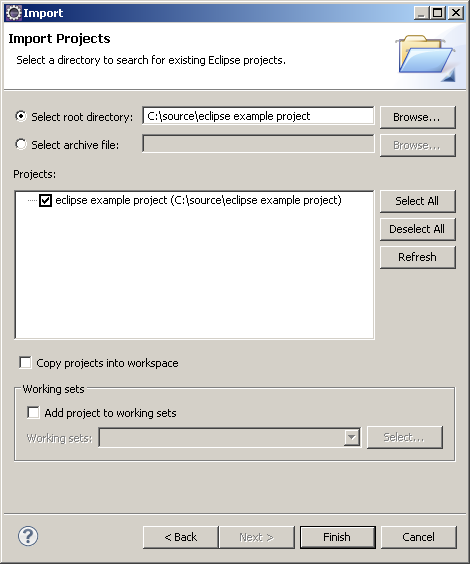
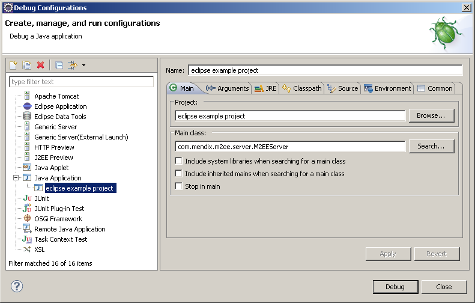
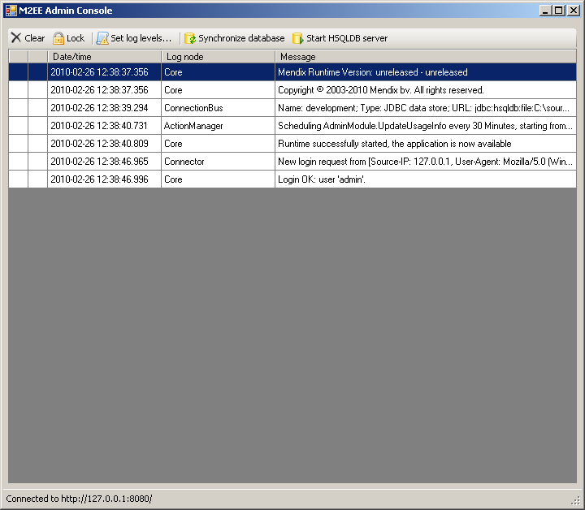

Using Eclipse to write and debug the Java actions in your Mendix project is really easy. When the Mendix model is deployed, an Eclipse project file, classpath file and launch configuration are generated.

In Mendix, all text is saved in UTF-8 encoding. First make sure your source code is also saved in UTF-8\. This can be done by going to the window menu and selecting preferences, then selecting UTF-8 as shown in the screenshot below.

{}

Settings UTF-8 encoding.

{}

You should also have a Java Development Kit (JDK) installed and selected.

{}

Selecting a default JDK.

{}

Make sure you add a JDK and select it as the default in Eclipse.

To add a Mendix project to Eclipse, you can perform these steps:

*   Open the File menu and click Import
*   Open the 'General' folder and select 'Existing projects into Workspace' and click next
*   Use the option 'select root directory', browse to your Mendix project folder and click finish

{}

Import existing project.

{}{}

Import existing project step 2.

{}

Now you can happily start editing your Java actions as you would do normally.

To actually launch the project, go to 'debug configurations' or 'run configurations' depending on how you'd like to run the project. In the left hand menu, select the 'Java application' menu and you'll see a launch configuration generated by the Mendix Business Modeler. Simply click 'debug' or 'run' on your right to start the application.

{}

Looking up your launch configuration.

{}

After you have launched the application, you will see the M2EE admin console popup. This is the same console as you would normally see in the Mendix Business Modeler if you would run the project from there. You can stop your application by closing the console.

{}

The M2EE admin console.

{}
