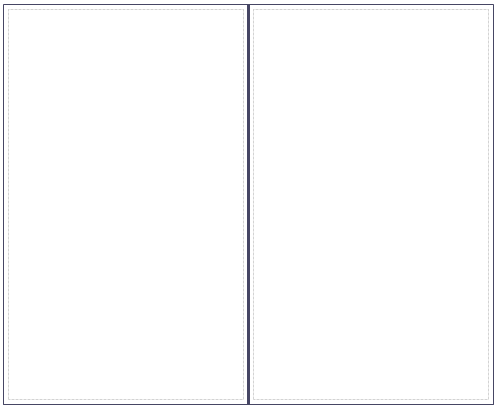

A vertical split pane creates a region that is split in two by a vertical divider. In the client the divider can be moved to the left and to the right by the end user.

If a vertical split pane is placed as a top-level widget in a form, it must be the only top-level widget. Apart from that, a vertical split pane can only be placed directly in another (horizontal or vertical) split pane.

## Appearance Properties

### Weights

This property determines the ratio of the panes in percentages. Both panes are presented by an integer value in this semi-colon separated list. Please note that the sum of the two values in this list must be exactly 100.

{}

40;60

This will result in a vertical split pane with 40 percent of the width reserved for the left pane and 60 percent reserved for the right pane.

{}

### Animated resize

This property indicates whether resizing by dragging the diver is visualized in real time or not.

_Default value:_ False

### Height

The height property determines the height of the split pane. A height of zero means that the split pane will get the default height that is defined in the theme.

{}

This property only has effect if the split pane is placed in a web-layout theme. In themes with application layout the split pane will always take 100% of the available height.

{}

_Default value:_ 0

## Common Properties

### Name

See [Widget Properties](widget-properties).

### Class

See [Widget Properties](widget-properties).

### Style

See [Widget Properties](widget-properties).
