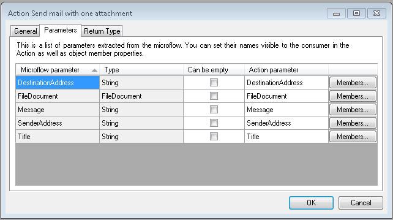
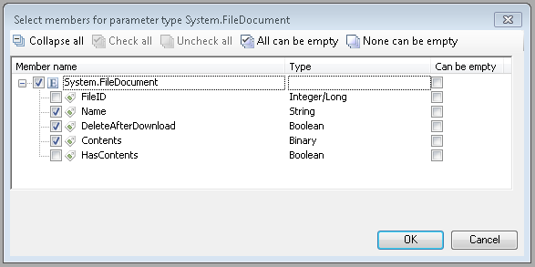
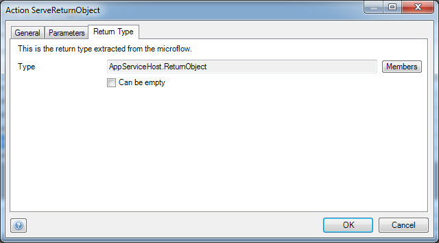

Provides the actual microflow actions of the app service. Note that once an app service version is set to Consumable, its parameters and return type are no longer editable as they are part of the app service contract.

In the General tab, you can set the microflow that corresponds to the action. When the microflow is set, the Parameters tab will be filled automatically.

An action page has the following tabs:

## General

### Caption

This is the name of the action the consumer will see in their toolbox.

### Icon

This is the icon that belongs to the action. An icon can be selected from any images document in the project. A new icon can be added to an images document if it is not available yet.

### Microflow

Defines which microflow will be executed when this action is called.

### Description

Describes the action. The consumer will see this description their overview.

## Parameters

### 

### Microflow parameter

Defines the name of the parameter in the microflow

### Type

Defines the type of the parameter.

### Can be empty

Defines whether a value is can be empty as an input parameter.

### Action parameter

Defines the name of the parameter in the app service action call. This is initially copied from the microflow parameter name but can be modified. There are three reserved parameter names that are not allowed to be used: **username**, **password** and **appservicelocation** (case insensitive).

### Exposed attributes and associations

A button is available for complex types (e.g. an entity from your domain model), to define whether to include or exclude the attribute in an entity, as well as to define whether an attribute can be empty as input.

### Return Type

Defines what kind of object will be returned by the action. This can be a simple type (like an integer or string), or a complex type (i.e. an entity from your entity model)

### Can be empty

Defines whether the return value can be **empty**.

{}

The Return Type tab of an app service action called 'ServeReturnObject'. An **empty** ReturnObject is disallowed here.

{}
