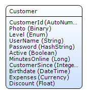
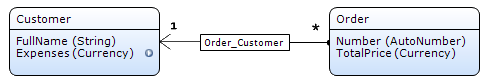

Attributes are characteristics that describe and/or identify the entity. For example, a Customer entity typically has attributes for the name of the customer, an e-mail address and other personal information.

The domain model editor uses the following symbols for visualization of attribute properties:

Symbol                             | Description
---------------------------------- | --------------------------------------------------------------------------
 | This attribute has one or more validation rules.
 | This attribute has a microflow that calculates the value of the attribute.

## Common Properties

### Name

The name property defines the name of the attribute. This name is used to refer to the attribute from forms, microflows, queries, constraints etcetera.

{}
If you delete an attribute in your entity and then create a new attribute with the same name, Mendix will consider it a new and different attribute. This means that upon deployment the old column will be dropped, including its data. Then a new, empty, column with the same name will be created.
{}

## Type

### Type

The type property defines the type of data that can be stored in the attribute. An attribute has one of the following types:

Type | Possible values
--- | ---
AutoNumber | A positive or negative whole number. AutoNumber attributes are automatically generated numbers. The default value of the attribute determines the first number that will be generated. Each created object will have an AutoNumber that is one greater than the previous one. AutoNumbers can only be used for persistable entities as the AutoNumber value is computed in the database.
Binary | Binary data. Can only be used for persistable entities as the data is stored in the database. For example an entire file. In most cases you want to use an association to a FileDocument or Image to store file contents.
Boolean | True or false.
Currency | The Currency type is deprecated. Use the high-precision Decimal type instead. The currency type is a synonym for the Float type, i.e. it represents a positive or negative number that can have digits after the decimal point. It was introduced in Mendix to make it clear what type should be used when representing amounts of money. However, given the finite precision of the Float type, performing calculations with very large numbers may yield incorrect results due to rounding errors. Because of this, it is recommended to use the high-precision Decimal type for these (financial) calculations.
Date and time | A point in time consisting of a date and a time component accurate up to milliseconds. |
Decimal | A positive or negative number that can have digits after the decimal point. The Decimal type can be used for high-precision calculations. Use this type to represent amounts of money for example. When a Decimal type attribute is persisted in the database its value is validated against 2 conditions. In case the number of digits of the integral part (before the decimal separator) is more than 20, an exception is thrown. In case the number of digits of the fractional part (after the decimal separator) is more than 8, the fractional value is automatically rounded according to [the round half to even rule (also known as bankers' rounding)](https://en.wikipedia.org/wiki/Rounding#Round_half_to_even). Therefore the the maximum allowable value for the Decimal type is 99999999999999999999.99999999.
Enumeration | One of the values of the given [enumeration](enumerations).
Float | The Float type is deprecated. Use the high-precision Decimal type instead. A positive or negative number. The number can have digits after the decimal point.
Hashed string | The hash value of a String or set of characters. It can among others contain letters, spaces and/or numbers. This type can for example be used to store a password. Hash values are generated using the hash algorithm that is chosen in the [Project Settings](project-settings).
Integer | A whole number that can be positive (maximum 231-1, thus 2147483647), negative (minimum -231, thus -2147483648), or zero.
Long | A whole number that can be positive (maximum 263-1), negative (minimum -263), or zero.
String | A text containing letters, spaces, numbers and other characters.

The maximum size that can approximately be stored in an attribute of type binary depends on the database:

HSQLDB | PostgreSQL | SQL Server | Oracle
------ | ---------- | ---------- | ----------------------------------------
1 MB   | 1 GB       | 2 GB       | 128 TB or limited by hard disk of server

_Default value:_ String

{}

In a web shop you want to store the id, profile photo, level (for service quality), user name, password, activity, total of minutes spent online, year of subscription, date of birth, total amount of expenses and the standard amount of discount for a customer.

The id should be unique for every customer, so this attribute has type AutoNumber.

The photo will be represented by an association to an entity that specializes Image. You do not use a Binary attribute for this purpose.

Level has three possible values: High, Medium and Low. This is stored in an attribute of type Enum.

The password itself should not be stored, but only its hash value, thus it is stored in an attribute of type HashString.

A customer can be active or inactive, which is stored in an attribute named 'Active' of type Boolean.

{}

### Localize (only attributes of type 'Date and time')

This property indicates whether the date and time should be localized. By default localization is enabled. If you are _not_ interested in the time component of a date (e.g. a birthday), you should set this property to 'No'. Otherwise, the date can change because of time zone differences: a date and time early in the morning on April 2nd in Europe will be on April 1st in the U.S.A.

In technical terms, this property indicates whether the client assumes that the date and time are in a local time zone (Yes) or in UTC (No). In the former case, the date is first converted to UTC before being sent to the server and converted from UTC before being displayed.

_Default value_: Yes

### Enumeration (only attributes of type 'Enumeration')

The enumeration property indicates which enumeration defines the possible values for this attribute.

### Length (only attributes of type 'String')

This property specifies whether the length of a String is limited to a maximum or unlimited. In the case of a limited length, the 'Max length' property specifies the maximum (see below).

_Default value:_ Limited

### Max length (only attributes of type 'String')

The 'Max length' property specifies the number of characters that can be stored in the attribute.

_Default value:_ 200

## Value

### Default value

The default value property defines the value of this attribute when an object is created. The default value should be compatible with the type of the attribute.

Type of the attribute | Default value of the default value property | Additional comments
--------------------- | ------------------------------------------- | -------------------------------------------------------------------------------------------------------------------------------------------------------------------------------------------------------------------------------------------------------------------------------------------------
AutoNumber            | 1                                           | Starting value of the increment. If there are already rows in the table, the AutoNumber values will be based on the right 32 bits of the id column value. This can cause gaps in the AutoNumber ranges with jumps of 100, because id values are reserved by the Runtime in blocks of 100.
Binary                | N/A                            |
Boolean               | False                                       |
Currency              | 0                                           |
DateTime              | (empty)                        | The default value should either comply with the format year-month-day (eventually postfixed by hour:minute, eventually postfixed by :second), or be `[%CurrentDateTime%]` (which means that when an object is created the value of this attribute is the date and time when the object is created).
Decimal               | 0                                           |
Enum                  | (empty)                        |
Float                 | 0                                           |
HashString            | (empty)                                     |
Integer               | 0                                           |
Long                  | 0                                           |
String                | (empty)                        |

### Source

The source determines whether the value of the attribute is stored in the database or calculated by a microflow.

{}

Take note of the following things when using calculated attributes:

*   Each time an object with a calculated attribute is retrieved, the attribute is calculated. Depending on the complexity of the microflow and the number of objects you retrieve this can have impact on performance.

*   Attributes that are calculated by a microflow are not stored in the database.

*   It is not possible to sort on an attribute for which this property is used, because sorting is done by the database engine.

{}

### Microflow (only if source is microflow)

If the source is a computation, the microflow property defines which microflow defines this computation to calculate the value of the attribute when the object is retrieved. The microflow should have a parameter of the type of the entity of the attribute and it should return a value with the same type as the attribute.

{}

In a webshop you want to show the total expenses for each customer. These are calculated by retrieving all orders associated with the customer and adding their totals.

{}

## Effects of data type changes on existing attributes

### Data type change behavior

If the type of an existing attribute is changed in the Modeler, mostly the existing column will be dropped and a new column will be created. For some attribute type changes Mendix tries to convert existing data in the database to the new type.

If data should NOT be converted to the new type, you must remove the attribute in the Modeler and create a new column (with the same name), instead of only changing the data type. Even if you change the type and rename the column, Mendix remembers the old column name and will try to convert the column values if possible.

### Conversion table

In the table below, for each data type change you can see whether Mendix will convert the values.

|  | to AutoNumber | to Binary | to Boolean | to DateTime | to Decimal | to Enum | to Float/Currency | to HashString | to Integer | to Long | to String (limited) | to String (unlimited)
| --- | --- | --- | --- | --- | --- | --- | --- | --- | --- | --- | --- | ---
| **from AutoNumber** | | **X** | **X** | **X** | **&#x2713;** | **X** | **&#x2713;** | **X** | **X** | **&#x2713;** | **–** Conversion only possible if length >= 20. | **&#x2713;**
| **from Binary** | **X** | | **X** | **X** | **X** | **X** | **X** | **X** | **X** | **X** | **X** | **X**
| **from Boolean** | **X** | **X** | | **X** | **X** | **X** | **X** | **X** | **X** | **X** | **–** Conversion only possible if length >= 5. Converted to a string by the database, so the value for true and false differs per database. | **–** Converted to a string by the database, so the value differs per database.
| **from DateTime** | **X** | **X** | **X** | | **X** | **X** | **X** | **X** | **X** | **X** | **X** | **X**
| **from Decimal** | **&#x2713;** | **X** | **X** | **X** | | **X** | **X** | **X** | **X** | **X** | **–** Conversion only possible if length >= 20. | **&#x2713;**
| **from Enum** | **X** | **X** | **X** | **X** | **X** | | **X** | **X** | **X** | **X** | **–**  The name of the enumeration value will be used. The value will be shortened to the right length if it does not fit in the new type. | **–** The name of the enumeration value will be used.
| **from Float/Currency** | **&#x2713;** | **X** | **X** | **X** | **–** Conversion only possible for actual values which have at most 20 digits before the decimal point. | **X** | | **X** | **X** | **&#x2713;** | **–** Conversion only possible if length >= 24. | **&#x2713;**
| **from HashString** | **X** | **X** | **X** | **X** | **X** | **X** | **X** | | **X** | **X** | **–** The value will be shortened to the right length if it does not fit in the new type. | **&#x2713;**
| **from Integer** | **&#x2713;** | **X** | **X** | **X** | **&#x2713;** | **X** | **&#x2713;** | **X** | | **&#x2713;** | **–** Conversion only possible if length >= 11 . | **&#x2713;**
| **from Long** | **&#x2713;** | **X** | **X** | **X** | **&#x2713;** | **X** | **&#x2713;** | **X** | **X** | | **–** Conversion only possible if length >= 20. | **&#x2713;**
| **from String (limited)** | **X** | **X** | **X** | **X** | **X** | **X** | **X** | **X** | **X** | **X** | | **&#x2713;**
| **from String (unlimited)** | **X** | **X** | **X** | **X** | **X** | **X** | **X** | **X** | **X** | **X** | **–** The value will be shortened to the right length if it does not fit in the new type. |

This is the key to the table above:

Symbol | Description
--- | ---
**&#x2713;** | Conversion always possible.
**–** | Conversion is not always possible, or data will be changed during conversion. If conversion is not possible, the behavior is the same as the "**X**" ones.
**X** | Conversion not possible. The original column will be removed and a new column will be created with default values for the existing rows.

### Manual conversion

Even if Mendix cannot convert the values of a specific column to another type, you can still manage that manually. Change the name of the attribute, for example append the text 'Deleted' to its name. Create a new attribute with the same name and the new data type. Look up each occurrence of the old (renamed) attribute in the whole model and change this to the new attribute. Be sure that there is no microflow or form anymore which refers to the old attribute.

Create a microflow in which you retrieve all instances of the entity, loop through the instances and for each instance, read the value of the old attribute, convert the value, store it in the new attribute and commit the instance. Place a button on an administrator form which calls this microflow.

When you deploy, you have to run this microflow one time, after which you can remove both the microflow and the button pointing to it, and then you can also remove the old attribute.
