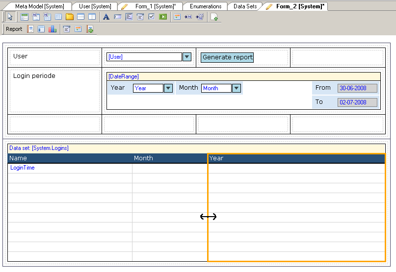

A basic report shows the reported data in a grid.

## Appearance Properties

### Weights

The weights are the widths of the columns, expressed as a percentage of the total width of the basic report.

You can edit this property by dragging the border between the columns in the basic report:

### Show export button

If this property is true, a button 'Export to Excel' is available for the end users on the basic report.

## Behavior Properties

### Zoom

The zoom property can refer to a form. When the end user double clicks an occurrence in the report, that form is displayed.

If the other form contains a report, the columns of the current report can be mapped to the parameters of the report in the other form.

### Use paging

If the expected quantity of data is too large to be displayed at once, use paging should be true, so that the data is distributed over different pages.

### Page size

If Use paging is true, this property indicates the number of occurrences that's displayed on one page.

## Common Properties

### Name, Class, Style

See [Widget Properties](common-widget-properties).
