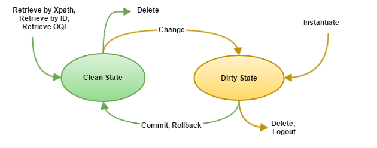
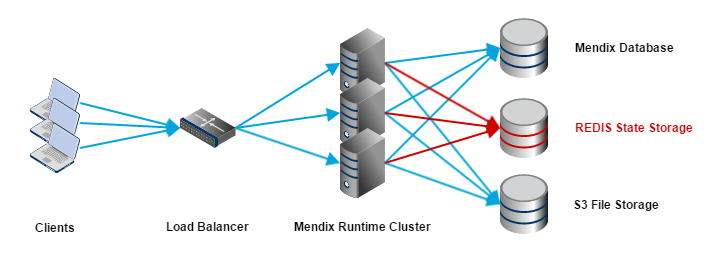
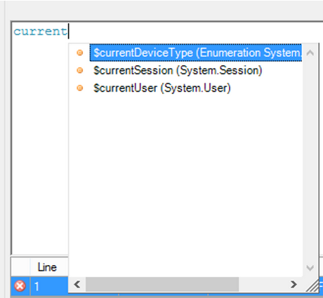

This page describes the impact of running Mendix Runtime as a Cluster on its behavior. This feature is not finished completely yet, therefore it starts with an overview of what features should work at this moment and what features will not. It describes how to configure it, how to start it and, what is required for running the Mendix Runtime in a Cluster. After that you'll find some background information on how specific topics behave in a cluster. It's important to read this document completely to get a grasp on the impact of clustering on your application.

{}

Clustering Support is **beta** feature. This means that it is _not supported_ in production environments.

{}

## Topics on this page

## Working features

Feature                                  | Status
---------------------------------------- | -------------------------------------------------------------------------
Sticky Sessions Disabled    | DONE
File Upload                 | DONE
File Download               | DONE
Session Expiration                       | LIMITED
HSQLDB                      | LIMITED
After startup/Before shutdown Microflows | NOT YET
Long Running Microflows     | NOT YET
Scheduled Events            | NOT YET
Microflow Debugger          | NOT YET
Global Locking (cluster-wide)            | NOT YET

{}

 Sessions will be expired correctly for all instances in most circumstances, but is not guaranteed at this moment. This will be improved in future versions.

{}{}

To use HSQLDB in the clustered mode, it should be started as a service and have all the clustered Mendix Runtime instances connected to it. Note that this has been tested only with basic scenarios and the behaviour is not known for complex applications/scenarios.

{}

## Cluster startup

As the Mendix Runtime performs database synchronization at startup it is important to begin starting the cluster by starting only one instance. After that instance has been fully started, additional instances can be safely added to the cluster.

## File storage 

When using clustered Mendix Runtime instances uploaded files should be stored in a shared file storage facility, as every Mendix Runtime instance should access the same files. Either the local storage facility is shared or the files are stored in a central storage facility, such as S3\. See [the S3 settings page](custom-settings) for how to configure S3 for Mendix.

## Configuring the Mendix Runtime

Clustering support for the Mendix Runtime can be enabled by setting the following configuration option:

*   `com.mendix.core.IsClustered` = `true`

Configuring the Mendix Runtime for clustering results automatically in the following behavior:

1.  Use of Persistent Sessions instead of normal Sessions. 
2.  Storage of Session State in the database (such that it can be accessed by all the Mendix Runtime instances in the cluster), instead of in the Mendix Runtime Instance's memory. This can have performance implications, depending on the amount of State data being generated by a Mendix Application.
3.  Disabling of Garbage Collection of Session State. Session State will be removed on Logout.

When clustering support is not enabled, the Mendix Runtime behaves as before.

## Cluster infrastructure

The Mendix Runtime Cluster requires the following infrastructure:

This means that a Mendix Cluster requires a Load Balancer to distribute the load of the clients over the available Mendix Runtime Cluster instances. It also means that all the instances need to connect to the same Mendix Database and that files need to be stored on S3 (see the File Storage topic). The number of instances in your cluster depends on the application, the high availability requirements and its usage. 

### Pivotal Web Services

The above depicted infrastructure is supported in an easy way in Pivotal Web Services. Pivotal Web Services allow to easily scale out by increasing the number of running instances for your App and provides a built-in load balancer for accessing the instances. Note: the cluster startup procedure of starting the first node alone also applies here.

Deploying your application into Pivotal Web Services is described in the page [Deploying a Mendix App to Pivotal](/deployment/cloud-foundry/deploy-a-mendix-app-to-pivotal). To have clustering support working correctly, the following environment variable needs to be set on Pivotal Web Services:

*   `CLUSTER_ENABLED = true
    `

Having this environment variable configured will automatically configure the Mendix Runtime setting `com.mendix.core.IsClustered` = `true` and automatically disable Sticky Sessions.

Scaling out can be done using the Pivotal App Manager. Using the Pivotal App Manager is documented in the [Pivotal Webservices Documentation](http://docs.run.pivotal.io/console/dev-console.html).

## Session state in a Cluster

When a user signs in to a Mendix application and starts going through a certain application flow, some data should be retained in that session (the time between login and logout), but not persisted yet in the database. The Mendix Web Client communicates this data on behalf of the user with a Mendix Runtime instance.

For example, imagine you are booking a holiday through a Mendix app consisting of a flight, hotel and rental car. In the first step you would select and configure the flight, in the second one your hotel, in the third your rental car and in the final step you confirm the booking and pay. Each of these steps could be in a different screen, but when you go from step one to step two you still would like to remember your booked flight. This is called the 'state' of your session. The data is not finalized yet, but should be retained between different requests. As reliably scaling out and supporting fail-over scenarios is necessary, the state can not be stored in the memory of one Mendix Runtime instance. Therefore, the session state is externalized so that every instance can work with that state for the current request.

In practice this means that, when a new request comes in for the current session, state is loaded from the external source and all changes to that state are tracked. At the end of the request, just before sending the response back, the new state is stored back to the external source again, making the updated state available for other instances.

Only state for requests which originate from the Mendix Web Client (both synchronous and asynchronous calls) are currently eligible to be retained between requests. For all other requests, such as scheduled events, web services or background executions, the state only lives for the current request. After that, the state either has to be persisted and/or reconstructed for a new request. The reason for only allowing Mendix Web Client requests to retain their state is that this is currently the only channel which works with actual end user input. End user input requires more interaction with and flexibility of data between requests. By only allowing these requests to retain state the load on the Mendix Runtime and the external source is minimized and performance optimized.

At the end of a user session (which is terminated either by an explicit user sign out or by the Mendix Runtime when the session has expired), all state for that session is removed from the external source.

Having unsaved objects (newly created or changed objects) in State is actually called 'Dirty State'. The following picture describes its behavior:

Reading objects from the Mendix Database and deleting (unchanged) objects from the Mendix Database is still 'Clean State'. Changing an existing object or instantiating a new object will create 'Dirty State'. 'Dirty State' needs to be synchronized (at the end of the request as described above) between the Mendix Runtime instances to allow requests being handled by other instances getting hold of the instantiated objects and changed objects within a session. Committing objects or rolling back will remove them from the 'Dirty State'. The same will happen if an instantiated or changed object is deleted. Non-persistent entities are always part of 'Dirty State'.

The more objects being part of 'Dirty State', the more data has to be synchronized between the Mendix Runtime instances. As such it has an impact on performance. In cluster environments it is advised to minimize the amount of 'Dirty State' to minimize the impact of the synchronization on performance.

{}

 It's important to realize that when calling external webservices in Mendix or using the OData integrations to fetch external data, the responses of those actions are converted into Mendix Entities. As long as they are not persisted in the Mendix Database, they will be part of `Dirty State` and have a negative impact on the performance of the application. To reduce this impact, this behavior is likely to change in the future.

{}

## Using REDIS for Dirty State storage

By default the Mendix Runtime uses the Mendix Database to store the Dirty State when clustering is enabled. However, this puts an additional load on the database which may slow down the system if insufficient resources are available. To circumvent that, it is possible to configure a REDIS server to store the Dirty State. With REDIS as Dirty State Store, the deployment picture would become:

This can be achieved by configuring the Mendix Runtime with the following parameters:

Configuration Parameter                      | Possible values                         | Description
-------------------------------------------- | --------------------------------------- | ---------------------------------------------------------------------------------------------------------------------------------------------------
`com.mendix.core.state.Implementation`       | `mxdb` (default) or `redis`             | Chooses between the Mendix Database (`mxdb`) or Redis (`redis`). In case of Redis, additional parameters are required to identify the Redis server.
`com.mendix.core.state.redis.Host`           | host name/ IP address                   | The host name or IP address of the Redis Server. This parameter is mandatory for Redis.
`com.mendix.core.state.redis.Port`           | port number                             | The port number of the Redis server (usually `6379`). This parameter is mandatory for Redis.
`com.mendix.core.state.redis.Secret`         | password                                | The password used to authenticate with the Redis server. This parameter is optional.
`com.mendix.core.state.redis.MaxConnections` | amount of connections (default is `50`) | Allowing the Mendix Runtime instance to use the specified amount of connections to communicate with Redis.

### Mapping of environment variables to config parameters on Pivotal Web Services

On Pivotal Web Services these configuration parameters can be configured using environment variables. The following mapping applies:

Pivotal Environment Variable                       | Maps to Mendix Configuration Parameter
-------------------------------------------------- | ---------------------------------------------------------
`CLUSTER_STATE_IMPLEMENTATION`        | `com.mendix.core.state.Implementation`
`CLUSTER_STATE_REDIS_MAX_CONNECTIONS` | `com.mendix.core.state.redis.MaxConnections`

Configuring the REDIS host, port and secret is done automatically by binding a REDIS service from the Pivotal Marketplace to the Pivotal App.

## ISession.getData() API usage

The Mendix Runtime has an (Java) API to store Java objects into the Session. By using `ISession.getData()` to store those objects, they get a Session scope (lifetime) and could be accessed in the subsequent requests (in combination with `ISession.retain()` and `ISession.release()` calls, depending on if the object has associations with objects which should not be garbage collected). With the introduction of Cluster support for the Mendix Runtime this API is deprecated and not supported in cluster mode. `ISession.getData()` only allows the object to be stored in memory on a particular Mendix Runtime instance, other instances will have no knowledge about this. This API will remain working for non-clustered setups (for backward compatibility reasons, but all of `ISession.getData()`, `ISession.retain()` and `ISession.release() `have been deprecated now).

The alternative solution for this API is to store the data in a Mendix Entity. This can be a persistent entity or non-persistent entity. They can be easily retrieved and stored by associating entities with the `System.Session` entity. When the `IsClustered` configuration option is enabled, `System.Session` instances are stored into the database, so that they are available for every Runtime instance (and hence also the associated objects are stored in the state). The same approach can be used with one instance of the Mendix Runtime (when `isClustered` disabled). In this case `System.Session` instances are automatically added to the state to make sure they are not garbage collected. 

In microflows the `$currentSession` variable has been introduced, so that a reference to the current session can be easily obtained. When an object needs to be stored its association can be set to `$currentSession` and when the object needs to be retrieved again `$currentSession` can be used as a starting point from which the desired object can be retrieved by association. The associated object can be designed in such a way that it meets the desired needs.

E.g. one can add `Key` and `Value` members to a `Data` entity associated with `System.Session` (and have constants for key values).

The `Value` values can easily be obtained by performing a find on the `Key` values of a list of `Data` instances.

Keep alive mechanism for Persistent Sessions

Persistent Sessions used to store a 'last active' date upon each request. This is a known performance bottleneck. To improve this particular aspect of the performance, the 'last active' date attribute of a session is no longer committed to the database immediately on each request. Instead, this information is remembered until the time the ClusterManagerAction runs. This action verifies whether the session has not been logged out by another instance and whether the last active date is more recent than the one in the database.

{}

Overriding the default values for SessionTimeout and ClusterManagerActionInterval custom settings can impact the behaviour of keep alive and results in unexpected session logout. In particular, the best practice is to set the ClusterManagerActionInterval to half of the SessionTimeout so that ClusterManager on each node gets the chance to run at least once before another instance attempts to delete a session.

{}
