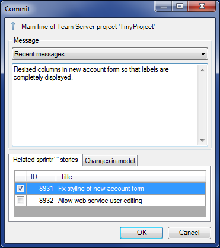

The commit dialog is used for committing changes to the Team Server. You can enter a message and - if applicable - select related sprintr™ stories.

## Message

Enter a message describing the changes you have made. This message may contain multiple lines. If you want to confirm the form by keyboard and you are inside the message box you can use Ctrl+Enter.

## Related sprintr™ stories

Tick the boxes next to the stories that are related to your commit. We recommended small sets of changes and then there is usually just one related story.

## Changes in model

If there are changes in the model this tab page will show a summary of those changes in the form of a grid.

## Changes on disk

If there are changes on disk this tab page will show a summary of those changes in the form of a grid. The tab page will be hidden if there are no disk changes. In the very common case that there are model changes and the only change on disk is the project file (.mpr) it will also be hidden, because it does not add useful information in that case.
