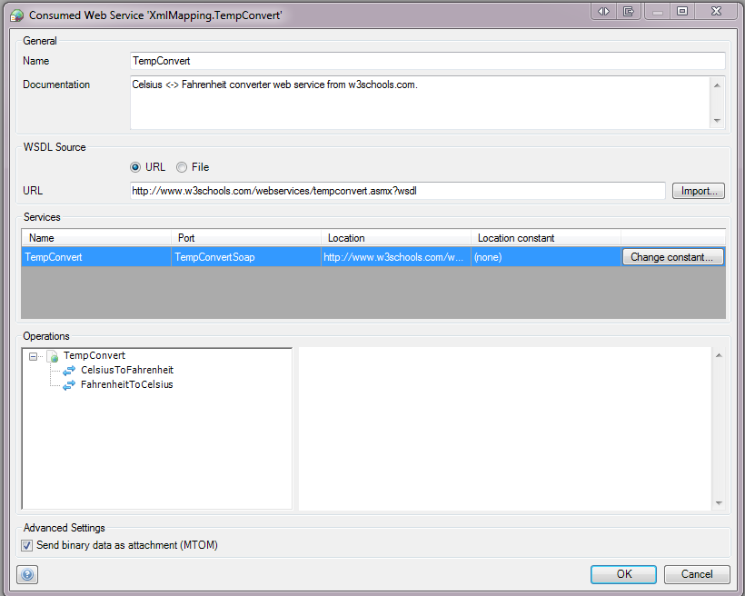

{}

This document describes the properties of an imported web service. If you want a general overview of consumed web services, you can check the [Consumed Web Services](consumed-web-services) overview documentation.

{}

## General

### Name

The name of the imported web service.

### Documentation

The documentation of the imported web service. Here you can describe the purpose of the webservice.

## Web service Description

### WSDL

You can load the WSDL from an URL or from a WSDL file saved on your harddisk. After selecting an option and adding the required url or file location, press import to fetch the services/operations in this WSDL.

{}

Starting from Modeler version 5.9, a dialog will ask for a username and password if you try to load a WSDL file from a URL that requires authentication.

{}{}

A WSDL file can contain multiple services. A service can contain multiple ports. Starting from Modeler version 5.18.0, upon loading a WSDL, a dialog will ask you to select a port for each service if a service contains multiple ports.

{}

### Services

This part contains the services to be found in the WSDL.

*   Name is the name of the service.
*   Location is where the service is located.
*   Location constant can be used to add additional locations for a service, for example: the URL of the soap service may change when moving from a development to a production environment. See also [Constants](constants).

If there is a multiple-port service defined in the WSDL, a dialog will pop up that allows the user to select which one of the ports to use _(Added in 5.10)._

### Operations

This part contains all the operations found in the WSDL. You can expand the list and see additional information about individual operations in the right pane.

### Advanced Settings

{}

**Added in 5.21.4** 

{}

*   Send binary data as attachment (MTOM) - enable or disable MTOM: the _Message Transmission Optimization Mechanism_, a method of efficiently sending binary data to and from Web services. Read more about it at [w3.org. Please note that message optimization will only be applied when you use one or more export mappings to create the request body in the Call web service action.](https://www.w3.org/TR/soap12-mtom/)

# Calling consumed web services

Please refer to the section [Call Web Service](call-web-service).
