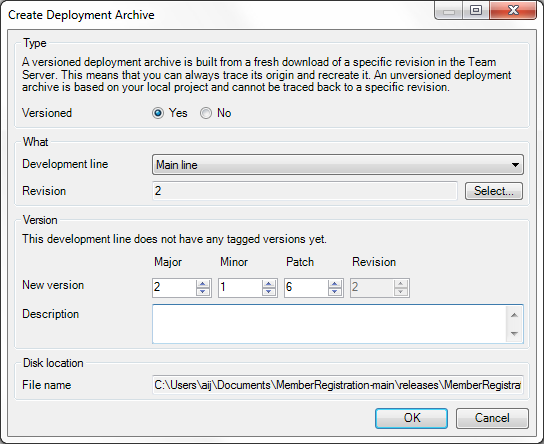

A deployment archive can be deployed on the Cloud Portal or on a server that is configured to run Mendix software. While developing you can deploy and run on your local machine, but once you are ready to deploy your project on a real server you will need to create a deployment archive.

## Versioned

A versioned deployment archive is built from a fresh download of a specific revision in the Team Server. This means that you can always trace its origin and recreate it. An unversioned deployment archive is based on your local project on disk and cannot be traced back to a specific revision. Therefore, we recommend that you create versioned deployment
archives unless you have very good reasons.

## Development line (for 'Versioned')

Choose the development line for which you want to create a deployment archive. This can be the main line or any branch line. For example, you create an archive from a maintenance branch line if your want to put a fix you implemented there online. Or you create a deployment archive from the main line because you are ready to deploy the next big version of your application.

## Revision (for 'Versioned')

Choose the revision of the selected development line for which you want to create a deployment archive. This is not necessarily the latest revision because you might want to exclude some recently developed functionality.

## New version (for 'Versioned')

Choose a version for the deployment archive. The version consists of four numbers: major version, minor version, patch and revision. The revision is fixed and determined by the revision you selected for 'Revision'.

The other numbers are free to choose but it is wise to use a convention for the numbering. Major versions typically contain major new feature or rewrites of existing features. A minor version contains small new features and fixes. A patch solves minor issues and should not change the data model of the application. A patch release should be interchangeable with another patch release with no changes to the data.

The Modeler will show you the latest version that you created an archive for (if any). You can increase major, minor or patch according to the convention you use.

## Description (for 'Versioned')

You can enter a custom description for this deployment archive. It is purely for your own reference so that you can quickly recognize an archive. The Cloud Portal will show you this description along with the version number.

## Disk location

The location where the deployment archive will be placed is shown here. This is not editable. All archives are placed in a directory 'releases' inside your project directory. This directory is automatically ignored so that these archives will not be committed to the repository. You can always recreate a deployment archive (assuming you have the Modeler version you used) so there is no need to put them on the Team Server.
