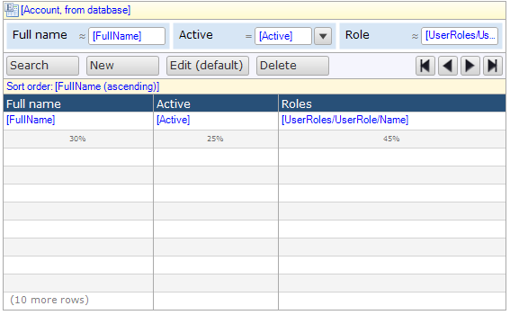

The data grid shows a list of objects in a grid. For example, a data grid can show all the orders a customer has placed. Using controls provided by the data grid you can browse, search and edit those objects.

{}

 A data grid showing accounts.

{}

# Common properties

## Name

The internal name of the widget. You can use this to give sensible names to widgets. The name property also appears in the generated HTML: the widget DOM element automatically includes the class '`mx-name-{NAME}`', which can be useful for [Selenium testing](/howto50/selenium-support).

## Class

The class property allows you to specify a cascading style sheet (CSS) class for the widget. This class will be applied to the widget in the browser and the widget will get the corresponding styling. The class should be a class from the theme that is used in the project. It overrules the default styling of the widget.

{}

Note that the styling is applied in the following order:

1. Default styling defined by the theme the project uses.
2. The 'Class' property of the widget.
3. The 'Style' property of the widget.

{}

## Style

The style property allows you to specify additional CSS styling. If a class is also specified, this styling is applied _after_ the class.

{}

background-color:blue; This will result in a blue background

{}

## Tab index

The tab index influences the order in which the end user navigates through the page using the tab key. By default tab indices are zero and the tab order is determined automatically by the client system. A value of minus one (-1) means that the widget will be skipped when tabbing through the page.

_Default value:_ 0

## General properties

### Show control bar

This property indicates whether the control bar will be visible in the end user interface. The control bar also includes the paging buttons.

{}

Even if the control bar is invisible there can still be a default button that is triggered by (double) clicking a row. See the property 'Default button trigger' and [data grid buttons](control-bar) for more information.

{}

_Default value:_ True

### Show paging buttons

This property indicates with the buttons to page through the information in the grid are visible. Only hide these buttons if you are sure that there will never be more objects than the number of rows of the grid. Note that hiding the control bar also hides the paging buttons.

_Default value:_ True

### Width Unit

{}

In earlier Mendix versions, only percentages where supported.

{}

The width unit specifies the unit of the specified column widths (see property 'Column Widths' below). There are two possible values for the unit:

Value      | Description
---------- | -----------------------------------------------------------------------------------------------------------------------------------------------------------------------------------------------------------------------------------------------------
Percentage | Column widths are expressed as percentages of the available width. When resizing, columns will become wider/narrower while keeping the same relative widths.
Pixels     | Column widths are expressed as pixels. Optionally, some columns can have width 'auto' and those columns evenly divide the rest of the space. When resizing, the pixel width columns will keep the same size; auto columns will become wider/narrower.

_Default value:_ Percentage

### Column Widths

{}

In earlier Mendix versions, only percentages where supported.

{}

The column widths property describes the widths of each of the columns as a list of numbers separated by semi-colons. The unit (see above) determines what these numbers mean: percentages or pixels. In the case of pixels, 'auto' is also a valid value for the width of a column. Auto columns evenly divide space that remains after giving the pixel width columns their desired width.

Examples:

Widths      | Unit       | Description
----------- | ---------- | ---------------------------------------------------------------------------------------------------------------------------------------------------------------
30;70       | Percentage | Two columns of which the first is 30% and the second is 70%
20;200;auto | Pixels     | Three columns of which the first is 20 pixels wide, the second is 200 pixels and the last one is 'auto' which means that it will take up the rest of the space.

{}

 A data grid with widths 200px and auto.

{}

### Number of rows

With this property you can change the number of rows that will be shown in one page. See also the property 'Show empty rows'.

**Default value:** 20

### Show empty rows

If you choose to show empty rows there will always be the grid will always show the same number of rows (see 'Number of rows') even if there are less objects to show on the page.

_Default value:_ False

### Selection mode

The selection mode determines whether and how the user can select items in the grid.

Value                  | Description
---------------------- | ---------------------------------------------------------------------------------------------------------------------------------------------------------------------------------------------------------------
No selection           | The user cannot select items.
Single selection       | The user can select a single item by clicking on it. Clicking another item will make that item the selection.
Multi-selection        | The user can select multiple items by clicking the first one and holding the 'Ctrl' key while clicking on other items. Simply clicking an item will deselect all items and make the clicked item the selection.
Simple multi-selection | The user can select multiple items by simply clicking on them. This was the default multi-selection behavior prior to version 3.1.0.

_Default value:_ Single selection

### Select first

This property indicates whether the first item will be selected initially. This is especially useful if there is a data view listening to this grid.

_Default value:_ False

### Default button trigger

The default button can be triggered by a single or a double click on a row.

Value        | Description
------------ | ---------------------------------------------------------------------------------------------------------------------
Single click | A single click triggers the default button. This cannot be used in combination with allowing the user to select rows.
Double click | A double click triggers the default button.

_Default value:_ Double click

### Refresh time (in seconds)

If the refresh time is non-zero, the data grid will refresh its contents every given number of seconds. For example, a task list could be refreshed every minute so that you know when new tasks arrive. By default the refresh time is zero and this means that the grid will not automatically refresh itself.

_Default value:_ 0

### Tooltip page

A tooltip page is a page that appears when you hover your mouse over a row. The tooltip page should consist of a data view on the same entity as the data grid. Besides creating and connecting a tooltip page you also have to specify on which columns the tooltip will appear. See the property 'Show tooltip' of [data grid columns](columns).

## Data source properties

The data source determines which objects will be shown in the data grid. For general information about data sources, see [Data Sources](data-sources).

### Type

The data grid supports the following types of data sources: [Database Source](database-source), [Association Source](association-source), [Microflow Source](microflow-source). The database source retrieves objects from the database and supports searching and sorting. The association source follows an association from the enclosing data view to get to the objects. Finally, the microflow source calculates the list of objects by executing a microflow.

### Entity (Path) (for data source types "Database" and "Association")

The entity (path) property specifies of which entity instances will be shown in the grid. A top-level grid is always connected to an entity. A nested grid can either be connected to an entity or to an entity path starting in the entity of the containing data view.

{}

Let us say the domain model contains entities Order and OrderLine with a reference from OrderLine to Order. You can then create a data view on Order and inside it a grid on OrderLine that is connected to the entity path OrderLine_Order/OrderLine. This will ensure that the grid will only show order lines of the order in the data view.

{}

### Show search bar (for data source type "Database")

See [Database Source](database-source).

### Wait for search (for data source type "Database")

See [Database Source](database-source).

### XPath constraint (for data source type "Database")

See [Database Source](database-source).

### Apply context (for data source type "Database")

See [Database Source](database-source).

### Remove from context (for data source type "Database")

See [Database Source](database-source).

### Microflow (for data source type "Microflow")

The microflow property specifies a microflow is executed when the grid is opened. The microflow returns the objects that will be shown in the data grid.

### Microflow settings (for data source type "Microflow")

The microflow settings specify which parameters to pass to the microflow. See [Starting Microflows](starting-microflows).

## Visibility properties

{} Conditional visibility settings were added to the data grid in version 5.10.0. {}

### Visible

By default, whether or not an element is displayed in the browser is determined by how the page is designed and the user's roles within the application. However, the page can be configured to hide the element unless a certain condition is met.

## Attribute Condition

### Attribute

When checked, this setting hides the widget unless a particular attribute has a certain value. Only boolean and enumeration attributes can be assigned to this purpose.

A practical example would be a web shop in which the user must submit both billing and delivery information. In this case you might not wish to bother the user with a second set of address input fields unless he or she indicates that the billing and delivery address are not the same. You can accomplish this by making the delivery address fields conditionally visible based on the boolean attribute SameBillingAndDeliveryAddress.

### Module roles

The widget can be made visible to a subset of the user roles available in your application. When activated, this setting will render the widget invisible to all users that are not linked to one of the selected user roles. Please note that this does not override project security. Any restrictions due to microflow, form, or entity access will remain in effect.

# Components

## Columns

### Common Properties

### Class

The class property allows you to specify a cascading style sheet (CSS) class for the widget. This class will be applied to the widget in the browser and the widget will get the corresponding styling. The class should be a class from the theme that is used in the project. It overrules the default styling of the widget.

{}

Note that the styling is applied in the following order:

1. Default styling defined by the theme the project uses.
2. The 'Class' property of the widget.
3. The 'Style' property of the widget.

{}

### Style

The style property allows you to specify additional CSS styling. If a class is also specified, this styling is applied _after_ the class.

{}

background-color:blue; This will result in a blue background

{}

### Data Source Properties

#### Attribute (path)

The attribute (path) property specifies the attribute's value that will be displayed in this column. It can be an attribute of the grid entity, or it can be an attribute of an associated entity, in which case we speak of an attribute path. The path can follow multiple associations of type reference, and at the end (optionally) one of type reference set. If you show a reference set in a column the values will be separated by a comma.

### Formatting Properties

#### Enumeration format (only for attributes of type Enumeration)

A column connected to an attribute of type enumeration can show its contexts as text (default) or as image.

Value | Description
----- | -----------------------------------------
Text  | Show the caption text of the enumeration.
Image | Show the image of the enumeration value.

#### Decimal precision (only for numeric attributes)

The precision of a value is defined the number of digits that is used to express that value. This property indicates the number of decimal places (the number of digits following the decimal point).

_Default value:_ 2

#### Group digits (only for numeric attributes)

For ease of reading, numbers with many digits before the decimal separator may be divided into groups using a delimiter. This property defines whether the end user will see these groups, or not.

_Default value:_ False

#### Date format (only for attributes of type DateTime)

The date format determines whether the date part, the time part or both are shown. How the date and time parts are formatted depends on the localization of the user using the application.

Possible values: 'Date', 'Time', 'Date and time' and 'Custom'.

_Default value:_ Date

If you choose 'Custom' as the date format (see above) the custom date format determines the way date and/or time are formatted. The custom date format is a string that follows the rules in this table,

Symbol | No.  | Example   | Description
------ | ---- | --------- | ---------------------------------------
G      | 1    | AD        | Era
y      | 1..n | 2010      | Year
M      | 1..2 | 09        | Month
M      | 3    | Sept
M      | 4    | September
w      | 1..2 | 27        | Week of Year
D      | 1..3 | 93        | Day of Year
a      | 1    | AM        | AM or PM
h      | 1..2 | 11        | Hour (1-12)
H      | 1..2 | 13        | Hour (0-23)
k      | 1..2 | 10        | Hour (1-24)
K      | 1..2 | 0         | Hour (0-11)
m      | 1..2 | 59        | Minute, use one or two for zero padding
s      | 1..2 | 12        | Second, use one or two for zero padding

{}

Format                           | Example output
-------------------------------- | -------------------------------------
`EEEE d MMMM yyy G, h:mm a ss's` | Tuesday 29 March 2011 AD, 1:37 PM 48s
`h:mm a`                         | 1:37 PM
`yyy D KK:mm`                    | 2011 88 01:26
`EEEE MMMM d yyy`                | Tuesday March 29 2011
`EEE, MMM d, ''yy`               | Wed, Jul 4, '01

 {}

### General Properties

#### Caption

The caption of a column is the text that appears as a header above the rows. This is a translatable text. See [Translatable Texts](translatable-texts).

#### Editable

The editable property indicates whether the values of the column will be editable in-line, i.e. without opening a page with a data view. In-line editing allows the data grid to behave like you would expect from a spreadsheet application.

#### Aggregate function

The values in a column can be aggregated in several ways. The aggregate function determines the way in which the values are aggregated. The aggregate will be shown at the bottom of the column that precedes by the aggregate caption (see below).

Value   | Description
------- | ------------------------------------------
None    | Do not aggregate the values in the column.
Average | Show the average of the values.
Minimum | Show the smallest value.
Maximum | Show the largest value.
Sum     | Show the sum of the values.
Count   | Show the count of the values.

{}

Note that all objects will be taken into account, and not just the ones on the current page.

{}

#### Aggregate caption

The aggregate caption is the text that appears in front of the computed value. This is a translatable text. See [Translatable Texts](translatable-texts).

{}

'Total' could be an aggregate caption for a column that shows the sum of the values.

{}

#### Show tooltip

This property determines whether the tooltip page is shown as the mouse is hovered over this column. The tooltip page can be configured on the data grid.

_Default value:_ False

## Control bar

The control bar of the template grid, data grid, and reference set selector allows you to manipulate the objects displayed by means of buttons. By default, both grids will be created with a new, edit, and delete button in the control bar. The control bar can also include a number of selection options and spreadsheet export buttons, as well as microflow buttons for custom actions.

See [Control Bar](control-bar).

## Search bar (for data source type "Database")

The search bar contains search fields that allow the end-user to quickly find the information he or she needs.

See [Search Bar](search-bar).

## Sort bar (for data source type "Database")

The sort bar contains a number of sort items. Each sort item specifies what attribute to sort on and in what direction (ascending or descending). First the contents of the grid will be sorted on the first item; if two rows are the same with respect to this sort item the second item will be used et cetera. For example, if you have sort items for name and age and two people have the same name they will be sorted on their age.

See [Sort Bar](sort-bar).
