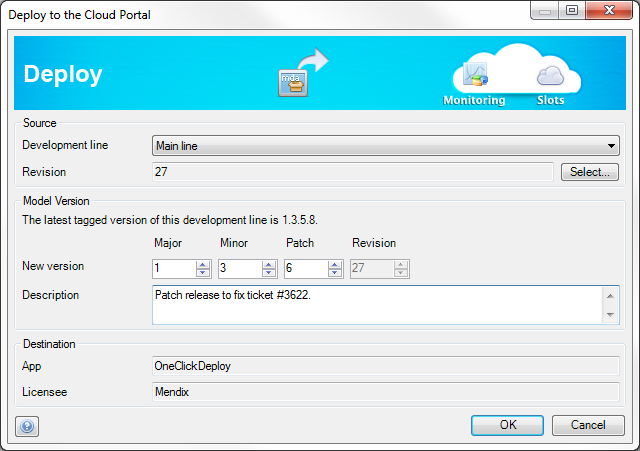

Use this dialog to create a versioned deployment archive and upload it to your app on the Cloud Portal.

## Development line

Choose the development line for which you want to create a deployment archive. This can be the main line or any branch line. For example, you create an archive from a maintenance branch line if your want to put a fix you implemented there online. Or you create a deployment archive from the main line because you are ready to deploy the next big version of your application.

## Revision

Choose the revision of the selected development line for which you want to create a deployment archive. This is not necessarily the latest revision because you might want to exclude some recently developed functionality.

## New version

Choose a version for the deployment archive. The version consists of four numbers: major version, minor version, patch and revision. The revision is fixed and determined by the revision you selected for 'Revision'.

The other numbers are free to choose but it is wise to use a convention for the numbering. Major versions typically contain major new feature or rewrites of existing features. A minor version contains small new features and fixes. A patch solves minor issues and should not change the data model of the application. A patch release should be interchangeable with another patch release with no changes to the data.

The Modeler will show you the latest version that you created an archive for (if any). You can increase major, minor or patch according to the convention you use.

## Description

You can enter a custom description for this deployment archive. It is purely for your own reference so that you can quickly recognize an archive. The Cloud Portal will show you this description along with the version number.

## Destination

This shows the app on the Cloud Portal where the deployment archive will end up.
