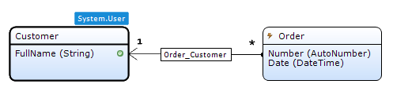
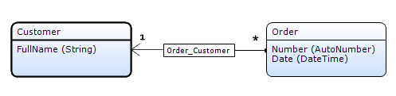

The domain model is a data model that describes the information in your application domain in an abstract way. It is central to the architecture of your application. The domain model consists of [entities](entities) and their relations represented by [associations](associations).

{}

Here is a domain model that defines customers and orders. The line between them is an association. The words 'Customer' and 'Order' are the names of the entities. The words below the entity names are the attributes of the entities.

{}

## Components

### Entities

See [entities](entities).

### Associations

See [associations](associations).

## Technical Appendix

In the database every entity is stored in one separate table and has columns for the attributes defined in the Modeler, the system attributes and a unique identifier for the object. If an entity has specializations there is also a column indicating which specialization the object belongs to. An association is stored in a cross-table with the identifiers (ID) of both objects.

Take a look at the following domain model.

The entity 'Customer' is stored in the table 'module$customer' which is shown below. Take note of the 'system$owner' and 'system$changedby' columns which contain the IDs of the 'User' objects from the 'System' module.

<table><thead><tr><th class="confluenceTh">id</th><th class="confluenceTh">createddate</th><th class="confluenceTh">changeddate</th><th class="confluenceTh">system$owner</th><th class="confluenceTh">system$changedby</th><th class="confluenceTh">fullname</th></tr></thead><tbody><tr><td class="confluenceTd">1</td><td class="confluenceTd">2006-10-24 08:10:45.053</td><td class="confluenceTd">2009-11-27 09:56:45.099</td><td class="confluenceTd">66</td><td class="confluenceTd">29</td><td class="confluenceTd">Steve Jobs</td></tr><tr><td class="confluenceTd">3</td><td class="confluenceTd">2007-09-30 09:56:45.099</td><td class="confluenceTd">2008-04-01 08:10:45.053</td><td class="confluenceTd">66</td><td class="confluenceTd">34</td><td class="confluenceTd">Bill Gates</td></tr></tbody></table>

The association 'Order_Customer' is stored in the table 'module$order_customer' which is shown below. Both columns contain IDs of the associated objects.

<table><thead><tr><th class="confluenceTh">module$orderid</th><th class="confluenceTh">module$customerid</th></tr></thead><tbody><tr><td class="confluenceTd">8</td><td class="confluenceTd">1</td></tr><tr><td class="confluenceTd">5</td><td class="confluenceTd">3</td></tr></tbody></table>

The entity 'Order' is stored in the table 'module$order' which is shown below. It is similar to the table of the entity 'Customer'. However all system attributes have been disabled and are not stored in the table.

<table><thead><tr><th class="confluenceTh">id</th><th class="confluenceTh">number</th><th class="confluenceTh">date</th></tr></thead><tbody><tr><td class="confluenceTd">5</td><td class="confluenceTd">5</td><td class="confluenceTd">2009-11-27 09:56:45.099</td></tr><tr><td class="confluenceTd">8</td><td class="confluenceTd">8</td><td class="confluenceTd">2008-04-01 08:10:45.053</td></tr></tbody></table>
