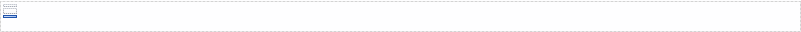

When enabled, the footer will be inserted at the bottom of every page. Other widgets can be put in the footer.

For inserting page numbers, see [Static Label](static-label-document-template)

{}

A footer

{}

## Appearance

### BottomMargin

The amount of space between the bottom of the page and the footer in inches.
