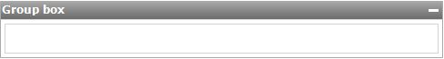

A group box can be used to visually group related widgets together. Group boxes are displayed as a frame around nested widgets with an optional header. Group boxes can be configured to collapse and expand dynamically.

{}

An empty group box.

{}

## Common properties

### Name

The internal name of the widget. You can use this to give sensible names to widgets. The name property also appears in the generated HTML: the widget DOM element automatically includes the class '`mx-name-{NAME}`', which can be useful for [Selenium testing](/howto50/selenium-support).

### Class

The class property allows you to specify a cascading style sheet (CSS) class for the widget. This class will be applied to the widget in the browser and the widget will get the corresponding styling. The class should be a class from the theme that is used in the project. It overrules the default styling of the widget.

{}

Note that the styling is applied in the following order:

1.  Default styling defined by the theme the project uses.
2.  The 'Class' property of the widget.
3.  The 'Style' property of the widget.

{}

### Style

The style property allows you to specify additional CSS styling. If a class is also specified, this styling is applied _after_ the class.

{}

background-color:blue;
This will result in a blue background

{}

## General properties

### Show header

Toggle whether a header is shown above the group box.

_Default value:_ True

### Caption

The text of the header. This property is only applicable if the header is visible.

_Default value:_ Group box

### Collapsible

This property specifies whether the group box can be collapsed by clicking the header and if so, whether it starts collapsed or expanded. This property is only applicable if the header is visible.

_Default value:_ Yes (start expanded)

## Visibility properties

{}
Conditional visibility settings were added in version 5.10.0.
{}

### Visible

By default, whether or not an element is displayed in the browser is determined by how the page is designed and the user's roles within the application. However, the page can be configured to hide the element unless a certain condition is met. 

## Attribute Condition

### Attribute

When checked, this setting hides the widget unless a particular attribute has a certain value. Only boolean and enumeration attributes can be assigned to this purpose.

A practical example would be a web shop in which the user must submit both billing and delivery information. In this case you might not wish to bother the user with a second set of address input fields unless he or she indicates that the billing and delivery address are not the same. You can accomplish this by making the delivery address fields conditionally visible based on the boolean attribute SameBillingAndDeliveryAddress.

### Module roles

The widget can be made visible to a subset of the user roles available in your application. When activated, this setting will render the widget invisible to all users that are not linked to one of the selected user roles. Please note that this does not override project security. Any restrictions due to microflow, form, or entity access will remain in effect.
