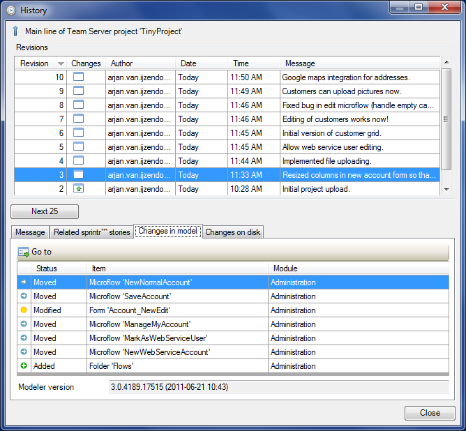

Use this dialog to look at all the changes that have been committed to a development line of a project. The form is also used when selecting a revision: to merge from, to create a branch line of or to create a deployment archive of.

## Revisions

Each line in the grid represents a revision in the repository. For each revision the following information is shown:

*   Revision number. The number of the revision in the repository. Revision numbers do not have to be consecutive if there is also activity in other development lines. Revision numbers are unique for a whole repository.
*   Changes. A visual summary of the changes in the selected revision. It shows whether there are model changes, disk changes and whether there was a change in the Modeler version that was used to commit the revision (green arrow up). Hover over this column to get a textual summary.
*   Author. The person who committed this revision.
*   Date. The date of the commit.
*   Time. The time of the commit.
*   Message. The user entered message of the commit. If the message is long, you can more easily read it in the Message tab page below.

By selecting a revision in this grid, the tab pages below it will be filled with information about this revision.

## Message

This tab page shows the message the the Modeler user entered when he or she committed these changes.

## Related sprintr™ stories

This tab page shows a list of sprintr™ stories that are related to the changes.

## Changes in model

This tab page shows a list of documents that were changed in the selected revision. From here you can quickly jump to the changed documents, assuming they still exist in the current version. The Modeler version that was used to commit the revision is also shown.

## Changes on disk

This tab page shows a list of the files that were changed on disk. You see whether files were added, deleted or modified.
