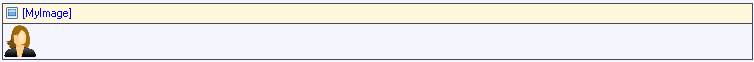

An image viewer can be used to display an image or its thumbnail.

{}

This image viewer shows the product image.

{}

An image viewer must be placed in a data view or template grid.

## Common properties

### Name

The internal name of the widget. You can use this to give sensible names to widgets. The name property also appears in the generated HTML: the widget DOM element automatically includes the class '`mx-name-{NAME}`', which can be useful for [Selenium testing](/howto50/selenium-support).

### Class

The class property allows you to specify a cascading style sheet (CSS) class for the widget. This class will be applied to the widget in the browser and the widget will get the corresponding styling. The class should be a class from the theme that is used in the project. It overrules the default styling of the widget.

{}

Note that the styling is applied in the following order:

1.  Default styling defined by the theme the project uses.
2.  The 'Class' property of the widget.
3.  The 'Style' property of the widget.

{}

### Style

The style property allows you to specify additional CSS styling. If a class is also specified, this styling is applied _after_ the class.

{}

background-color:blue;
This will result in a blue background

{}

## Data source properties

### Entity (path)

The entity (path) property specifies which entity will be shown in the image viewer. It starts in the data view entity and must end in System.Image or a specialization thereof. If the data view entity itself is (a specialization of) System.Image you can use this entity on the image viewer as well.

## Events

### On click

This property specifies what happens when the image is clicked:

<table><thead><tr><th class="confluenceTh">Value</th><th class="confluenceTh">Meaning</th></tr></thead><tbody><tr><td class="confluenceTd">Do nothing</td><td class="confluenceTd">Nothing happens.</td></tr><tr><td class="confluenceTd">Call microflow</td><td class="confluenceTd">The specified microflow is executed.</td></tr><tr><td class="confluenceTd">Enlarge</td><td class="confluenceTd">The image is shown at full size.</td></tr></tbody></table>

_Default value:_ Do nothing

### Microflow (in the case 'Call microflow')

This property specifies the microflow that will be executed when the image is clicked.

### Microflow settings (in the case 'Call microflow')

The on click settings specify what parameters will be passed to the microflow, whether to show a progress bar or not, and more.

See [Starting Microflows](starting-microflows).

## General properties

### Default image

This is the image that is displayed if no image is uploaded.

### Width Unit

{}

Added in Mendix 5.18\. Before, the only option was to specify the width in pixels where zero (0) meant auto.

{}

The width of an image can be specified in three ways: pixels, percentage or auto. 

<table><thead><tr><th class="confluenceTh">Value</th><th class="confluenceTh">Definition</th></tr></thead><tbody><tr><td class="confluenceTd">Pixels</td><td class="confluenceTd">The width is specified in a number of pixels. If you specify both width and height, the image will be scaled proportionally in the rectangle you define.</td></tr><tr><td class="confluenceTd">Percentage</td><td class="confluenceTd">The width is specified in a percentage of the container of the image. It can be larger than its original width in which case the image is stretched.</td></tr><tr><td class="confluenceTd">Auto</td><td class="confluenceTd">The width of the given image is used.</td></tr></tbody></table>

_Default value_: Percentage

### Width

The width of the image in pixels or percentage (see width unit). In the case of 'Auto', no value needs to be specified.

_Default value_: 100

### Height Unit

{}

Added in Mendix 5.18\. Before, the only option was to specify the width in pixels where zero (0) meant auto.

{}

The height of an image can be specified in three ways: pixels, percentage or auto. 

<table><thead><tr><th class="confluenceTh">Value</th><th class="confluenceTh">Definition</th></tr></thead><tbody><tr><td class="confluenceTd">Pixels</td><td class="confluenceTd">The height is specified in a number of pixels. If you specify both width and height, the image will be scaled proportionally in the rectangle you define.</td></tr><tr><td class="confluenceTd">Percentage</td><td class="confluenceTd">The height is specified in a percentage of the container of the image. It can be larger than its original height in which case the image is stretched.</td></tr><tr><td class="confluenceTd">Auto</td><td class="confluenceTd">The height of the given image is used.</td></tr></tbody></table>

_Default value_: Auto

### Height

The height of the image in pixels or percentage (see height unit). In the case of 'Auto', no value needs to be specified.

_Default value_: not applicable

### Responsive

This property influences how the image scales. If the value is 'Yes', the image wil never get bigger than its original size. It can become smaller. If the value is 'No', the image can become both larger and smaller than its original size.

_Default value:_ Yes

### Show

This property indicates whether the generated thumbnail is shown or the full image.

_Default value:_ Thumbnail

## Visibility properties

{}
Conditional visibility settings were added in version 5.10.0.
{}

### Visible

By default, whether or not an element is displayed in the browser is determined by how the page is designed and the user's roles within the application. However, the page can be configured to hide the element unless a certain condition is met. 

## Attribute Condition

### Attribute

When checked, this setting hides the widget unless a particular attribute has a certain value. Only boolean and enumeration attributes can be assigned to this purpose.

A practical example would be a web shop in which the user must submit both billing and delivery information. In this case you might not wish to bother the user with a second set of address input fields unless he or she indicates that the billing and delivery address are not the same. You can accomplish this by making the delivery address fields conditionally visible based on the boolean attribute SameBillingAndDeliveryAddress.

### Module roles

The widget can be made visible to a subset of the user roles available in your application. When activated, this setting will render the widget invisible to all users that are not linked to one of the selected user roles. Please note that this does not override project security. Any restrictions due to microflow, form, or entity access will remain in effect.

## Related articles

*   [Data view](data-view)
*   [Entities](entities)
