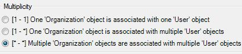
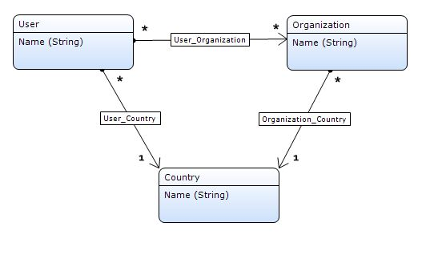
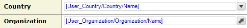

The input reference set selector is an [input widget](input-widgets) that can be used to display and edit [associations](associations) for which the multiplicity setting is configured to allow multiple parent objects to associate with multiple children. This type of association is also known as a reference set.

{}

The multiplicity settings of an association can be found by double-clicking the association in the [domain model](domain-model).

{}{}

This input reference set selector allows you to link a user to organizations.

{}

When clicked, the input reference set selector will open a select page containing a widget with all possible objects that can be used to fill the association.

## General properties

### Select page

The select page determines which page is displayed when the input reference selector is clicked. This page can be used to select associated objects from the list of all possible objects. This page should contain a data grid, template grid or list view connected to the same entity as the input reference set selector.

If an input reference set selector is not editable under any circumstances, no select page is required.

See [Opening Pages](opening-pages). Note that opening select pages in content is prohibited.

{}

You can generate a new page to show by right-clicking the widget and selecting 'Generate select page...'.

{}

## Selectable objects properties

### XPath constraint

With the XPath constraint you can add a manual constraint to limit the list of objects that can be selected. This XPath constraint will be added to the constraints that are generated by the [context mechanism](context-mechanism).

{}

The XPath constraint `[InStock = true()]` on a reference selector for products will ensure that only products that are in stock are selectable.

{}

### Constrained by

An input reference set selector can be constrained by one or more paths. This is typically used to make one reference selector dependent on another. For example, in page where you can edit a user, an organization selector can be constrained by a country selector. After selecting a country, the organization selector is constrained by this country and shows only organizations linked to that country.

{}

In the domain model the user has a reference association to country and a reference set association to organization. The third association, from country to organization, describes the relation between those two entities. Such a 'triangle' shaped part of the domain model is what makes constraining possible.

The page has displays a reference selector for the reference to country and an input reference set selector for the reference set to organization. The latter is constrained by the path through the domain model that forms the triangle.

{}

## Data source properties

### Attribute (path)

Many input widgets, like text boxes and drop-down widgets, can be connected to:

1.  an attribute of the entity of the data view that contains the widget
2.  an attribute of an entity associated with the data view entity by following one or more associations of type reference through the domain model.

In the first case we say the widget is connected to an attribute and in the second case to an attribute path.

{}

An input widget connected to an attribute _path_ must be read-only. The Modeler will check this for you.

{}

## Label properties

{}

Added in Mendix 5.18.0

{}

A label can be used to described the purpose of the widget to the user. The label is shown next to the widget in the user interface. If a label is configured, the widget will be rendered in the browser wrapped in a form group. See [Bootstrap documentation](http://getbootstrap.com#forms).

### Show label

This property determines whether the label is rendered and the widget is wrapped in a form group.

_Default value:_ No

### Label caption

This property is shown only when Show label is Yes. This property determines what text is rendered within a label.

## Editability properties

### Editable

The editable property indicates whether the end user will be able to change the value displayed by the widget.

<table><thead><tr><th class="confluenceTh">Value</th><th class="confluenceTh">Description</th></tr></thead><tbody><tr><td class="confluenceTd">Default</td><td class="confluenceTd">The value is editable if security allows it (i.e. if the user that is signed in has write rights to the selected attribute). </td></tr><tr><td class="confluenceTd">Never </td><td class="confluenceTd">The value is never editable. </td></tr><tr><td class="confluenceTd">Conditional </td><td class="confluenceTd">The value is editable if security allows it and the specified condition holds. (see below) </td></tr></tbody></table>

_Default value:_ Default

### Condition

A widget can be made editable based on the value of an attribute of the enclosing data view. The attribute must be of type boolean or enumeration. For each value, you specify whether the widget is editable. Upon entering the page and upon changing the condition attribute the edit state of the widget will be updated.

Example: you don't have to ask for the marriage date if the end user indicates that he or she is not married.

## Visibility properties

{}
Added in Mendix 5.10.0.
{}

### Visible

By default, whether or not an element is displayed in the browser is determined by how the page is designed and the user's roles within the application. However, the page can be configured to hide the element unless a certain condition is met. 

## Attribute Condition

### Attribute

When checked, this setting hides the widget unless a particular attribute has a certain value. Only boolean and enumeration attributes can be assigned to this purpose.

A practical example would be a web shop in which the user must submit both billing and delivery information. In this case you might not wish to bother the user with a second set of address input fields unless he or she indicates that the billing and delivery address are not the same. You can accomplish this by making the delivery address fields conditionally visible based on the boolean attribute SameBillingAndDeliveryAddress.

### Module roles

The widget can be made visible to a subset of the user roles available in your application. When activated, this setting will render the widget invisible to all users that are not linked to one of the selected user roles. Please note that this does not override project security. Any restrictions due to microflow, form, or entity access will remain in effect.

## Events properties

### On change

The on-change property optionally specifies a microflow that will be executed when leaving the widget after the value has been changed.

### On change settings

The on change settings specify what parameters are passed to the microflow, whether a progress bar is shown and more.

See [Starting Microflows](starting-microflows).

## Common properties

### Name

The internal name of the widget. You can use this to give sensible names to widgets. The name property also appears in the generated HTML: the widget DOM element automatically includes the class '`mx-name-{NAME}`', which can be useful for [Selenium testing](/howto50/selenium-support).

### Class

The class property allows you to specify a cascading style sheet (CSS) class for the widget. This class will be applied to the widget in the browser and the widget will get the corresponding styling. The class should be a class from the theme that is used in the project. It overrules the default styling of the widget.

{}

Note that the styling is applied in the following order:

1.  Default styling defined by the theme the project uses.
2.  The 'Class' property of the widget.
3.  The 'Style' property of the widget.

{}

### Style

The style property allows you to specify additional CSS styling. If a class is also specified, this styling is applied _after_ the class.

{}

background-color:blue;
This will result in a blue background

{}

### Tab index

The tab index influences the order in which the end user navigates through the page using the tab key. By default tab indices are zero and the tab order is determined automatically by the client system. A value of minus one (-1) means that the widget will be skipped when tabbing through the page.

_Default value:_ 0

## Related articles

*   [Data view](data-view)
