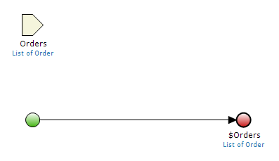
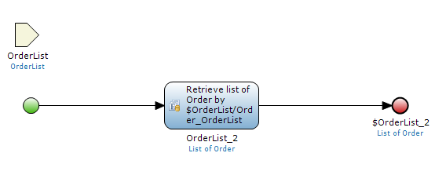
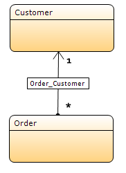

In Mendix 5.4.0, a major improvement has been made in app services: now the complete domain model is transferred from the provider to the consumer. As a consequence, parameters of type List in published microflows are handled differently than in the previous release.
In previous releases, when you published an app service that contained a microflow with a List of _Entity_ input parameter, on the consuming side your domain model would contain a "wrapper" entity with a one-to-many relationship to the _Entity_. _microflow with a List input parameter_

With this release, a 1 on 1 copy of the domain model is made. Therefore, this wrapper entity is no longer generated. This is why the Mendix Modeler version 5.4.0 will prevent you from publishing an app service with an action that has a List input.

_Domain model with a wrapper entity for the Order_

### How to handle cases like these

The suggested way to deal with these situations is to manually create an entity with a one-to-many relationship to the entity you want to pass a list of. For example, if you have a list of Orders belonging to a OrderList, you can pass the OrderList entity which will take references to its orders with it.

_Retrieve the order list from the wrapper object via association_

### Existing domain models

In many cases, you will already have a domain model in which an entity exists that is associated with the entity that you want to use as input. For example, a _Customer_ might be associated with _Order_:
_A domain model with an existing associated entity to Order._

In this situation, it is sufficient to pass the Customer entity in a similar fashion to the OrderList example above. You do not need to create a special entity especially for the purpose of passing a list of objects to an app service microflow.
