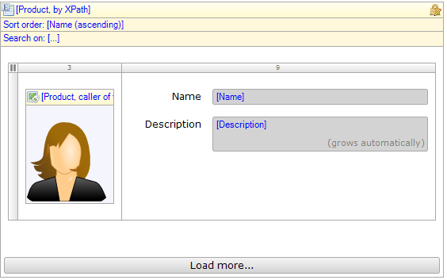

The list view is similar to the template grid. The list view shows a list of objects arranged vertically. Each object is shown using a template. During development, the object template is defined by placing a widget inside the list view's dropzone. The list of objects shown is determined by a datasource.

{}

A read-only list view showing all available products.

{}

## Common properties

### Name

The internal name of the widget. You can use this to give sensible names to widgets. The name property also appears in the generated HTML: the widget DOM element automatically includes the class '`mx-name-{NAME}`', which can be useful for [Selenium testing](/howto50/selenium-support).

### Class

The class property allows you to specify a cascading style sheet (CSS) class for the widget. This class will be applied to the widget in the browser and the widget will get the corresponding styling. The class should be a class from the theme that is used in the project. It overrules the default styling of the widget.

{}

Note that the styling is applied in the following order:

1.  Default styling defined by the theme the project uses.
2.  The 'Class' property of the widget.
3.  The 'Style' property of the widget.

{}

### Style

The style property allows you to specify additional CSS styling. If a class is also specified, this styling is applied _after_ the class.

{}

background-color:blue;
This will result in a blue background

{}

## General properties

### Editable

If this property is set to 'Yes', items in the list view can be edited. The changes made to list view items can be saved with a save button and reverted with a cancel button. Searching and paging are disabled to avoid confusion about what changes are saved or reverted.

### Click action

The click action defines what action is performed when a list view entry is 'clicked'. This can either be opening a page or calling a microflow. For opening a page see [Opening Pages](opening-pages) and for the microflow settings see [Starting Microflows](starting-microflows). The list view has no Confirmation or Advanced microflow settings.

### Page size

With this property you can change the number of containers that will be shown in one page. You cannot set this property when the list view is editable.

## Data source properties

The data source determines which objects will be shown in the list view. For general information about data sources, see [Data Sources](data-sources).

### Type

The list view supports the following types of data sources: Database Source, Association Source, Microflow Source. The database source retrieves objects from the database and supports searching and sorting. The association source follows an association from the enclosing data view to get to the objects. Finally, the microflow source calculates the list of objects by executing a microflow.

### Entity (Path) (for data source types "Database" and "Association")

The entity (path) property specifies of which entity instances will be shown in the list view. A top-level list view is always connected to an entity. A nested list view can either be connected to an entity or to an entity path starting in the entity of the containing data view.

{}

Let us say the domain model contains entities Order and OrderLine with a reference from OrderLine to Order. You can then create a data view on Order and inside it a grid on OrderLine that is connected to the entity path OrderLine_Order/OrderLine. This will ensure that the grid will only show order lines of the order in the data view.

{}

### XPath constraint (for data source type "Database")

See [Database Source](database-source).

### Microflow (for data source type "Microflow")

The microflow property specifies a microflow is executed when the list view is opened. The microflow returns the objects that will be shown in the list view.

### Microflow settings (for data source type "Microflow")

The microflow settings specify which parameters to pass to the microflow. See [Starting Microflows](starting-microflows).

## Templates properties

### Templates

If the entity that is connected to the list view has specializations, you can optionally specify templates for each specialization. For each row in the list view the most specific template is shown. The different templates can be selected by clicking the extra header that appears when a specialization template is added.

{}

Let us say you have an entity Vehicle and two specializations thereof: Bicycle and Car. And there is a specialization of Car called SportsCar. You create a list view that is connected to Vehicle. With the templates property of the list view you specify what template to show for arbitrary Vehicles. For the specializations Bicycle and Car you create separate templates to show them.

Now if there is a row of type Bicycle the template specific for bicycles will be shown. A row of type Car will be shown in the template for Car. A row of type SportsCar is shown in the template for Car. There is no template specific for sports cars (in this example) and Car is the 'closest' generalization for which there is a template.

{}

## Visibility properties

{}
Conditional visibility settings were added in version 5.10.0.
{}

### Visible

By default, whether or not an element is displayed in the browser is determined by how the page is designed and the user's roles within the application. However, the page can be configured to hide the element unless a certain condition is met. 

## Attribute Condition

### Attribute

When checked, this setting hides the widget unless a particular attribute has a certain value. Only boolean and enumeration attributes can be assigned to this purpose.

A practical example would be a web shop in which the user must submit both billing and delivery information. In this case you might not wish to bother the user with a second set of address input fields unless he or she indicates that the billing and delivery address are not the same. You can accomplish this by making the delivery address fields conditionally visible based on the boolean attribute SameBillingAndDeliveryAddress.

### Module roles

The widget can be made visible to a subset of the user roles available in your application. When activated, this setting will render the widget invisible to all users that are not linked to one of the selected user roles. Please note that this does not override project security. Any restrictions due to microflow, form, or entity access will remain in effect.
