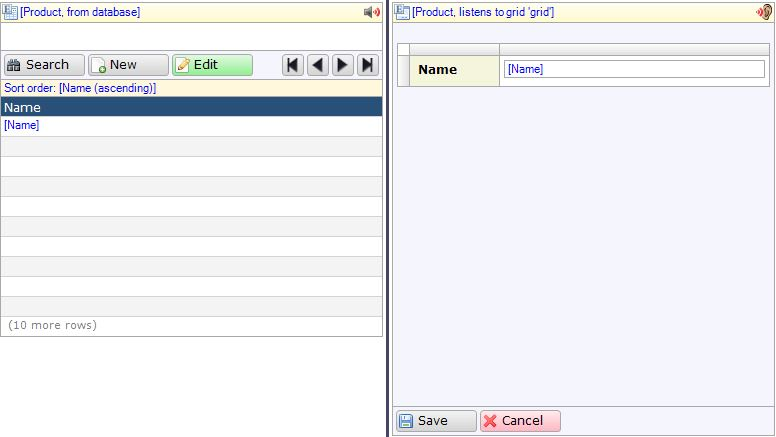

The listen to grid data source allows a data view to display detailed information on an object selected from a grid on the same page. This is especially useful when displaying large amounts of data, which limits the information available per object, as it allows the user to view details concerning individual objects without having to open a new page.

{}

The data view on the right listens to the data grid on the left. In this example, the listening view will display the image attached to the selected product if one is selected.

{}

Both template and data grids can be selected as a listen target.

If no object is selected in the listen target the data view will remain empty and unresponsive.

## Properties

### Listen target

Designates the grid from which the view derives its data. Grids are listed by their name property.
