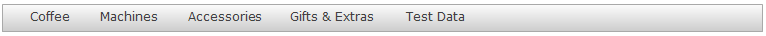

The menu bar widget shows a configured menu in the form of a horizontal bar with items. Items can have subitems in which case the main item can be expanded. Subitems cannot have subitems again. In the end a [Menu Item](menu-item) points to either the page or the microflow that will opened or started when the item is clicked.

{}

{}

## Common Properties

### Name

The internal name of the widget. You can use this to give sensible names to widgets. The name property also appears in the generated HTML: the widget DOM element automatically includes the class '`mx-name-{NAME}`', which can be useful for [Selenium testing](/howto50/selenium-support).

### Class

The class property allows you to specify a cascading style sheet (CSS) class for the widget. This class will be applied to the widget in the browser and the widget will get the corresponding styling. The class should be a class from the theme that is used in the project. It overrules the default styling of the widget.

{}

Note that the styling is applied in the following order:

1.  Default styling defined by the theme the project uses.
2.  The 'Class' property of the widget.
3.  The 'Style' property of the widget.

{}

### Style

The style property allows you to specify additional CSS styling. If a class is also specified, this styling is applied _after_ the class.

{}

background-color:blue;
This will result in a blue background

{}

## General Properties

### Menu source

The items that are shown in the menu widget are determined by the menu source. A menu widget is either filled from a menu configured in the [Navigation](navigation) document or a [Menu](menu) document.

Value              | Description
------------------ | ------------------------------------------------------------------------------------------------------------------------------------
Project Navigation | The menu items are taken from one of the menus defined in the <Navigation> document. Use this for the main menu of your application.
Menu Document      | The menu items are taken from a <Menu> document. Use menu documents for auxiliary menus.

_Default value:_ Project navigation

### Menu (only for menu source 'Project navigation')

If the menu source is 'Project navigation', this property specify which of the three menus that can be configured in the [Navigation](navigation) document will be used to fill the menu widget.

Value   | Description
------- | ----------------------
Desktop | Use the 'Desktop' menu
Tablet  | Use the 'Tablet' menu
Phone   | Use the 'Phone' menu

_Default value:_ Desktop

### Menu document (only for menu source 'Menu document')

If the menu source is 'Menu document', you can select a [Menu](menu) document that will be used to fill the menu widget.
