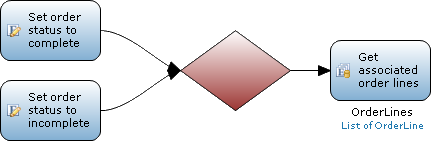

A merge can be used to combine multiple sequence flows into one sequence flow. Imagine a situation where the microflow has been separated in the part preceding the merge to execute specific actions. After this the same action needs to be executed for all the separated flows. In this situation a merge can be used to avoid redundancy.

{}

You have a situation where the microflow has been separated in two flows according to certain conditions. In one flow the status of the order is set to complete and in the other the status is set to incomplete. After this you want to retrieve all associated order lines (to for instance aggregate the prices into a total) for the two flows. You can use a merge to combine the two flows so you can suffice with only one activity for the retrieval.

{}

## Debug Properties

### Break here

See [Microflow Element Common Properties](microflow-element-common-properties)

### Break condition

See [Microflow Element Common Properties](microflow-element-common-properties)
