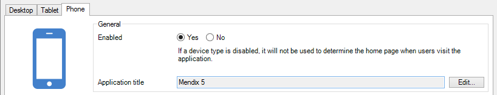
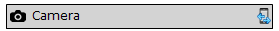

Mendix allows you to quickly build apps for mobile devices. This document gives an overview of mobile app development with Mendix and points to relevant documentation pages.

## Navigation

Every app starts at the home page. You can specify different home pages for phones and tablets in the [Navigation](navigation) document. The tablet and phone device types can be enabled and disabled separately. If you enable a device, you also have to provide its home page. Apart from the home page, different home page for different user roles can be specified. Also, there is a default menu that can be used in [menu widgets](menu-widgets). 

## Layout

In theory, you can show the whole desktop site on mobile devices but you probably want to have optimized pages with simpler layout and less information. [Layouts](layout), introduced in Mendix 5, help you to create pages that suit a device. For mobile device you might want to have a layout that hides the menu in a collapsible [side bar](sidebar-toggle-button). You will need at least one layout per supported device type (desktop, tablet, phone) to optimize your app but you can create as many as you like.

## Widgets

Some widgets are more suitable to mobile use than others. The [data grid](data-grid), for example, is not very well suited because of its reliance on multiple columns and multiple search fields. The [list view](list-view) is a simpler, more compact widget for showing a list of objects. [Data views](data-view) lend themselves equally to mobile and desktop usage but it, of course, depends on all the widgets you place inside. Some custom widgets can only be used in hybrid mobile apps, because they access native features of the device. And that is the topic of the next section.

## Hybrid Mobile Apps

Mendix apps can simply be viewed in mobile web browsers. However, some features of mobile devices cannot be accessed through HTML and Javascript. Also, if you want to publish your app on the Apple App Store, Google Play or Microsoft Phone Store, you have to wrap your app in a native shell. We use [PhoneGap](http://phonegap.com/) to do this. PhoneGap creates a native wrapper around a web application and provides access to native functions through a Javascript API. These apps are also called 'hybrid' apps because they are a hybrid of a web and a native app. Mendix facilitates the creation of hybrid mobile apps in a number of ways.

### Hybrid Mobile Widgets

To access native functions of the device, we provide a number of PhoneGap widgets on the App Store. And, of course, you can build your own custom widgets that use native features. PhoneGap widgets can be recognized by their special icon. You can also search for them by using Edit > Find Advanced (Ctrl+Shift+F). 

For more information on hybrid mobile apps, see:

*   [Developing Hybrid Mobile Apps](developing-hybrid-mobile-apps)
*   [Customizing Hybrid Mobile Apps](customizing-hybrid-mobile-apps)
*   [Packaging Hybrid Mobile Apps](packaging-hybrid-mobile-apps)
*   [Publishing Hybrid Mobile Apps](publish-packages-to-mobile-stores)
