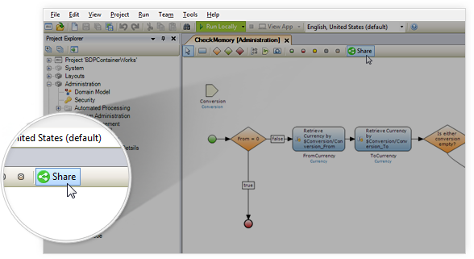
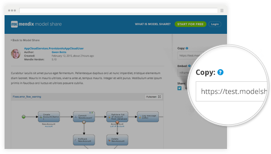
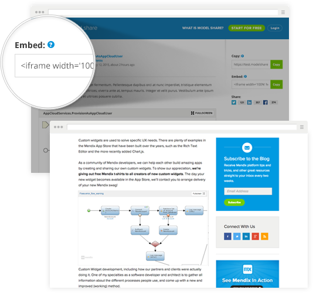

# Introduction

Mendix [Model Share](https://modelshare.mendix.com/) is a simple way to share parts of your Mendix Models with others. Model Shares can be viewed online, used inside blogposts and other media, and imported directly to the Mendix Modeler. All Model Shares have an unique URL which can be used for sharing. A typical Model Share URL looks as follows: `https://modelshare.mendix.com/models/6769804c-aabd-4fcc-8c8b-10e40a9b3eb8/microflow`. Mendix Model Share is supported in Mendix 5.14 and higher. 

# Creating a Model Share

A Model Share can be quickly created from within the Mendix Modeler. Open the document (currently, only microflows are supported) you want to share and press the 'Share' button. Optionally provide a title and description for the new Model Share - these are used as meta data. After filling out the details, confirm your input by clicking the 'Share' button and a new Model Share will be created. Model Shares will be bound to your personal Mendix Account.

{}

Please note that all information inside the selected document is publicly readable. So make sure that your microflow doesn't contain hardcoded passwords, endpoints and other sensitive data.

{}

After finishing the upload, the Mendix Modeler will show the URL of your Model Share. You can use this URL to point your colleagues to your Model Share, use it to ask questions on the Mendix forum, or paste it inside the Mendix Modeler (after which the document will be imported automatically).

# Importing a Model Share

The Mendix Modeler will recognize automatically if a Model Share URL is on the clipboard. So if you know the URL of a model share, just copy it to your clipboard and use the paste button in the Mendix Modeler to import the Model Share. The Mendix Modeler will automatically solve naming conflicts. The Model Share URL can be copied easily from the Model Share page or a Model Share embedded view using the 'Copy' button.

# Embedding a Model Share in (for example) a blog post

To embed a Model Share in your blog post, go to the page of your Model Share and copy the embed text. The embed text will look as follows:

**Example embed code**

<iframe width='100%' height='491px' frameborder='0' src='https://modelshare.mendix.com/models/b44c19a1-db24-424d-8447-a64f85286016/AppCloudServices.RetrieveDisplayName?embed=true' allowfullscreen></iframe>


Once pasted in your blog post / tutorial / wherever valid (X)HTML is accepted, the embed should appear as follows:

# Removing Model Shares

You can remove Model Shares you have created by navigating to your [model shares](https://modelshare.mendix.com/mymodels/) on the model share website. This will show a list of model shares uploaded by your Mendix account. If you want to remove a Model Share, open it, and press the 'Delete' button in the side bar. Note that it might take a while before Model Shares are removed from caches and especially from search engine results.

# Disclaimer

*   All shared models are publicly available and will be indexed by search engines.
*   Mendix stores all the models on best efforts basis. Model share is not a backup service, please use the Mendix Teamserver instead.
