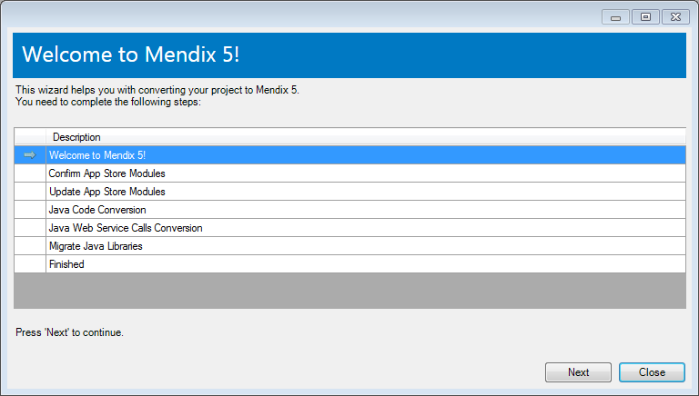
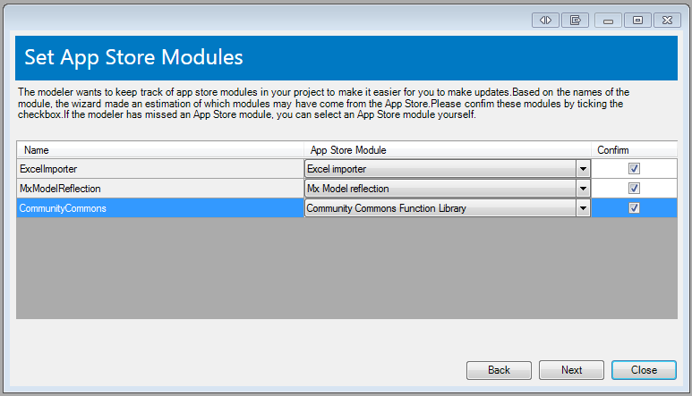
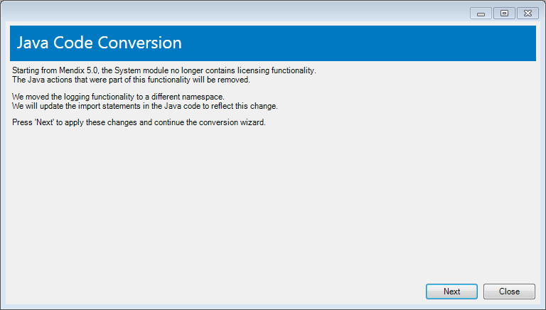
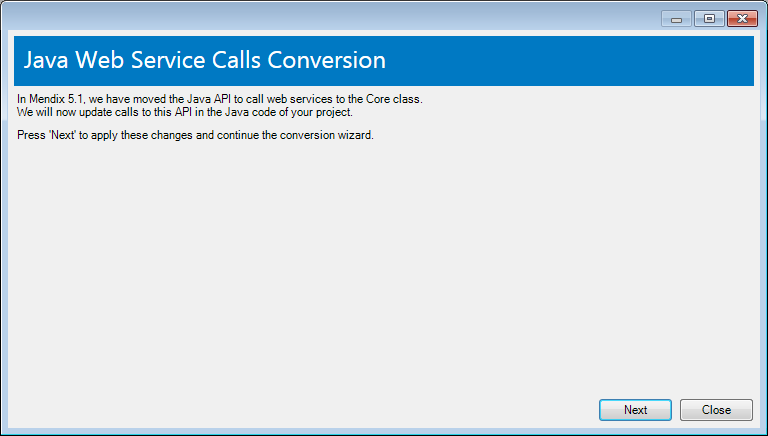
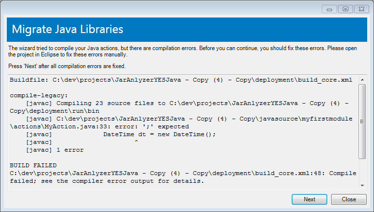

Please read the [Release Notes](release-notes) to see what new major improvements we added in the version 5 release.

This documentation aims to help you to update your project from version 4 to version 5\. It contains the following topics:

*   [Converting your project](moving-from-4-to-5): preparing for conversion and actually converting your project to version 5.
*   [Java 7 required](moving-from-4-to-5): from Mendix 5 on Java 7 is required to run the platform.
*   [Using com.sun packages in custom Java actions](moving-from-4-to-5): Read this section for more information about using com.sun package in custom Java action code
*   [Breaking changes in the Mendix Runtime API](moving-from-4-to-5): changes in the API that might affect your Java code.
*   [Database synchronization](moving-from-4-to-5): notes on migrating the data database to Mendix 5.
*   [Theming](moving-from-4-to-5): notes on theming Mendix 5 applications.
*   [Converting App Store Modules](moving-from-4-to-5): how to convert app store modules to be Mendix 5 compatible.

## Converting your project

Before converting your project we advise you to look at the following points.

### Backup Project

If you are not using the team server, make a backup of your project. Check that the backup was successful by opening the project.

{}

Really make a backup!

{}

### Convert to latest 4.x.

Convert your project to the latest version of 4\. At the time of writing the latest version is 4.7.2.

### Fix errors and warnings

Fix errors and warnings as far as possible. Take special note of the 'Deprecated' warnings. Features that are deprecated in version 4 will be completely gone in version 5.

### Converting!

Now you are ready to convert. Simply open your project in the new version 5 modeler and you can choose to convert your project.

When you open a project in the Mendix 5 modeler, a conversion wizard appears that will guide you through a number of manual steps to make your project ready for Mendix 5\. It will update the App Store modules in your project, and update Java action code and libraries. The steps are shown below:

Click 'Next' to continue.

#### Confirm App Store modules

In Mendix 5, the Mendix Modeler keeps track of which modules in your project originate from the App Store. It will also remember the version of these modules, so it can notify you of updates in the future.

You need to tell the Modeler which modules have been downloaded from the App Store in the past. The wizard makes an (accurate) guess based on the names of the modules in your project. You need to confirm the App Store modules by ticking the check box in the 'Confirm' column.

If you have changed the name of a downloaded module in the past, the wizard may not find a matching App Store module. For this case, you can manually select the corresponding App Store module by expanding the drop-down in the second column.

Press 'Next' to continue. Notice that App Store modules have a special icon from now on, so you can recognize them more easily in the Project Explorer.

#### Update App Store Modules

The next screen shows the latest versions of the App Store modules in your project. The current version number is unknown, because the Modeler did not store version information in the past (it will from now on). By default, all modules will be updated. This is recommended, because the Java code is up to date in the latest versions, and it will save you from repairing Java code yourself in these modules.

Press 'Next' to continue. You will see some dialogs appear; the wizard downloads and installs new versions of the modules you selected.

#### Java Conversion

In the next 2 steps we will perform Java code code conversions.

Press 'Next' to continue.

Press 'Next' to continue.

#### Solve Model Consistency Errors

Before you can move on, you to manually solve consistency errors in your project. Close the wizard (it will remember your completed steps) and fix all errors.

The final error that remains is the one that indicates that the wizard should be completed. Right click and select 'Continue Conversion Wizard.'

Press 'Next' on the start page.

#### Migrate Java Libraries

If you do not have custom Java actions, this step will be straightforward and skipped automatically.

However if you do have custom Java code, we may prompt you to fix Java compilation errors.

In such cases please open Eclipse and solve the errors manually. See the section 'Breaking API Changes' below to see what has changed in the API. When you have solved all errors, press 'Compile again'. If your Java code compiles, you can press 'Next' to move on to the next screen.

In Mendix 5 we changed the way Java actions are compiled. Previously Java action code had access to all the libraries that were used by the Mendix runtime. This prevented us from updating our libraries properly without potentially breaking Java actions. The Mendix Runtime in Mendix 5 runs in an OSGi container which enables us to allow projects to use different version of libraries than the Runtime itself uses.

The consequence is that projects that were using Mendix runtime libraries before Mendix 5 should now include these libraries in their 'userlib' directory. The wizard will analyze your Java code to see which of these libraries are actually used and copy those to the 'userlib' folder.

For reference we keep a log of all copied libraries in a file in the project's directory in 'deployment/project_dependencies_copied.txt'.

This is the final step of the conversion process. Press 'Next' to continue to the final screen, and press 'Close' to close the wizard and start modeling in Mendix 5.

## Java 7 required

From Mendix 5 on, it is required to use Java 7 instead of Java 6\. There is a known bug in the JVM (see [http://bugs.sun.com/view_bug.do?bug_id=4670071](http://bugs.sun.com/view_bug.do?bug_id=4670071) for more background info), which has not been solved before Java 7\. This bug can cause Mendix 5 apps to encounter problems during startup in Java 6 (Mendix 4 apps are not affected by this bug).

## Using com.sun packages in custom Java actions

After or during migration to 5 you may run in to errors about missing classes in packages `sun` or `com.sun`, for example:

`java.lang.NoClassDefFoundError: com/sun/beans/editors/BooleanEditor`

Directly using these packages provided by the JDK may cause compatibility issue in the future as Sun may decide to deprecate them.
The solution to solve this issue is to manually add jars containing these packages to your classpath (`userlib` in case of a Mendix project) when needed.

For more information refer to [Why Developers Should Not Write Programs That Call 'sun' Packages](http://www.oracle.com/technetwork/java/faq-sun-packages-142232.html) .

## Breaking API changes in the Mendix Runtime

Some changes in Mendix 5 which were necessary to provide certain features caused a few breaking API changes. Those changes are minimal and should only affect very specialized Java code, so the impact should be limited.

The following changes were made:

*   The [parameterless constructor for UserAction](http://apidocs.mendix.com/4/runtime/classcom_1_1mendix_1_1systemwideinterfaces_1_1core_1_1_user_action_3_01_r_01_4.html#ae8ae662e18e6eeeb8c3586e2cc3e582b) has been removed. Constructing a UserAction always requires an [IContext](http://apidocs.mendix.com/4/runtime/interfacecom_1_1mendix_1_1systemwideinterfaces_1_1core_1_1_i_context.html) now. Changes are only necessary for custom user actions which are NOT defined as custom Java action in the Modeler, e.g. an action which replaces the LoginAction using an action listener.
*   The methods [addTextMessageFeedback](http://apidocs.mendix.com/4/runtime/classcom_1_1mendix_1_1core_1_1actionmanagement_1_1_core_action_3_01_r_01_4.html#a15e515619fa4873f40b896e1a6523950), [addRefreshObjectFeedback](http://apidocs.mendix.com/4/runtime/classcom_1_1mendix_1_1core_1_1actionmanagement_1_1_core_action_3_01_r_01_4.html#a9e59d60a4c65661ec2bdd2563eec724d), [addRefreshObjectListFeedback](http://apidocs.mendix.com/4/runtime/classcom_1_1mendix_1_1core_1_1actionmanagement_1_1_core_action_3_01_r_01_4.html#a7799f3382fb809014c7a5d5b7c27accf), [addOpenFormFeedback](http://apidocs.mendix.com/4/runtime/classcom_1_1mendix_1_1core_1_1actionmanagement_1_1_core_action_3_01_r_01_4.html#a7b46548456e83baf102b03dbdd1fc065), [addLoginFeedback](http://apidocs.mendix.com/4/runtime/classcom_1_1mendix_1_1core_1_1actionmanagement_1_1_core_action_3_01_r_01_4.html#a71150cc29de1070542c4c5c0da646e19), [addCloseCallerFeedback](http://apidocs.mendix.com/4/runtime/classcom_1_1mendix_1_1core_1_1actionmanagement_1_1_core_action_3_01_r_01_4.html#acdeea41cc3a8eb9f3609c1ae46e98921) and [addDataValidationFeedback](http://apidocs.mendix.com/4/runtime/classcom_1_1mendix_1_1core_1_1actionmanagement_1_1_core_action_3_01_r_01_4.html#a5d950fb91a21a93ad70da7c8f81e4336) are not defined on [CoreAction](http://apidocs.mendix.com/4/runtime/classcom_1_1mendix_1_1core_1_1actionmanagement_1_1_core_action_3_01_r_01_4.html) anymore. They are now defined and immediately deprecated on CustomJavaAction, which inherits from [UserAction](http://apidocs.mendix.com/4/runtime/classcom_1_1mendix_1_1systemwideinterfaces_1_1core_1_1_user_action_3_01_r_01_4.html#ae8ae662e18e6eeeb8c3586e2cc3e582b). This means these methods cannot be called from actions which directly inherit from UserAction. Your code will only stop compiling for custom user actions which are NOT defined as custom Java action in the Modeler and call one of these methods. But note that even the methods in CustomJavaAction have been deprecated, you should rewrite these to com.mendix.webui.FeedbackHelper. The reason they are moved to CustomJavaAction is merely to make conversion to 5 easier.
*   [Core.addUserAction](http://apidocs.mendix.com/4/runtime/classcom_1_1mendix_1_1core_1_1_core.html#ae543051ee287c47238135dc4d99a857c) now has a parameter of type java.lang.Class instead of type String. This change is necessary to avoid class loading problems in an OSGi environment.

The following methods, which were intended for internal use only, have been removed:

*   [Core.getFormNames()](http://apidocs.mendix.com/4/runtime/classcom_1_1mendix_1_1core_1_1_core.html#af913b5f0bab00f5f982c354c0021bca0)
*   [Core.retrieveXPathSchemaRaw(..)](http://apidocs.mendix.com/4/runtime/classcom_1_1mendix_1_1core_1_1_core.html#a402eda183219a620b392bca8533eed09)
*   [Core.retrieveXPathSchema(..)](http://apidocs.mendix.com/4/runtime/classcom_1_1mendix_1_1core_1_1_core.html#a88943a3a3c45c8a37b6342148ebe3ac5)
*   [IRetrievalSchema.toXML(..)](http://apidocs.mendix.com/4/runtime/interfacecom_1_1mendix_1_1systemwideinterfaces_1_1connectionbus_1_1requests_1_1_i_retrieval_schema.html#a75152c856028f45207790a8cbcbf77fc).
*   [ISortExpression.toXML(..)](http://apidocs.mendix.com/4/runtime/interfacecom_1_1mendix_1_1systemwideinterfaces_1_1connectionbus_1_1requests_1_1_i_sort_expression.html#acee2d007dd389aa10e47191e1a3be51c)
*   [IGetRequest.getDataStoreIdentifier()](http://apidocs.mendix.com/4/runtime/interfacecom_1_1mendix_1_1systemwideinterfaces_1_1connectionbus_1_1requests_1_1types_1_1_i_get_request.html#a3eba482affc071037ef806ad971ac389), [IGetRequest.setDataStoreIdentifier(..)](http://apidocs.mendix.com/4/runtime/interfacecom_1_1mendix_1_1systemwideinterfaces_1_1connectionbus_1_1requests_1_1types_1_1_i_get_request.html#a1374e742c48599cbbccf21e11f4a2e72) and [IGetRequest.toXML(..)](http://apidocs.mendix.com/4/runtime/interfacecom_1_1mendix_1_1systemwideinterfaces_1_1connectionbus_1_1requests_1_1types_1_1_i_get_request.html#a52db877bbb60478b07179a7302376b4a)

#### Removed deprecated methods

The following deprecated methods and/or classes have been removed in Mendix 5:

_Core.getFormPath(..)_
Affected method: [Core.getFormPath(..)](http://apidocs.mendix.com/4/runtime/classcom_1_1mendix_1_1core_1_1_core.html#a500da62328c92b7e4446bfa89d454252)

_Core.getFileDocumentContentAsFile(..)_
Affected method: [Core.getFileDocumentContentAsFile(..)](http://apidocs.mendix.com/4/runtime/classcom_1_1mendix_1_1core_1_1_core.html#a8c5f093517d54fcebbf22a0d474902f8)

The way file document content is stored can differ per application deployment environment. File document content can be stored on disk, but also for example in external storage. Being storage type agnostic becomes more and more important with the increasing usage of cloud environments, this means the API should also comply with this. For this reason only the [Core.getFileDocumentContent(..)](http://apidocs.mendix.com/4/runtime/classcom_1_1mendix_1_1core_1_1_core.html#a75acf9182fbbadf119bfc2245875e312), which returns an InputStream can be used and the deprecated [Core.getFileDocumentContentAsFile(..)](http://apidocs.mendix.com/4/runtime/classcom_1_1mendix_1_1core_1_1_core.html#a8c5f093517d54fcebbf22a0d474902f8)
is removed from the API in Mendix 5\. To fix usages of this method one can use the sample code below (which makes use of the [Apache Commons IO library](http://commons.apache.org/proper/commons-io/)):

**Sample code to replace Core.getFileDocumentContentAsFile occurrences**

public void doSomethingWithFileDocumentContent(IMendixObject fileDocument)
{
	InputStream inputStream = null;
	File tempFile = null;
	FileOutputStream outputStream = null;
	try
	{
		tempFile = File.createTempFile("file", "tmp");
		outputStream = FileUtils.openOutputStream(tempFile);
		inputStream = Core.getFileDocumentContent(getContext(), fileDocument);
		IOUtils.copy(inputStream, outputStream);

		// Do something with the file.
		String contents = FileUtils.readFileToString(tempFile);
		Core.getLogger("FileUtil").info("The contents of the file is: " + contents );
		// End of do something with file.
	}
	catch (IOException ioe)
	{
		Core.getLogger("FileUtil").error("Couldn't copy FileDocument '" + fileDocument.getId() + "' to temporary file.");
	}
	finally
	{
		IOUtils.closeQuietly(outputStream);
		IOUtils.closeQuietly(inputStream);
		FileUtils.deleteQuietly(tempFile);
	}
}



Writing file document content to a stream can be accomplished with the following code:

**Write file document content to a stream**

public void writeContentToStream(IMendixObject fileDocument)
{
	InputStream inputStream = IOUtils.toInputStream(text);
	Core.storeFileDocumentContent(getContext(), fileDocument, inputStream);
}



Batching

Affected methods and classes: [Core.createBatch(..)](http://apidocs.mendix.com/4/runtime/classcom_1_1mendix_1_1core_1_1_core.html#aed0056f6d5068dbac588f1aaa72fb630), [Core.changeBatch(..)](http://apidocs.mendix.com/4/runtime/classcom_1_1mendix_1_1core_1_1_core.html#a59c5a449b2c5881f4ea56344d0966377), [Core.changeBatch(..)](http://apidocs.mendix.com/4/runtime/classcom_1_1mendix_1_1core_1_1_core.html#aa14708bf9085304e1e860c5a79e20897), [Core.removeBatch(..)](http://apidocs.mendix.com/4/runtime/classcom_1_1mendix_1_1core_1_1_core.html#ad9edd2fb99ea6f49cbf553de4a931ef1) and batch interfaces [IBatch](http://apidocs.mendix.com/4/runtime/interfacecom_1_1mendix_1_1systemwideinterfaces_1_1core_1_1_i_batch.html), [IChangeBatch](http://apidocs.mendix.com/4/runtime/interfacecom_1_1mendix_1_1systemwideinterfaces_1_1core_1_1_i_change_batch.html), [ICreateBatch](http://apidocs.mendix.com/4/runtime/interfacecom_1_1mendix_1_1systemwideinterfaces_1_1core_1_1_i_create_batch.html) and [IRemoveBatch](http://apidocs.mendix.com/4/runtime/interfacecom_1_1mendix_1_1systemwideinterfaces_1_1core_1_1_i_remove_batch.html).

All batching code can be replaced by using [Core.instantiate()](http://apidocs.mendix.com/4/runtime/classcom_1_1mendix_1_1core_1_1_core.html#a97b114ba40a4c6be5ceea9accd5e7b84), [Core.commit(..)](http://apidocs.mendix.com/4/runtime/classcom_1_1mendix_1_1core_1_1_core.html#a12b75c0ee9aaaccf9cf322ce1c25d0cd) and [Core.delete(..)](http://apidocs.mendix.com/4/runtime/classcom_1_1mendix_1_1core_1_1_core.html#a792d268ee4be4114ec7813deb75b1396) or their microflow activity equivalents. Since Mendix 4 these methods are as efficient as the more complex batching code. This deprecated batching code was no longer maintainable due to the changes in Mendix 5 and is therefore removed in Mendix 5.

_IRetrievalSchema.isSecurityDisabled(..)_ and _IRetrievalSchema.setSecurityDisabled(..)_
Affected methods: [IRetrievalSchema.isSecurityDisabled()](http://apidocs.mendix.com/4/runtime/interfacecom_1_1mendix_1_1systemwideinterfaces_1_1connectionbus_1_1requests_1_1_i_retrieval_schema.html#ab6a56bb0f5d3eeaebf3a8e9aa4f7419c) and [IRetrievalSchema.setSecurityDisabled(..)](http://apidocs.mendix.com/4/runtime/interfacecom_1_1mendix_1_1systemwideinterfaces_1_1connectionbus_1_1requests_1_1_i_retrieval_schema.html#a4f23132936fb662b546953fba4823690)

## Database synchronization

In Mendix 5, direct migration of your application database from Mendix 2.5 or below will not be supported anymore. To migrate your database, first synchronize it with your application model in the latest version of Mendix 4 and then convert it to Mendix 5.

## Theming

Mendix 5 adopted [Bootstrap](http://twitter.github.io/bootstrap/) as its main css framework. Therefore all Mendix classes are renamed to conform to Bootstrap's naming conventions. By dropping support for Internet Explorer 6 and 7, we were able to simplify the DOM structure of widgets, which makes styling a lot easier.

However, this also means that theme packages from earlier versions will not work with Mendix 5.

## Converting App Store Modules

App Store Modules need to be updated for Mendix 5\. Mendix 5 will only show modules that have been converted. Here is a list of steps you can take to convert your app store module:

### Conversion

*   Create a new project in a recent 4 version (4.7.1 for converting to 5-rc1 and 4.7.2 for 5.0.0)
*   Add other app store modules if your module depends on them.
*   Fix errors and warnings, especially deprecation warnings.
*   Close the project in Mendix 4.
*   Open the project in Mendix 5.
*   The conversion wizard will start automatically.
*   If other app store modules are recognized during the conversion wizard, then there are Mendix 5 versions of those already. Choose to update them.
*   Fix Java compilations errors if there are any. See the section on [breaking changes](moving-from-4-to-5) for API differences in Mendix 5.
*   In the step 'Removing unused Java libraries', you as the module creator probably know best which Java libraries are really necessary. Only keep those.

### Pages

If your module contains pages, those pages will be use the layout 'Layouts.DesktopLayout' after conversion. This layout may not exist in projects that your module will be imported to.

Depending on your module you will want to do one of two things: create a layout inside your module and base pages on that or expose snippets. If the pages in your module are administrative interfaces that stand on its own, we advise you to create a simply layout (you can duplicate the DesktopLayout) inside your module and change your pages to point to that new layout.

If your module exposes grids and views that user will want to incorporate into the consuming application, you can also opt to create snippets containing those user interfaces. A snippet does not need a layout and can be used in pages of the project the module is imported into.

In both cases, your module will be self-contained again and is ready to be uploaded to the App Store!
