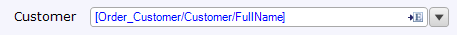
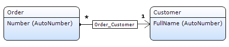
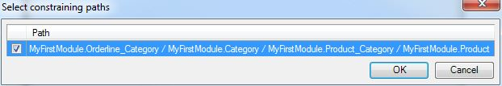

The reference selector is an [input widget](input-widgets) that can be used to display and edit [associations](associations).

{}

This reference selector allows you to select a product for your orderline.

To use a reference selector you need a many-to-one association in the domain model.

{}

The reference selector is similar to a [drop-down](drop-down) except that it allows users to choose from a list of objects with which to fill an association rather than items listed in an enumeration. The selector requires you to choose an entity with which the parent object shares a reference. It will also require you to choose which attribute from that referenced entity you wish to display in the selector.

{}

If you only want to _display_ information, you can also use the text box. This has the added advantage that you can follow more than one association step.

{}

## General properties

### Select using

The reference selector allows the end user to select objects by using either a drop-down or a pop-up page. If you choose to select using a page, the drop-down functionality will be replaced with a button to the right of the widget that will open a selection pop-up.

<table><thead><tr><th class="confluenceTh">Value</th><th class="confluenceTh">Description</th></tr></thead><tbody><tr><td class="confluenceTd">Page</td><td class="confluenceTd">Select the reference using a pop-up page.</td></tr><tr><td class="confluenceTd">Drop-down</td><td class="confluenceTd">Select the reference using a drop-down.</td></tr></tbody></table>

{}

The advantage of a selecting using a drop-down is that it is very efficient; no page needs to be opened. The advantage of selecting using a page is that the end user can search the objects. If there are a lot of objects (say, more than 20) to select from, selecting using a page is advisable.

{}

*Default value:* Drop-down

### Select page

The select page property determines which page is opened when the select page button is used. This page can be used to select associated objects from the list of all possible objects. This page should contain a data grid, template grid or list view connected to the same entity as the input reference set selector.

See [Opening Pages](opening-pages). Note that opening select pages in content is prohibited.

{}

You can generate a new page to show by right-clicking the widget and selecting 'Generate select page...'.

{}

### Decimal precision (only for numeric attributes)

The precision of a value describes the number of digits that are used to express that value. This property indicates the number of decimal places (the number of digits following the point).

*Default value:* 2

### Group digits (only for numeric attributes)

For ease of reading, numbers with many digits before the decimal separator may be divided into groups using a delimiter. This property determines whether or not such a delimiter is used. Which delimiter is used depends on the language of the end user.

*Default value:* No

### Date format (only for attributes of type date and time)

The date format determines whether the reference selector displays the date, time, date and time, or a custom variation of the linked attribute. How the date and/or time are formatted depend on the localization of the user viewing the data.

*Default value:* Date

### Required

This property indicates whether this widget must be filled in by the end user or not. If set to true, this widget can not be left empty and a message will be shown if the end user presses the 'Save' button.

*Default value:* False

### Required message

This property determines the message that is shown to the end user if the widget is empty and the 'Required' property is set to true. This is a translable text. See [Translatable Texts](translatable-texts).

{}

For example, if an address field is required, the required message for the text box of the address could be something like "The address is required."

{}

### Go-to page

The go-to page gives end users quick access to a more detailed overview of the object being selected. This property determines which page is shown to the user. The page should contain a data view with the same entity as the one that is selected by the reference selector.

### Go-to page settings

These settings specify how the page is opened.

See [Opening Pages](opening-pages) for more details.

## Selectable objects properties

The properties in the category 'Selectable objects' determine the objects out of which the end user can make a selection. There are two, mutually exclusive, ways of influencing the selectable objects:

1.  A microflow returns the list of selectable objects.
2.  The list of objects is determined automatically taking into account the context mechanism and the properties that influence that mechanism.

### Microflow

If a microflow is selected, the microflow will be called to compute the list of objects that the reference selector will show. A microflow can only be used if the selection is made using a drop-down.

{}

Note that the other properties in this category have no effect when using a microflow!

{}

### Microflow settings

In the microflow settings you can specify what parameters to pass to the microflow.

### XPath constraint

With the XPath constraint you can add a manual constraint to limit the list of objects that can be selected. This XPath constraint will be added to the constraints that are generated by the [context mechanism](context-mechanism).

{}

The XPath constraint `[InStock = true()]` on a reference selector for products will ensure that only products that are in stock are selectable.

{}

This property has no effect if a microflow is used to fill the reference selector.

### Constrained by

A reference selector can be constrained by one or more paths. This is typically used to make one reference selector dependent on another. For example, in page where you can edit an order line, a product selector can be constrained by a category selector. After selecting a category, the product selector is constrained by this category and shows only products in the category.

{}

*Domain model*

In the domain model the order line has associations of type reference to both category and product. In this form, these can be edited with two reference selectors. The third association, from product to category, describes the relation between those two entities. Such a 'triangle' shaped part of the domain model is what makes constraining possible.

*Form*

The page has two reference selectors, one for category and one for product. The one for product is constrained by the path through the domain model that forms the triangle.

{}

This property has no effect if a microflow is used to fill the reference selector.

### Apply context

The property 'Apply context' indicates whether the context mechanism will be used to constrain the list of selectable objects. See [Context Mechanism](context-mechanism) for more information.

This property has no effect if a microflow is used to fill the reference selector.

*Default value:* False

### Remove from context

The property 'Remove from context' allows you to remove specific entities from the context. This change in the context has effect on the list of objects that you can select from.

This property is useful if you want the application to 'forget' the fact that for example a customer was selected and to show all orders of all customers instead of only the orders of the selected customer. See the [Context Mechanism](context-mechanism) for more information.

This property has no effect if a microflow is used to fill the reference selector.

### Sort order

The sort order specifies the order in which the items in the reference selector are shown. You can sort on multiple attributes in both directions (ascending and descending). If no sort order is specified, the reference selector sorts on the displayed attribute.

*Default value:* No sort order

## Data source properties

### Attribute path

The attribute path specifies which attribute of an associated entity is shown in the reference selector. The path must follow one association of type reference starting in the entity of the data view.

{}

Order_Customer/Customer/Name will allow the end user to select a user from a list of user names.

{}{}

Keep in mind that even though you connect an attribute to the reference selector you are actually selecting an object. The attribute is just there to provide a visualization of the object. In this respect, the reference selector is different from other widgets like check boxes and text boxes. In those widgets you edit the value of the attribute. In the reference selector you edit an association of type reference.

{}

## Label properties

{}

Added in Mendix 5.18.0

{}

A label can be used to described the purpose of the widget to the user. The label is shown next to the widget in the user interface. If a label is configured, the widget will be rendered in the browser wrapped in a form group. See [Bootstrap documentation](http://getbootstrap.com#forms).

### Show label

This property determines whether the label is rendered and the widget is wrapped in a form group.

*Default value:* No

### Label caption

This property is shown only when Show label is Yes. This property determines what text is rendered within a label.

## Editability properties

### Editable

The editable property indicates whether the end user will be able to change the value displayed by the widget.

<table><thead><tr><th class="confluenceTh">Value</th><th class="confluenceTh">Description</th></tr></thead><tbody><tr><td class="confluenceTd">Default</td><td class="confluenceTd">The value is editable if security allows it (i.e. if the user that is signed in has write rights to the selected attribute). </td></tr><tr><td class="confluenceTd">Never </td><td class="confluenceTd">The value is never editable. </td></tr><tr><td class="confluenceTd">Conditional </td><td class="confluenceTd">The value is editable if security allows it and the specified condition holds. (see below) </td></tr></tbody></table>

*Default value:* Default

### Condition

A widget can be made editable based on the value of an attribute of the enclosing data view. The attribute must be of type boolean or enumeration. For each value, you specify whether the widget is editable. Upon entering the page and upon changing the condition attribute the edit state of the widget will be updated.

Example: you don't have to ask for the marriage date if the end user indicates that he or she is not married.

## Visibility properties.

{}
Conditional visibility settings were added in version 5.10.0.
{}

### Visible

By default, whether or not an element is displayed in the browser is determined by how the page is designed and the user's roles within the application. However, the page can be configured to hide the element unless a certain condition is met. 

## Attribute Condition

### Attribute

When checked, this setting hides the widget unless a particular attribute has a certain value. Only boolean and enumeration attributes can be assigned to this purpose.

A practical example would be a web shop in which the user must submit both billing and delivery information. In this case you might not wish to bother the user with a second set of address input fields unless he or she indicates that the billing and delivery address are not the same. You can accomplish this by making the delivery address fields conditionally visible based on the boolean attribute SameBillingAndDeliveryAddress.

### Module roles

The widget can be made visible to a subset of the user roles available in your application. When activated, this setting will render the widget invisible to all users that are not linked to one of the selected user roles. Please note that this does not override project security. Any restrictions due to microflow, form, or entity access will remain in effect.

## Events properties

### On change

The on-change property optionally specifies a microflow that will be executed when leaving the widget after the value has been changed.

### On change settings

The on change settings specify what parameters are passed to the microflow, whether a progress bar is shown and more.

See [Starting Microflows](starting-microflows).

## Common properties

### Name

The internal name of the widget. You can use this to give sensible names to widgets. The name property also appears in the generated HTML: the widget DOM element automatically includes the class '`mx-name-{NAME}`', which can be useful for [Selenium testing](/howto50/selenium-support).

### Class

The class property allows you to specify a cascading style sheet (CSS) class for the widget. This class will be applied to the widget in the browser and the widget will get the corresponding styling. The class should be a class from the theme that is used in the project. It overrules the default styling of the widget.

{}

Note that the styling is applied in the following order:

1.  Default styling defined by the theme the project uses.
2.  The 'Class' property of the widget.
3.  The 'Style' property of the widget.

{}

### Style

The style property allows you to specify additional CSS styling. If a class is also specified, this styling is applied _after_ the class.

{}

background-color:blue;
This will result in a blue background

{}

### Tab index

The tab index influences the order in which the end user navigates through the page using the tab key. By default tab indices are zero and the tab order is determined automatically by the client system. A value of minus one (-1) means that the widget will be skipped when tabbing through the page.

*Default value:* 0

## Related articles

*   [Data view](data-view)
*   [Entities](entities)
*   [Associations](associations)
