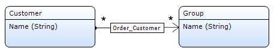

The reference set selector allows you to set an association of type reference set by selecting objects. For example, if customers can belong to several groups, a reference set selector can be used to select the groups the customer belongs to. This requires that there is an association from customer to group of type reference set in the domain model.

{}

In this data view on customer you can select multiple groups using the reference set selector.

In the domain model there is an association of type reference set from customer to group.

{}

The reference set selector looks a lot like a [data grid](data-grid) and consequently shares many properties with the data grid. Main differences are that the reference set selector lacks a search bar and that it has different buttons by default (Add, Remove).

{}

The 'Add and Remove' buttons mean something else than the 'New and Delete' buttons that are used by default in the data grid:

*   The Add button adds a reference to an existing object. The New button, on the other hand, creates a new object and does not add references. (the [context mechanism](context-mechanism) may automatically set references but that is a story for another time)

*   The Delete button actually deletes an object for good, whereas the Remove button simply removes the reference to the object and leaves the object itself intact.

{}

## Components

### Control bar

See [Control Bar](control-bar).

### Sort bar

See [Sort Bar](sort-bar).

### Columns

See [Columns](columns) for more information.

## Common properties

### Name

The internal name of the widget. You can use this to give sensible names to widgets. The name property also appears in the generated HTML: the widget DOM element automatically includes the class '`mx-name-{NAME}`', which can be useful for [Selenium testing](/howto50/selenium-support).

### Class

The class property allows you to specify a cascading style sheet (CSS) class for the widget. This class will be applied to the widget in the browser and the widget will get the corresponding styling. The class should be a class from the theme that is used in the project. It overrules the default styling of the widget.

{}

Note that the styling is applied in the following order:

1.  Default styling defined by the theme the project uses.
2.  The 'Class' property of the widget.
3.  The 'Style' property of the widget.

{}

### Style

The style property allows you to specify additional CSS styling. If a class is also specified, this styling is applied _after_ the class.

{}

background-color:blue;
This will result in a blue background

{}

### Tab index

The tab index influences the order in which the end user navigates through the page using the tab key. By default tab indices are zero and the tab order is determined automatically by the client system. A value of minus one (-1) means that the widget will be skipped when tabbing through the page.

_Default value:_ 0

## Appearance properties

### Show control bar

This property indicates whether the control bar will be visible in the end user interface. The control bar also includes the paging buttons.

{}

Even if the control bar is invisible there can still be a default button that is triggered by (double) clicking on a row. See the property 'Default button trigger' and [control bar](control-bar) for more information.

{}

_Default value:_ True

### Show paging buttons

This property indicates whether the buttons to page through the information in the grid are visible or not. Only hide these buttons if you are sure that there will never be more objects than the number of rows of the grid. Note that hiding the control bar also hides the paging buttons.

_Default value:_ True

### Column weights

The column weights are percentages separated by semi-colons. They determine the widths of the columns. The weights have to add up to 100\. An alternative way of changing the widths of columns is by dragging the separating line between columns.

{}

In the screenshot above the column weights are 63;37.

{}

### Number of rows

With this property you can change the number of rows that will be shown in one page. See also the property 'Show empty rows'.

_Default value:_ 5

### Show empty rows

If you choose to show empty rows there will always be the grid that shows the same number of rows (see 'Number of rows') even if there are fewer objects to show on the page.

_Default value:_ False

## Behavior properties

### Selection mode

The selection mode determines whether and how the user can select items in the grid.

<table><thead><tr><th class="confluenceTh">Value</th><th class="confluenceTh">Description</th></tr></thead><tbody><tr><td class="confluenceTd">No selection</td><td class="confluenceTd">The user cannot select items.</td></tr><tr><td class="confluenceTd">Single selection</td><td class="confluenceTd">The user can select a single item by clicking on it. Clicking another item will make that item the selection.</td></tr><tr><td class="confluenceTd">Multi-selection</td><td class="confluenceTd">The user can select multiple items by clicking the first one and holding the 'Ctrl' key while clicking on other items. Simply clicking an item will deselect all items and make the clicked item the selection.</td></tr><tr><td class="confluenceTd">Simple multi-selection</td><td class="confluenceTd">The user can select multiple items by simply clicking on them. This was the default multi-selection behavior prior to version 3.1.0.</td></tr></tbody></table>

_Default value:_ Single selection

### Default button trigger

The default button can be triggered by a single or a double click on a row.

<table><thead><tr><th class="confluenceTh">Value</th><th class="confluenceTh">Description</th></tr></thead><tbody><tr><td class="confluenceTd">Single click</td><td class="confluenceTd">A single click triggers the default button. This cannot be used in combination with allowing the user to select rows.</td></tr><tr><td class="confluenceTd">Double click</td><td class="confluenceTd">A double click triggers the default button.</td></tr></tbody></table>

_Default value:_ Double click

### Tooltip page

A tooltip page is a page that appears when you hover your mouse over a row. The tooltip page should consist of a data view on the same entity as the data grid. On top of creating, and connecting, a tooltip page you also have to specify on which columns the tooltip will appear. See the property 'Show tooltip' of [data grid columns](columns).

## Data source properties

### Entity path

The entity path of a reference set selector is a path following one association of type 'reference set' from the entity of the containing data view to the entity on the other side of that association. In the example above the association Customer_Group from Customer to Group is followed and the path is: Customer_Group/Group.

{}

With the reference selector you are editing an association of type reference set (Customer_Group). Adding, and removing, objects using the selector will only add and remove references to those objects; the objects themselves are unchanged.

{}

## Events properties

### On change

The on-change property optionally specifies a microflow that will be executed when leaving the widget after the value has been changed.

### On change settings

The on change settings specify what parameters are passed to the microflow, whether a progress bar is shown and more.

See [Starting Microflows](starting-microflows).

## Selectable objects properties

The selectable objects are determined in the same way as in the reference selector. See the [selectable objects properties](reference-selector) of the reference selector for more information. Note that you cannot use a microflow in a reference set selector.

### XPath constraint

See [Selectable Objects Properties](reference-selector) of the reference selector.

### Constrained by

See [Selectable Objects Properties](reference-selector) of the reference selector.

### Apply context

See [Selectable Objects Properties](reference-selector) of the reference selector.

### Remove from context

See [Selectable Objects Properties](reference-selector) of the reference selector.

## Visibility properties

{}
Conditional visibility settings were added in version 5.10.0.
{}

### Visible

By default, whether or not an element is displayed in the browser is determined by how the page is designed and the user's roles within the application. However, the page can be configured to hide the element unless a certain condition is met. 

## Attribute Condition

### Attribute

When checked, this setting hides the widget unless a particular attribute has a certain value. Only boolean and enumeration attributes can be assigned to this purpose.

A practical example would be a web shop in which the user must submit both billing and delivery information. In this case you might not wish to bother the user with a second set of address input fields unless he or she indicates that the billing and delivery address are not the same. You can accomplish this by making the delivery address fields conditionally visible based on the boolean attribute SameBillingAndDeliveryAddress.

### Module roles

The widget can be made visible to a subset of the user roles available in your application. When activated, this setting will render the widget invisible to all users that are not linked to one of the selected user roles. Please note that this does not override project security. Any restrictions due to microflow, form, or entity access will remain in effect.

## Related Articles

*   [Data view](data-view)
*   [Entities](entities)
*   [Associations](associations)
