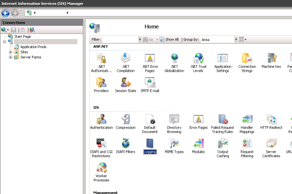
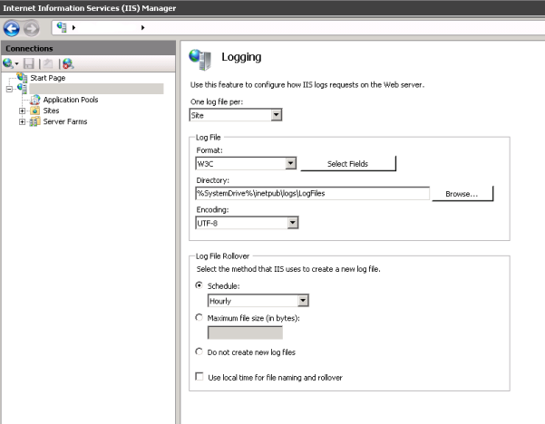
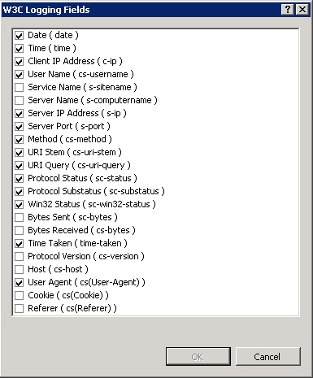
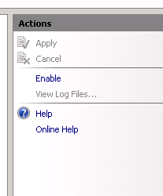

## **Introduction**

On an operational IIS server, reviewing log files forms an integral part of system maintenance. IIS logs will provide detailed information on the performance and health of your webserver. This document will detail how to enable and configure IIS logging, and how to interpret the resulting log file information.

## **Enabling per-site IIS logging**

*   Open the IIS management console and expand the server node and select Logging in the features pane:





*   Press the "Select Fields" button to configure the information you wish to log in your log files:



*   The default selection of fields will provide a decent amount of information for standard environments. If more detail is desired, select more fields.

*   Next, choose a log file location and rollover frequency. Please note that on heavily accessed websites, log files will demand a fair amount of disk space.

*   Enable logging in the Actions pane:



## **Interpreting IIS log files**

*   Log files in the W3C format will resemble the following sample:

```
#Software: Microsoft Internet Information Services 7.5
#Version: 1.0
#Date: 2013-06-24 10:56:45
#Fields: date time s-ip cs-method cs-uri-stem cs-uri-query s-port cs-username c-ip cs(User-Agent) sc-status sc-substatus sc-win32-status time-taken
2013-06-24 10:56:45 192.168.0.1 POST /xas/ - 80 - 222.222.222.222 Mozilla/5.0+(Windows+NT+6.1;+WOW64)+AppleWebKit/537.36+(KHTML,+like+Gecko)+Chrome/27.0.1453.110+Safari/537.36 404 0 2 471
```

*   The fields in the log file correspond to the fields chosen earlier when setting up IIS logging. Using the example above, the following can be concluded:
    *   The request was made on the 24th of June 2013 at 10:56 AM
    *   The answering webserver's IP address was 192.168.0.1
    *   A HTTP Post method was performed on the /xas/ folder of the IIS site
    *   The connection was made using the HTTP protocol (TCP port 80)
    *   The requesting client's IP address was 222.222.222.222
    *   The requesting client was using the Google Chrome web browser on a x64 Windows 7 or Windows 2008R2 client OS
    *   The request could not be completed (error: not found)
    *   The request was completed in 471Ms

More information on interpreting IIS logs can be found here: [Monitoring - What to monitor](monitoring-what-to-monitor)
