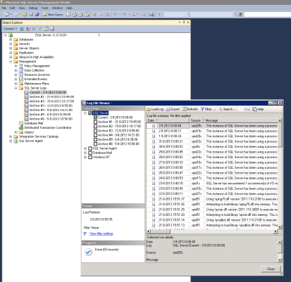

## **Introduction**

On an operational SQL server, several log files are created that can assist in troubleshooting any performance issues or errors that may occur. This document will describe the four most important log files and their function.

## **Logs**

### **SQL Server Error Log**

The Error Log, SQL Server's most important log file, is used to troubleshoot all general system problems. To view the Error log, use either one of two methods:

*   Windows Explorer: Browse to the "%ProgramFiles%\Microsoft SQL Server\MSSQL.1MSSQL\LOG\ERRORLOG" directory and view the logs, named "ERRORLOG.X", using a third party log or document viewer.
*   SQL Server Management Studio: Expand the server node, expand Management, and click SQL Server Logs:

### **Windows Event Log**

As well as serving as a general source of troubleshooting information, the Windows event log contains very detailed information on the health of your SQL server. The three main Windows event logs: Application, Security and System, all three contain information about different SQL server sub systems:

*   Application: The application log records events in SQL Server and SQL Server Agent
*   Security: The security log records authentication information
*   System: the system log records service startup and shutdown events.

To view the Windows Event log, go to Administrative Tools, Event Viewer.

### SQL Server Agent Log

SQL Server's job scheduling subsystem, SQL Server Agent, maintains a set of log files with warning and error messages about the jobs it has run, written to the %ProgramFiles%\Microsoft SQL Server\MSSQL.1\MSSQL\LOG directory. SQL Server will maintain up to nine SQL Server Agent error log files. The current log file is named SQLAGENT .OUT, whereas archived files are numbered sequentially. You can view SQL Server Agent logs by using SQL Server Management Studio (SSMS). Expand a server node, expand Management, click SQL Server Logs, and select the check box for SQL Server Agent.

### SQL Server Profiler Log

SQL Server Profiler, the primary application-tracing tool in SQL Server, captures the system's current database activity and writes it to a file for later analysis. You can find the Profiler logs in the log .trc file in the %ProgramFiles%\Microsoft SQL Server\MSSQL.1\MSSQL\LOG directory.

More information on interpreting SQL Server logs can be found in [Monitoring - What to monitor](monitoring-what-to-monitor)
