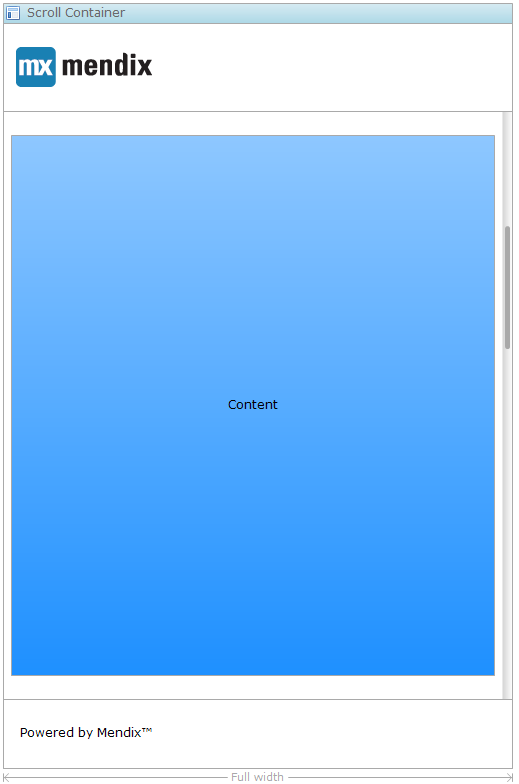

{}

Added in Mendix 5.18\. For older versions see the [Layout Container](layout-container).

{}

A scroll container is used to divide the layout in regions such as a header, sidebar or footer. A scroll container must be the only top-level widget. Apart from that, a scroll container can only be placed directly in another scroll container.

Scroll containers may be placed on navigation layouts as well as on pages.

{}

The scroll container splits the layout in three parts: a header containing a logo, a content part with a placeholder and a footer.

{}

## Common Properties

### Name

The internal name of the widget. You can use this to give sensible names to widgets. The name property also appears in the generated HTML: the widget DOM element automatically includes the class '`mx-name-{NAME}`', which can be useful for [Selenium testing](/howto50/selenium-support).

### Class

The class property allows you to specify a cascading style sheet (CSS) class for the widget. This class will be applied to the widget in the browser and the widget will get the corresponding styling. The class should be a class from the theme that is used in the project. It overrules the default styling of the widget.

{}

Note that the styling is applied in the following order:

1.  Default styling defined by the theme the project uses.
2.  The 'Class' property of the widget.
3.  The 'Style' property of the widget.

{}

### Style

The style property allows you to specify additional CSS styling. If a class is also specified, this styling is applied _after_ the class.

{}

background-color:blue;
This will result in a blue background

{}

## General Properties

### Layout mode

This property determines in which mode the scroll container operates.

<table><thead><tr><th class="confluenceTh">Value</th><th class="confluenceTh">Description</th></tr></thead><tbody><tr><td class="confluenceTd">Headline</td><td class="confluenceTd">The top and bottom regions extend the entire width of the container and the remaining regions are placed in the middle.</td></tr><tr><td class="confluenceTd">Sidebar</td><td class="confluenceTd">The side panels extend the full height of the container.</td></tr></tbody></table>

_Default value:_ Headline

### Scroll behavior

This property determines what happens when the content of a region does not fit in the region.

<table><thead><tr><th class="confluenceTh">Value</th><th class="confluenceTh">Description</th></tr></thead><tbody><tr><td class="confluenceTd">Per region</td><td class="confluenceTd">Every region will show its own scroll bar in case its content does not fit.</td></tr><tr><td class="confluenceTd">Full widget</td><td class="confluenceTd">The scroll container will grow to fit its contents and will leave scrolling to its parent.</td></tr></tbody></table>

_Default value:_ Per region

### Width

By default the scroll container will extend the full width of its parent widget. It can also be given a specific width, which can be defined either in pixels or a percentage of its parent widget.

_Default value:_ Full width

### Width value (for width set to 'pixels' or 'percentage')

The width of the scroll container, either in pixels or a percentage, depending on the value of the width property.

### Alignment (for width set to 'pixels' or 'percentage')

The scroll container can be aligned to the left, to the right or in the middle of its parent widget.

_Default value:_ Center

## Regions

### Enable top

Whether the scroll container should contain a top region.

### Enable bottom

Whether the scroll container should contain a bottom region.

### Enable left

Whether the scroll container should contain a left region.

### Enable right

Whether the scroll container should contain a right region.
