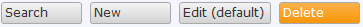

The select all button allows the end-user to select all objects in a grid, or reference set selector. With the selection type property you can determine whether this button should select the objects on the current page, or the objects on all pages.

## Common properties

### Class

The class property allows you to specify a cascading style sheet (CSS) class for the widget. This class will be applied to the widget in the browser and the widget will get the corresponding styling. The class should be a class from the theme that is used in the project. It overrules the default styling of the widget.

{}

Note that the styling is applied in the following order:

1.  Default styling defined by the theme the project uses.
2.  The 'Class' property of the widget.
3.  The 'Style' property of the widget.

{}

### Style

The style property allows you to specify additional CSS styling. If a class is also specified, this styling is applied _after_ the class.

{}

background-color:blue;
This will result in a blue background

{}

## General properties

### Caption

{}

Changed in Mendix 5.19: button captions are based on templates with parameters that will be replaced by attribute values.

{}

The caption defines the text that will be shown. The template can contain parameters that are written as a number between braces, e.g. {1}. The first parameter has number 1, the second 2 etcetera. Note that to use template parameters the widget must be placed in a context of an entity, e.g. inside a [data view](data-view) or [list view](list-view). The parameters will be replaced by the values of the attributes.

_Before 5.19:_

This property indicates what text will be shown on this widget or part of the widget. This is a translatable text. See [Translatable Texts](translatable-texts).

### Tooltip

{}

Added in Mendix 5.8.0.

{}

The tooltip property determines the text you will see in the tooltip that appears when you hover over the button. The tooltip text is translatable. See [Translatable Texts](translatable-texts). If the tooltip is not specified, no tooltip will be shown when hovering over the button.

### Image

{}

Replaced by the property 'Icon' in Mendix 5.16.

{}

This property indicates which image will be shown in front of the caption of the button.

### Icon

{}

Added in Mendix 5.16.

{}

The icon property determines the icon that will be shown in front of the caption of the button. There are three options: no icon, a glyph icon or a (bitmap) image. Glyph icons come from the Bootstrap Halflings collection. The advantages of a glyph icon over a bitmap image are that glyphs are scalable, look sharp on high-resolution screens and their color can be changed by changing the font color. The advantage of an image icon is that it can have multiple colors.

### Button Style

{}

Added in Mendix 5.18.

{}

This property applies a predefined styling to the button.

### Is default button

This property indicates whether this button is the default button of the grid or reference set selector. A grid or reference set selector can only have one default button. The default button is triggered when clicking or double clicking a row. Whether a click or a double click triggers it depends on the 'default button trigger' property of the [Data grid](data-grid), [Template grid](template-grid) or [Reference set selector](reference-set-selector).

{}

The default button is marked with a "(default)" suffix in the Modeler, so that you can easily spot it. In the screenshot below the Edit button is the default button and the Delete button has a button style 'Warning'.

{}

_Default value:_ False

### Selection type

<table><thead><tr><th class="confluenceTh">Value</th><th class="confluenceTh">Description</th></tr></thead><tbody><tr><td class="confluenceTd">Select page</td><td class="confluenceTd">Clicking on this button selects all objects on the current page.</td></tr><tr><td class="confluenceTd">Select all</td><td class="confluenceTd">Clicking on this button selects all objects.</td></tr></tbody></table>{}

Due to technical limitations, a button with selection type 'Select all' cannot be combined with remove, delete or select buttons.

{}

_Default value:_ Select page

## Visibility properties

{}
Conditional visibility settings were added in version 5.10.0.
{}

### Visible

By default, whether or not an element is displayed in the browser is determined by how the page is designed and the user's roles within the application. However, the page can be configured to hide the element unless a certain condition is met. 

## Attribute Condition

### Attribute

When checked, this setting hides the widget unless a particular attribute has a certain value. Only boolean and enumeration attributes can be assigned to this purpose.

A practical example would be a web shop in which the user must submit both billing and delivery information. In this case you might not wish to bother the user with a second set of address input fields unless he or she indicates that the billing and delivery address are not the same. You can accomplish this by making the delivery address fields conditionally visible based on the boolean attribute SameBillingAndDeliveryAddress.

### Module roles

The widget can be made visible to a subset of the user roles available in your application. When activated, this setting will render the widget invisible to all users that are not linked to one of the selected user roles. Please note that this does not override project security. Any restrictions due to microflow, form, or entity access will remain in effect.
