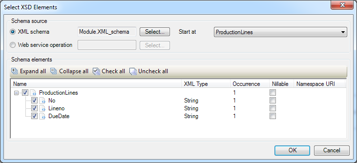

This describes how to select elements for a XML-to-Domain mapping.

## XSD Source

Here you can select whether the XML schema comes from an [imported web service](consumed-web-services) or an [XML schema](xml-schemas).

When using an XML schema as source, you must select which XML element to start at. This should be the root element of the XML file(s) that you wish to import.

## XSD Elements

In this part you can select which elements from the XML you wish to map to your domain model. It is possible to skip certain elements of complex XML schemas and start the mapping at the element you need.

The select elements screen. The toolbar buttons are explained in the following table:

<table><thead><tr><td class="confluenceTd">Expand all</td><td class="confluenceTd">Expands the entire tree, unless a node is a duplicate of one of its ancestors, or the numer of expanded nodes is too large. The maximum of nodes per expand operation is currently 10,000.</td></tr></thead><tbody><tr><td class="confluenceTd">Collapse all</td><td class="confluenceTd">Collapses the entire tree, so that only the root node remains visible</td></tr><tr><td class="confluenceTd">Check all</td><td class="confluenceTd">Checks the box next to every expanded node and visible leaf node. Collapsed nodes and their children are not affected.</td></tr><tr><td class="confluenceTd">Uncheck all</td><td class="confluenceTd">Unchecks the box next to every expanded node and visible leaf node. Collapsed nodes and their children are not affected.</td></tr></tbody></table>
