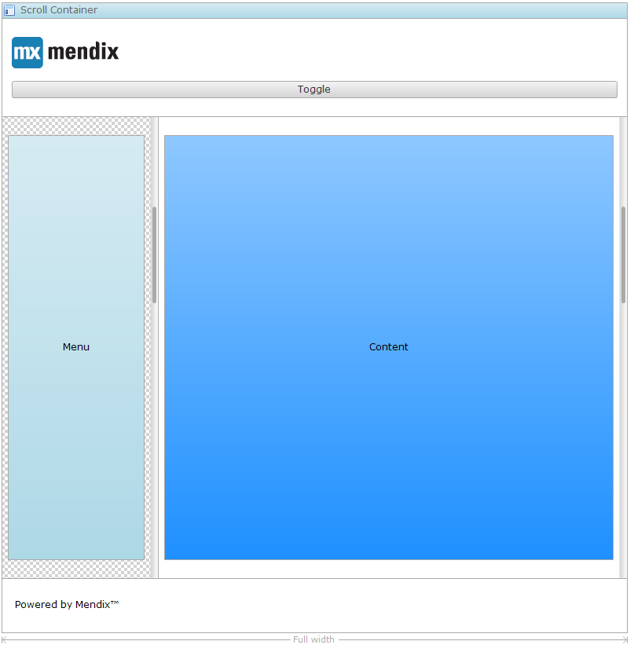

The sidebar toggle is a button that when pressed will make a region of a [scroll container](scroll-container) (Mendix 5.18) or [layout container](layout-container) appear or disappear. This makes it possible to create sidebars, for instance a menu on a mobile phone that is hidden by default and can be shown by clicking the button. See the picture for an example layout that used the sidebar toggle. 

## Button properties

### Caption

{}

Changed in Mendix 5.19: button captions are based on templates with parameters that will be replaced by attribute values.

{}

The caption defines the text that will be shown. The template can contain parameters that are written as a number between braces, e.g. {1}. The first parameter has number 1, the second 2 etcetera. Note that to use template parameters the widget must be placed in a context of an entity, e.g. inside a [data view](data-view) or [list view](list-view). The parameters will be replaced by the values of the attributes.

_Before 5.19:_

The caption can be set to either a literal value, or an attribute value. A literal caption specifies a translatable text. See [Translatable Texts](translatable-texts). An attribute caption specifies a path to an attribute. The path starts at the entity of the entity widget in which this widget is contained.

### Image

{}

Replaced by the property 'Icon' in Mendix 5.16.

{}

This property indicates which image will be shown in front of the caption of the button.

### Icon

{}

Added in Mendix 5.16.

{}

The icon property determines the icon that will be shown in front of the caption of the button. There are three options: no icon, a glyph icon or a (bitmap) image. Glyph icons come from the Bootstrap Halflings collection. The advantages of a glyph icon over a bitmap image are that glyphs are scalable, look sharp on high-resolution screens and their color can be changed by changing the font color. The advantage of an image icon is that it can have multiple colors.

### Render mode

This property indicates how the button is rendered.

<table><thead><tr><th class="confluenceTh">Value</th><th class="confluenceTh">Description</th></tr></thead><tbody><tr><td class="confluenceTd">Button</td><td class="confluenceTd">The trigger is rendered as a button.</td></tr><tr><td class="confluenceTd">Link</td><td class="confluenceTd">The trigger is rendered as a hyperlink.</td></tr></tbody></table>

_Default value:_ Button

### Button Style

{}

Added in Mendix 5.18.

{}

This property applies a predefined styling to the button.

## Common properties

### Name

The internal name of the widget. You can use this to give sensible names to widgets. The name property also appears in the generated HTML: the widget DOM element automatically includes the class '`mx-name-{NAME}`', which can be useful for [Selenium testing](/howto50/selenium-support).

### Class

The class property allows you to specify a cascading style sheet (CSS) class for the widget. This class will be applied to the widget in the browser and the widget will get the corresponding styling. The class should be a class from the theme that is used in the project. It overrules the default styling of the widget.

{}

Note that the styling is applied in the following order:

1.  Default styling defined by the theme the project uses.
2.  The 'Class' property of the widget.
3.  The 'Style' property of the widget.

{}

### Style

The style property allows you to specify additional CSS styling. If a class is also specified, this styling is applied _after_ the class.

{}

background-color:blue;
This will result in a blue background

{}

### Tab index

The tab index influences the order in which the end user navigates through the page using the tab key. By default tab indices are zero and the tab order is determined automatically by the client system. A value of minus one (-1) means that the widget will be skipped when tabbing through the page.

_Default value:_ 0

## General properties

### Region

Choose the region that should be collapsed/expanded by clicking this button.

<table><thead><tr><th class="confluenceTh">Region</th><th class="confluenceTh">Effect</th></tr></thead><tbody><tr><td class="confluenceTd">Left</td><td class="confluenceTd">The left region of the layout container will be toggled.</td></tr><tr><td class="confluenceTd">Right</td><td class="confluenceTd">The right region of the layout container will be toggled.</td></tr></tbody></table>{}

The sidebar toggle is right-to-left-aware (RTL) which means that in RTL languages the sidebar will slide in from the right if you choose 'Left'.}

{}

_Default value:_ Left

### Mode

{}

Added in Mendix 5.18.0.

{}

Determines how the region will be toggled.

<table><thead><tr><th class="confluenceTh">Mode</th><th class="confluenceTh">Effect</th></tr></thead><tbody><tr><td class="confluenceTd">Push content aside</td><td class="confluenceTd">The sidebar moves the rest of the content off-screen (only available mode in Mendix 5.17 and older).</td></tr><tr><td class="confluenceTd">Slide over content</td><td class="confluenceTd">The sidebar moves over the content.</td></tr><tr><td class="confluenceTd">Shrink content</td><td class="confluenceTd">The content shrinks to make space for the sidebar.</td></tr></tbody></table>

### Initially open

{}

Added in Mendix 5.18.0.

{}

Only applicable if the mode is "Shrink content".

## Visibility properties

{}
Conditional visibility settings were added in version 5.10.0.
{}

### Visible

By default, whether or not an element is displayed in the browser is determined by how the page is designed and the user's roles within the application. However, the page can be configured to hide the element unless a certain condition is met. 

## Attribute Condition

### Attribute

When checked, this setting hides the widget unless a particular attribute has a certain value. Only boolean and enumeration attributes can be assigned to this purpose.

A practical example would be a web shop in which the user must submit both billing and delivery information. In this case you might not wish to bother the user with a second set of address input fields unless he or she indicates that the billing and delivery address are not the same. You can accomplish this by making the delivery address fields conditionally visible based on the boolean attribute SameBillingAndDeliveryAddress.

### Module roles 

Module role conditional visibility is split into three subcategories.

<table><thead><tr><th class="confluenceTh">Setting</th><th class="confluenceTh">Description</th></tr></thead><tbody><tr><td class="confluenceTd">for applicable roles</td><td class="confluenceTd">All access determined by page and microflow access is maintained. For instance; if the user does not have access to the microflow triggered by a certain microflow button, that button will remain hidden from that user.</td></tr><tr><td class="confluenceTd">for all roles</td><td class="confluenceTd">This setting overrides the setting above, rendering the element visible to all users, regardless of security settings. Note that this does not provide the user access to the restricted data, it merely unveils the element. In the example above, the microflow button would become visible, but clicking it would still result in a log-in page or error.&nbsp;</td></tr><tr><td class="confluenceTd">for selected roles</td><td class="confluenceTd">The widget can be made visible to a subset of the user roles available in your application. When activated, this setting will render the widget invisible to all users that are not linked to one of the selected user roles. Please note that this does not override project security. Any restrictions due to microflow, form, or entity access will remain in effect.</td></tr></tbody></table>
