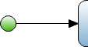

A start event defines the location where the microflow will start from. A microflow can only start from one location. Therefore a microflow can only contain one start event.

{}

When you want to start your microflow with an activity, you link a start event, using a sequence flow with the activity.

{}
