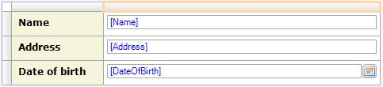
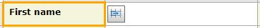
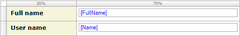

Tables can be used to lend structure to a page. They contain a number of [rows](table-row) and columns, the intersection of which is called a [cell](table-cell). Each cell can contain widgets.

{}

An example of how you can create a structured page with a table.

{}

Cells can be merged horizontally and vertically to allow for asymmetric lay-outs. To merge cells the cell you wish to merge to must be empty. A merge can then be initiated either in a cell's context menu or by clicking the merge button that will automatically appear if you select an eligible cell.

{}

The merge button

{}

Tables can be selected by clicking the white square in the top-left corner.

Tables allow for a number of keyboard interactions. Examples include navigating between rows and columns with the cursor keys and copy(ctrl+c)/pasting(ctrl+v) rows and cells.

## Common properties

### Name

The internal name of the widget. You can use this to give sensible names to widgets. The name property also appears in the generated HTML: the widget DOM element automatically includes the class '`mx-name-{NAME}`', which can be useful for [Selenium testing](/howto50/selenium-support).

### Class

The class property allows you to specify a cascading style sheet (CSS) class for the widget. This class will be applied to the widget in the browser and the widget will get the corresponding styling. The class should be a class from the theme that is used in the project. It overrules the default styling of the widget.

{}

Note that the styling is applied in the following order:

1.  Default styling defined by the theme the project uses.
2.  The 'Class' property of the widget.
3.  The 'Style' property of the widget.

{}

### Style

The style property allows you to specify additional CSS styling. If a class is also specified, this styling is applied _after_ the class.

{}

background-color:blue;
This will result in a blue background

{}

## General properties

### Width Unit

{}

In earlier Mendix versions, only percentages where supported.

{}

The width unit specifies the unit of the specified column widths (see property 'Column Widths' below). There are two possible values for the unit:

<table><thead><tr><th class="confluenceTh">Value</th><th class="confluenceTh">Description</th></tr></thead><tbody><tr><td class="confluenceTd">Percentage</td><td class="confluenceTd">Column widths are expressed as percentages of the available width. When resizing, columns will become wider/narrower while keeping the same relative widths.</td></tr><tr><td class="confluenceTd">Pixels</td><td class="confluenceTd">Column widths are expressed as pixels. Optionally, some columns can have width 'auto' and those columns evenly divide the rest of the space. When resizing, the pixel width columns will keep the same size; auto columns will become wider/narrower.</td></tr></tbody></table>

_Default value:_ Percentage

### Column Widths

{}

In earlier Mendix versions, only percentages where supported.

{}

The column widths property describes the widths of each of the columns as a list of numbers separated by semi-colons. The unit (see above) determines what these numbers mean: percentages or pixels. In the case of pixels, 'auto' is also a valid value for the width of a column. Auto columns evenly divide space that remains after giving the pixel width columns their desired width.

Examples:

<table><thead><tr><th class="confluenceTh">Widths</th><th class="confluenceTh">Unit</th><th class="confluenceTh">Description</th></tr></thead><tbody><tr><td class="confluenceTd">30;70</td><td class="confluenceTd">Percentage</td><td class="confluenceTd">Two columns of which the first is 30% and the second is 70%</td></tr><tr><td class="confluenceTd">20;200;auto</td><td class="confluenceTd">Pixels</td><td class="confluenceTd">Three columns of which the first is 20 pixels wide, the second is 200 pixels and the last one is 'auto' which means that it will take up the rest of the space.</td></tr></tbody></table>{}

A table with widths 30% and 70%

{}

## Visibility properties

{}
Conditional visibility settings were added in version 5.10.0.
{}

### Visible

By default, whether or not an element is displayed in the browser is determined by how the page is designed and the user's roles within the application. However, the page can be configured to hide the element unless a certain condition is met. 

## Attribute Condition

### Attribute

When checked, this setting hides the widget unless a particular attribute has a certain value. Only boolean and enumeration attributes can be assigned to this purpose.

A practical example would be a web shop in which the user must submit both billing and delivery information. In this case you might not wish to bother the user with a second set of address input fields unless he or she indicates that the billing and delivery address are not the same. You can accomplish this by making the delivery address fields conditionally visible based on the boolean attribute SameBillingAndDeliveryAddress.

### Module roles

The widget can be made visible to a subset of the user roles available in your application. When activated, this setting will render the widget invisible to all users that are not linked to one of the selected user roles. Please note that this does not override project security. Any restrictions due to microflow, form, or entity access will remain in effect.
