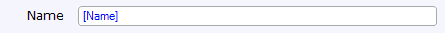

A text box can be used to display and/or edit a textual value.

{}

This text box allows the end-user to set the name of the customer.

{}

A text box must be placed in a data view or template grid and connected to an attribute of type String. The connected attribute is shown in blue and between brackets inside the text box.

## General properties

### Decimal precision (only for numeric attributes)

The precision of a value describes the number of digits that are used to express that value. This property indicates the number of decimal places (the number of digits following the point).

_Default value:_ 2

### Group digits (only for numeric attributes)

For ease of reading, numbers with many digits before the decimal separator may be divided into groups using a delimiter. This property indicates whether the end user will see these groups.

_Default value:_ False

### Show as password (only for attributes of type String or HashString)

<table><thead><tr><th class="confluenceTh">Value</th><th class="confluenceTh">Description</th></tr></thead><tbody><tr><td class="confluenceTd">False</td><td class="confluenceTd">Normal text box</td></tr><tr><td class="confluenceTd">True</td><td class="confluenceTd">Typed characters are not shown to the end user. Instead an asterisk is shown for every typed character.</td></tr></tbody></table>

_Default value:_ False

### Input mask (only in web forms)

The input mask limits what the user can enter in the text box. A '9' means any digit, 'Z' means any letter, 'U' an upper-case letter, 'L' a lower-case letter and '*' a letter or a digit. Other characters will be taken literally. For example, the input mask 99-LLL-9999 matches 24-apr-2008.

### Maximum length

This property indicates the maximum number of characters that can be typed in this text box.

<table><thead><tr><th class="confluenceTh">Value</th><th class="confluenceTh">Description</th></tr></thead><tbody><tr><td class="confluenceTd">Attribute length</td><td class="confluenceTd">The maximum number of characters is the same as the maximum length of the connected attribute.</td></tr><tr><td class="confluenceTd">Unlimited</td><td class="confluenceTd">The maximum number of characters is unlimited.</td></tr><tr><td class="confluenceTd">Custom</td><td class="confluenceTd">The maximum number of characters is set by the user.</td></tr></tbody></table>

_Default value: Attribute length_

### Placeholder text

The placeholder text is shown when no text has been entered yet. It can be used to give a hint to the user what kind of text should be entered.

### Required

This property indicates whether this widget must be filled in by the end user or not. If set to true, this widget can not be left empty and a message will be shown if the end user presses the 'Save' button.

_Default value:_ False

### Required message

This property determines the message that is shown to the end user if the widget is empty and the 'Required' property is set to true. This is a translable text. See [Translatable Texts](translatable-texts).

{}

For example, if an address field is required, the required message for the text box of the address could be something like "The address is required."

{}

## Data source properties

### Attribute (path)

Many input widgets, like text boxes and drop-down widgets, can be connected to:

1.  an attribute of the entity of the data view that contains the widget
2.  an attribute of an entity associated with the data view entity by following one or more associations of type reference through the domain model.

In the first case we say the widget is connected to an attribute and in the second case to an attribute path.

{}

An input widget connected to an attribute _path_ must be read-only. The Modeler will check this for you.

{}

## Label properties

{}

Added in Mendix 5.18.0

{}

A label can be used to described the purpose of the widget to the user. The label is shown next to the widget in the user interface. If a label is configured, the widget will be rendered in the browser wrapped in a form group. See [Bootstrap documentation](http://getbootstrap.com#forms).

### Show label

This property determines whether the label is rendered and the widget is wrapped in a form group.

_Default value:_ No

### Label caption

This property is shown only when Show label is Yes. This property determines what text is rendered within a label.

## Editability properties

### Editable

The editable property indicates whether the end user will be able to change the value displayed by the widget.

<table><thead><tr><th class="confluenceTh">Value</th><th class="confluenceTh">Description</th></tr></thead><tbody><tr><td class="confluenceTd">Default</td><td class="confluenceTd">The value is editable if security allows it (i.e. if the user that is signed in has write rights to the selected attribute). </td></tr><tr><td class="confluenceTd">Never </td><td class="confluenceTd">The value is never editable. </td></tr><tr><td class="confluenceTd">Conditional </td><td class="confluenceTd">The value is editable if security allows it and the specified condition holds. (see below) </td></tr></tbody></table>

_Default value:_ Default

### Condition

A widget can be made editable based on the value of an attribute of the enclosing data view. The attribute must be of type boolean or enumeration. For each value, you specify whether the widget is editable. Upon entering the page and upon changing the condition attribute the edit state of the widget will be updated.

Example: you don't have to ask for the marriage date if the end user indicates that he or she is not married.

## Visibility properties

{}
Added in Mendix 5.10.0.
{}

### Visible

By default, whether or not an element is displayed in the browser is determined by how the page is designed and the user's roles within the application. However, the page can be configured to hide the element unless a certain condition is met. 

## Attribute Condition

### Attribute

When checked, this setting hides the widget unless a particular attribute has a certain value. Only boolean and enumeration attributes can be assigned to this purpose.

A practical example would be a web shop in which the user must submit both billing and delivery information. In this case you might not wish to bother the user with a second set of address input fields unless he or she indicates that the billing and delivery address are not the same. You can accomplish this by making the delivery address fields conditionally visible based on the boolean attribute SameBillingAndDeliveryAddress.

### Module roles

The widget can be made visible to a subset of the user roles available in your application. When activated, this setting will render the widget invisible to all users that are not linked to one of the selected user roles. Please note that this does not override project security. Any restrictions due to microflow, form, or entity access will remain in effect.

## Events properties

### On change

The on-change property optionally specifies a microflow that will be executed when leaving the widget after the value has been changed.

### On change settings

The on change settings specify what parameters are passed to the microflow, whether a progress bar is shown and more.

See [Starting Microflows](starting-microflows).

### On enter

The on-enter property optionally specifies a microflow that will be executed when the widget is entered, either by using the tab key or by clicking it with the mouse.

### On enter settings

The on enter settings specify what parameters are passed to the microflow, whether a progress bar is shown and more.

See [Starting Microflows](starting-microflows).

### On leave

The on-leave property optionally specifies a microflow that will be executed when leaving the widget, either by using the tab key or by clicking another widget.

### On leave settings

The on leave settings specify what parameters are passed to the microflow, whether a progress bar is shown and more.

See [Starting Microflows](starting-microflows).

## Common properties

### Name

The internal name of the widget. You can use this to give sensible names to widgets. The name property also appears in the generated HTML: the widget DOM element automatically includes the class '`mx-name-{NAME}`', which can be useful for [Selenium testing](/howto50/selenium-support).

### Class

The class property allows you to specify a cascading style sheet (CSS) class for the widget. This class will be applied to the widget in the browser and the widget will get the corresponding styling. The class should be a class from the theme that is used in the project. It overrules the default styling of the widget.

{}

Note that the styling is applied in the following order:

1.  Default styling defined by the theme the project uses.
2.  The 'Class' property of the widget.
3.  The 'Style' property of the widget.

{}

### Style

The style property allows you to specify additional CSS styling. If a class is also specified, this styling is applied _after_ the class.

{}

background-color:blue;
This will result in a blue background

{}

### Tab index

The tab index influences the order in which the end user navigates through the page using the tab key. By default tab indices are zero and the tab order is determined automatically by the client system. A value of minus one (-1) means that the widget will be skipped when tabbing through the page.

_Default value:_ 0

## Related articles

*   [Data view](data-view)
*   [Attributes](attributes)
