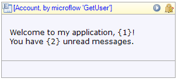

{}

Added in Mendix 5.19

{}

The text widget shows text which can optionally contain parameters. Every parameter is replaced with the value of the attribute it refers to. The text widget is the recommended way to show text to the user.

{}

Text widget placed in a data view, showing a greeting message to the user.

{}

If you start typing in any empty container the Modeler will automatically generate a text widget to display your text.

## General properties

### Text template

Text template defines the text that will be shown. The template can contain parameters that are written as a number between braces, e.g. {1}. The first parameter has number 1, the second 2 etcetera. Note that to use template parameters the widget must be placed in a context of an entity, e.g. inside a [data view](data-view) or [list view](list-view).

### Parameters

For each parameter in the template you define an attribute of the context entity or a referred entity of which the value will be inserted at the position of the parameter.

### Render mode

The render mode determines how the text will be shown in the web browser.

<table><thead><tr><th class="confluenceTh">Value</th><th class="confluenceTh">Description</th></tr></thead><tbody><tr><td class="confluenceTd">Text</td><td class="confluenceTd">The text will be rendered inline with the previous/next texts on a page (&lt;span&gt; tag in HTML)</td></tr><tr><td colspan="1" class="confluenceTd">Paragraph</td><td colspan="1" class="confluenceTd">The text will be rendered as a separate paragraph (&lt;p&gt; tag in HTML)</td></tr><tr><td class="confluenceTd">Heading 1</td><td class="confluenceTd">The text will be rendered as a large heading (&lt;h1&gt; tag in HTML)</td></tr><tr><td class="confluenceTd">...</td><td class="confluenceTd">...</td></tr><tr><td class="confluenceTd">Heading 6</td><td class="confluenceTd">The text will be rendered as a small heading (&lt;h6&gt; tag in HTML)</td></tr></tbody></table>

_Default value:_ Text

## Visibility properties

### Visible

By default, whether or not an element is displayed in the browser is determined by how the page is designed and the user's roles within the application. However, the page can be configured to hide the element unless a certain condition is met. 

## Attribute Condition

### Attribute

When checked, this setting hides the widget unless a particular attribute has a certain value. Only boolean and enumeration attributes can be assigned to this purpose.

A practical example would be a web shop in which the user must submit both billing and delivery information. In this case you might not wish to bother the user with a second set of address input fields unless he or she indicates that the billing and delivery address are not the same. You can accomplish this by making the delivery address fields conditionally visible based on the boolean attribute SameBillingAndDeliveryAddress.

### Module roles

The widget can be made visible to a subset of the user roles available in your application. When activated, this setting will render the widget invisible to all users that are not linked to one of the selected user roles. Please note that this does not override project security. Any restrictions due to microflow, form, or entity access will remain in effect.

## Common properties

### Name

The internal name of the widget. You can use this to give sensible names to widgets. The name property also appears in the generated HTML: the widget DOM element automatically includes the class '`mx-name-{NAME}`', which can be useful for [Selenium testing](/howto50/selenium-support).

### Class

The class property allows you to specify a cascading style sheet (CSS) class for the widget. This class will be applied to the widget in the browser and the widget will get the corresponding styling. The class should be a class from the theme that is used in the project. It overrules the default styling of the widget.

{}

Note that the styling is applied in the following order:

1.  Default styling defined by the theme the project uses.
2.  The 'Class' property of the widget.
3.  The 'Style' property of the widget.

{}

### Style

The style property allows you to specify additional CSS styling. If a class is also specified, this styling is applied _after_ the class.

{}

background-color:blue;
This will result in a blue background

{}
