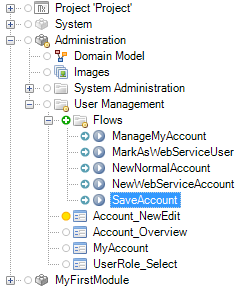
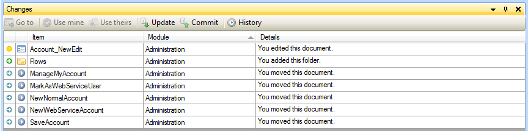
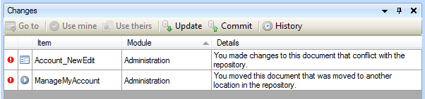
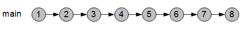
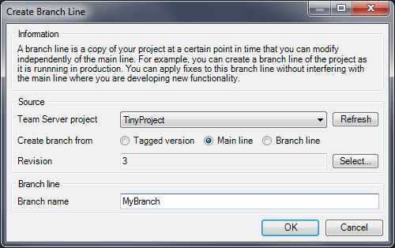
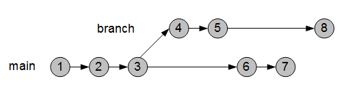
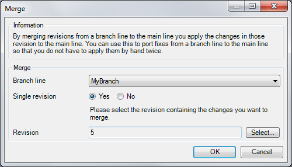
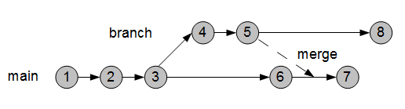
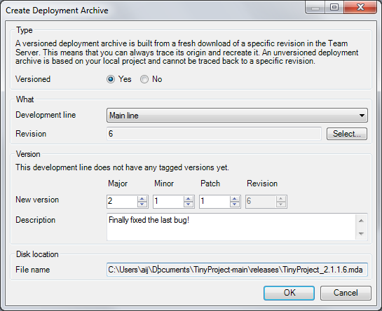

Version control introduces a number of new concepts to the Modeler interface. People familiar with version control will recognize many of them. Here is an overview of those concepts together with screenshots of relevant parts of the Modeler.

## Repository

The repository is the central place where your project and its complete history are stored. Each project corresponds to a repository. The Mendix Team Server can host any number of repositories.

## Revision

A revision in a repository is the complete state of your project at a point in time. This includes the model (the .mpr file) and all resources (Java, custom widgets, etcetera). Every time a person commits a set of changes a new revision is created.
Revisions are numbered starting from one. Using the revision number you can uniquely identify the project at a certain point in time. Let us say the latest revision in the repository is 20\. If a person now commits some changes, revision 21 will be created. Revision 20 is the state of the project before those changes are applied and 21 is the revision including the changes.

## Working copy

A working copy is a local copy of the project. This local copy is what you work on and where you make all your changes. You create a working copy by downloading a revision from the Team Server repositoy. We call the revision that you download the original of the working copy (in Subversion this is called 'base'). When you start working on your local copy it starts to deviate from the original. Working on your local copy has no effect on the repository. Once you are happy with the changes you can commit them, creating a new revision in the process.

Let us say you download revision 35 from the repository. This is your original. You make some changes to your working copy and then commit them. This creates revision 36 and your working copy now has this revision as its original.

## Download from Team Server

Before you can start working on a Team Server project you have to download it to your computer. You select a project, a development line and a disk location This creates a working copy for you to edit. In the Modeler you can download a Team Server project by simply opening the project.

## Upload to Team Server

If you have an existing project and you want to start using version control, you have to upload the project to the Team Server. You can upload to a new project or you can select an existing project that is Team Server enabled but does not store an actual Modeler project yet. Uploading to a new project also creates a sprintr™ project.

## Status

The status of your project is a summary of all the changes in your working copy when compared to the original. The Modeler shows the status both in the project explorer and in the new 'Changes' dock. Different kinds of changes are visualized with different icons.

Icon                               | Meaning
---------------------------------- | ----------------------------------------------------------------------
 | Nothing happened to this item. It is unchanged w.r.t. to the original.
 | You modified this item (i.e. document, folder or module).
 | You added this item.
 | You moved this item to another position in the project tree.
 | You deleted this item.
 | This item is conflicted. We will get back to conflicts later on.

The project explorer shows an icon in front of items (documents, folders and modules) that are changed in some way. There is only room for one icon and if a document is both modified and moved it is shown as modified.

In the screenshot you can see that the document Account_NewEdit has been modified. Also a new folder called 'Flows' was added and all microflows were moved inside this folder. Note that the folders and modules containing changes are depicted with a small yellow circle. This helps you to quickly see where in the project the changes are.

The Changes Dock shows a line for each change to an item. If a document is both modified and moved there are two lines for that document. The dock also shows items that were deleted, something the project explorer cannot do.

## Commit

Sending changes to the repository is called 'committing'. The idea is that you commit small, consistent pieces of work to the repository. Examples are implementing a new feature and fixing a bug. The Modeler will warn against committing while there are errors in your project. Preferably, the revisions in the repository are always error-free.

Committing results in a new revision in the repository. You can add the following information to a commit which will be attached to the newly created revision:
A textual message. You can enter this message in the Modeler when committing and it should be a summary of the changes you made.

A list of sprintr™ stories that relate to the commit. Our advice is to keep commits small and this means that a commit probably relates to one story. The Modeler only shows stories that are currently 'Running' and will not change the state of the sprintr™ story. Setting the status to 'Done' is the responsibility of the team and depends on your definition of done.

The Modeler also attaches some information automatically:

*   The author, i.e. the person who committed.
*   The date and time of the commit.
*   The list of changed documents/folder/modules along with the type of the change (modify, add, delete, ...).
*   The version of the Modeler that was used to commit.

If you also changed Java source code, added widgets or made other changes that affect files other than the project file you will get a 'Changes on disk' tab page that shows you what disk changes you are about to commit.

Committing is only allowed if your working copy is up to date with the repository. If someone else committed a change since the last time you updated, you have to update first. The reason for this is that the revision you will create with the commit should incorporate both your changes and the changes by the other person. Updating will combine the latest changes in the repository with your changes. After reviewing the result and fixing possible problems, you can commit again.

## Update

Updating is the process of retrieving the latest changes from the repository. It is advisable to frequently update so that the number of changes you retrieve is small.

In the process of updating the original of your working copy is updated as well. Let us say that the last time you updated you received all changes up to and including revision 40\. That means the original for your working copy is revision 40\. You have made some changes to your working copy. Since you started doing that other people on your team have made a total of four commits (41, 42, 43 and 44). If you now update, you will receive those changes and 44 will be the new original to which your changes are compared.

Changes you receive from the repository when updating are combined with the changes you have made to your working copy (if any). Afterwards, your working copy will contain both your changes and the changes you received. Many times combining those changes will work out fine. For example, one person adds a form and another changes a microflow. Or two people both add a tab page to a form. Only if the changes are too close a document a conflict arises. For example, two people both change properties of the same data view. You will have to resolve such conflicts before you can commit.

## Conflict

A conflict arises when two changes cannot be combined. There are two places where this can happen. The first is inside a document when two modifications are too close to each other, for example two people both changing properties of the same data view. We call this a document conflict. The second place is at the level of the project, for example when one person delete a form something that the other person modifies or two people move a microflow to different locations in the tree. We call this a project conflict.

The documents that are conflicted are marked as such in the project explorer and the changes dock. In the case of a document conflict you can zoom in to the exact spot where the conflicting change is. In the case of a project conflict the document will be highlighted in the project explorer tree.

Resolving a conflict can be done in by using the 'Use mine' and 'Use theirs' button in the version control dock. In the case of a project conflict only the 'Use mine' button is enabled and it resolves the conflict and keeps the situation as it is now in your working copy. For document conflicts both buttons are enabled and with them you can choose between your version and 'their' version.

## History

The history of the project is a list of all revisions that have been committed in reverse chronological order (newest is at top of list). The history form quickly shows you revision number, date, time, author and message of each revision. By selecting a revision you can view additional details such as related sprintr™ stories, changed documents, Modeler version and changes on disk. Icons summarize the kinds of changes that happened in the project; whether there are model changes, disk changes and whether the project was upgraded to a new Modeler version can quickly be checked by looking at the icons.

## Development lines

A repository can contain a number of development lines. Each development line offers independent development from the other development lines. In the simple case there is just one development called the main line (called 'trunk' in subversion). All development then happens inside that one line.

It is often convenient to have more than one development line. For example, one development line for fixing bugs in the currently deployed version of your project and another line where you develop new functionality. If you then find a bug in the deployed version you can fix it in the corresponding development line irrespective of the state of the development line where new functionality is developed.

Development lines other than the main line are called branch lines. Our advice would be to develop new features in the main line and to have branch lines for fixing bugs in versions that have been deployed. This is the scenario the Modeler makes easy but other scenarios for more complex projects are supported as well.

Note that revision numbers are unique across all development lines. This means that two commits in the same development line do not always have consecutive numbers, for example the jump from 3 to 6.

## Merge

If you have multiple development lines, you sometimes want to port changes from one development line to another. For example, the fix that you made in a branch line for the production version should also be applied to the new 2.0 version you are developing in the main line. You can, of course, do this by hand but the Modeler can also help you by merging changes from one development line to another.

Merging is always done while you have a working copy open. The merge will result in extra local changes in that working copy. It is advisable to commit local changes first before merging extra changes into a working copy. Otherwise, the uncommitted local changes and the changes caused by the merge will be combined and it is very hard to untangle them if you are unhappy with the merge. The Modeler will warn you if you have uncommitted changes.

In the picture below revision 5 from the branch line is merged into a working copy of the main line that was at revision 6\. Those merged changes are then committed to form revision 7.

The example shows that you can merge a single revision. It is also possible to merge a whole range of revisions from one development line to another. If a branch line represents a big new feature that you completely want to integrate into the main line you can merge all revisions of the branch.

## Tag

A tag points to a specific revision in a specific development line. When creating a (versioned) deployment archive a tag is created automatically. If at some point in time you want to add a feature or fix a problem in the deployed project, you simply check what tag was used for creating the archive and create a branch from that tag. This way you can always go back to the version that you deployed.

