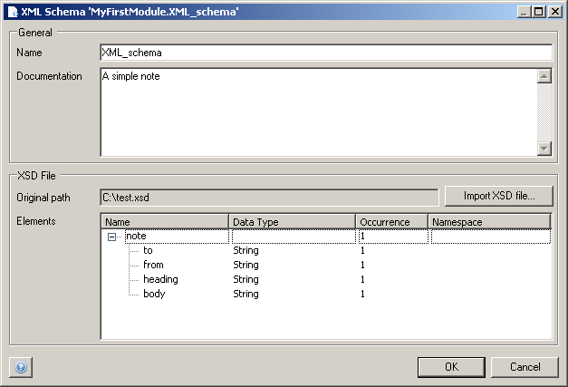

An XML schema is defined in an XML Schema Definition (XSD) file and can be imported in your model. It describes what a certain XML document should look like. The schema can then be used in [Domain-to-XML Mappings](domain-to-xml-mappings) or [XML-to-Domain Mappings](xml-to-domain-mappings).

## General

### Name

The name of the schema.

### Documentation

Documentation that describes the schema.

## XSD File

### Original path

The file path to the XSD file. After selecting an XSD file, hit 'Import XSD file'.

### Elements

The elements of which the XML file is comprised.

{}

A simple schema

{}
