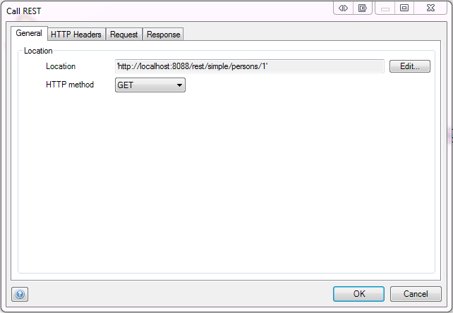
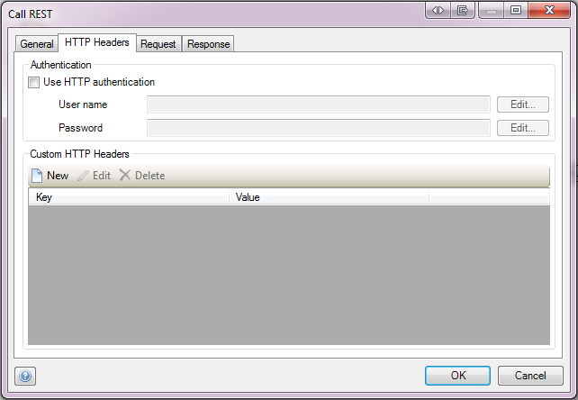
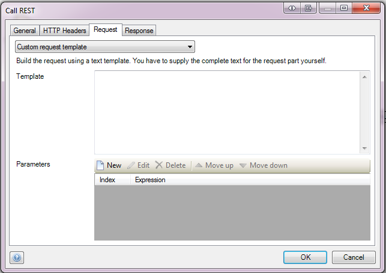
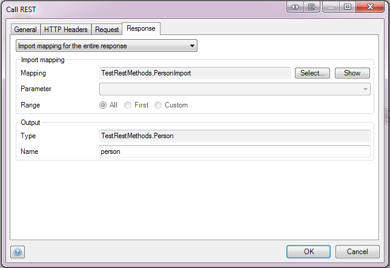

{}
The Call Rest Action is available since Mendix 6.6.0.
{}

The Call Rest activity can be used to call a Rest endpoint. You can specify the location and how the response of the rest call should be handled.

## General

### Location

This property defines the REST endpoint to be called. The location needs to be entered using a string template. The string template should result in a valid URL string. Parameters can be used by writing a number between braces, e.g. '{1}'. For each parameter in the template you can specify its value using a [microflow expression](microflow-expressions) resulting in a String value. To escape opening brace '{' double opening brace should be used, e.g. '&#123;&#123;'.

### HTTP method

This property defines the HTTP method to use when calling a REST endpoint. Possible values are: GET, POST, PUT, PATCH, DELETE.

## HTTP Headers

### Use HTTP authentication

Use HTTP authentication defines whether the basic authentication should be used.

### User name

User name defines the user name that will be used to authenticate over HTTP. The user name needs to be entered using [microflow expressions](microflow-expressions). The microflow expression should result in a string.

### Password

Password defines the password that will be used to authenticate over HTTP. The password needs to be entered using [microflow expressions](microflow-expressions). The microflow expression should result in a string.

### Custom HTTP Headers

These custom headers are added to the HTTP request header. Each custom header is a pair of a key and a value (a microflow expression).

## Request

The request can be generated in several ways that are described in the following sections. Requests can only be built for HTTP methods POST, PUT, PATCH.

### Export mapping

Using this option, a single [Export Mapping](export-mappings) can be used to generate the body for the request. You can choose the export mapping to use for the request part and, if applicable, the object that you want to use as parameter for the mapping.

### Binary for the entire request

This option allows you to send binary data (for example, the contents of FileDocument) as a request.

{}
The 'Binary for the entire request' option is available from Mendix 6.9.0.
{}

### Custom request template

This option allows you to generate the request using a string template. The template defines the structure of the request in plain text. Parameters can be used by writing a number between braces, e.g. '{1}'. For each parameter in the template you can specify its value using a [microflow expression](microflow-expressions) resulting in a String value. To escape opening brace '{' double opening brace should be used, e.g. '&#123;&#123;'.

## Response

The response tab offers 4 options, accessible through a dropdown:

*   Import mapping for the entire response. If the response is JSON or XML it can be mapped to entities using an [Import Mapping](import-mappings). 
*   Store the response in a string variable. If the response is a string, such as CSV, it can be stored directly in a string variable.
*   Store the response in a file document. If the response is a binary content, such as PDF, it can be stored directly to a file document. From version 6.10.0 onwards you are required to specify the type of entity to store it in. This entity should inherit from System.FileDocument.

	{}
    The 'Store the response in a file document' option is available from Mendix 6.9.0.
	{}

*   Ignore the response. The response does not have to be used though; it can also be ignored if you are not interested in it.

### Import Mapping 

Here you can choose the [Import Mapping](import-mappings) that will be used to transform the JSON or XML into objects.

### Output

### Type

The type of the output variable.

### Name

The name for the variable that will hold the result of the operation.
