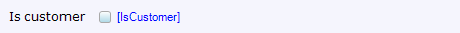

A check box is an [input widget](input-widgets) that can be used to display and edit boolean attributes. It will display a tick if the value is true and remain empty if it is false.

{}

This checkbox might be used to indicate whether or not a user is a customer.

{}

## Data source properties

{}

{}

## Editability properties

{}

{}

{}

## Visibility properties

{}

## Events properties

{}

{}

{}

## Common properties

{}

{}

{}

{}

## Related articles

*   [Data view](data-view)
*   [Attribute](attributes)s
